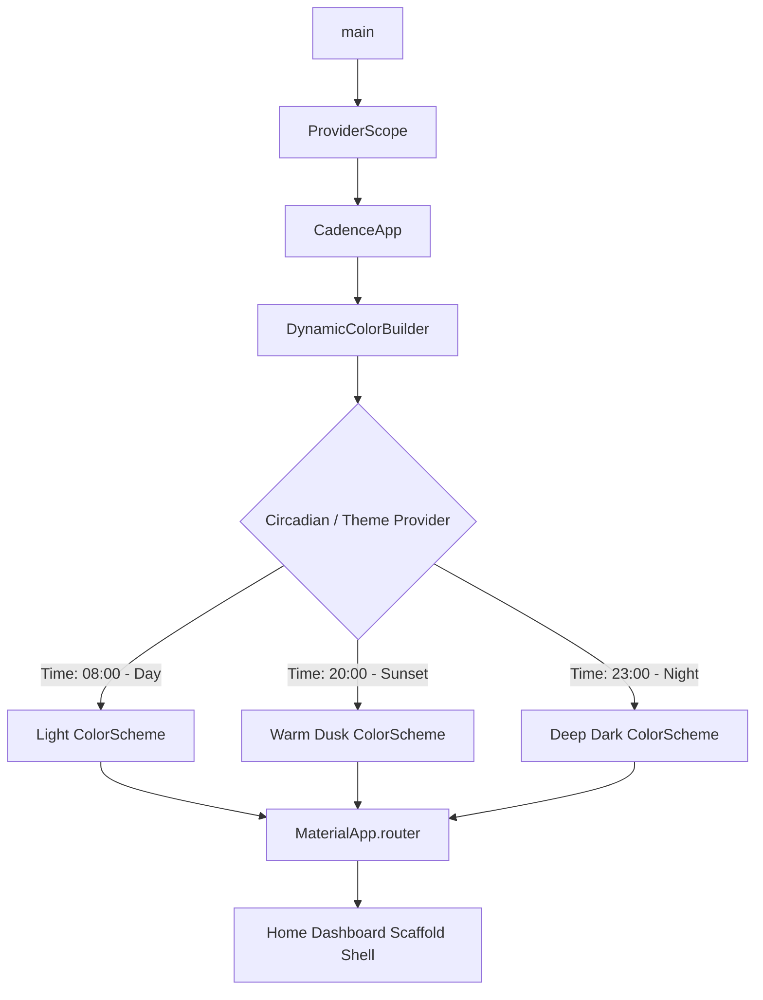

# Chunk 1: Flutter Project Skeleton & M3 Expressive Setup

**Tags:** `#flutter #ui #theming #riverpod #material3`

## What this chunk does
Initializes the Cadence Flutter application structure, sets up state management with `flutter_riverpod`, and implements a responsive Material 3 Expressive theming engine featuring dynamic wallpaper color extraction (`dynamic_color`) and a circadian dark mode system that transitions UI tones based on time of day.

## Why it's needed
Cadence is an offline-first personal dashboard that will be used constantly throughout the day—morning routine, daytime work/study sessions, evening reflection, and night reviews. Establishing clean project architecture early prevents refactoring chaos later. Furthermore, establishing the M3 Expressive design tokens, smooth spring transitions, and circadian color interpolation now guarantees that every subsequent screen we build inherits cohesive styling out of the box.

## Builds on
*n/a* (This is the foundational chunk).

## Key concepts

### 1. Flutter Project Architecture & ProviderScope
In Flutter, widgets form a tree. State management with Riverpod wraps the entire root widget inside `ProviderScope`. Unlike `InheritedWidget` or `Provider`, Riverpod providers are compile-safe, globally declared objects that do not depend on the `BuildContext` to be discovered.

### 2. Material 3 & Expressive Elevation
Material 3 shifts away from heavy drop shadows to communicate surface elevation. Instead, it uses **tonal elevation**, where higher elevation surfaces receive a stronger tint of the primary color. `ThemeData(useMaterial3: true)` enables this by default.

### 3. Dynamic Color (`dynamic_color`)
On Android 12+ (API 31+), the OS exposes the user's system wallpaper palette via `DynamicColorBuilder`. When available, the app extracts the core seed colors and generates a `ColorScheme` matching the user's operating system environment.

### 4. Circadian Dark Mode & `Color.lerp`
Most apps provide a binary toggle (Light vs Dark). Cadence introduces a **Circadian Mode**:
- Daytime: Clean, bright light theme with high legibility.
- Evening (e.g., sunset to late evening): Warm, low-contrast dark palette to reduce blue light.
- Deep Night: Deep AMOLED black palette.
We achieve smooth shifts between these palettes using Dart's `Color.lerp(Color a, Color b, double t)` function, where `t` represents the fractional progress between two time intervals.

## Visual model

## How it works

1. **Bootstrap (`main.dart`):** Ensures Flutter engine bindings are initialized (`WidgetsFlutterBinding.ensureInitialized()`) and wraps `CadenceApp` with `ProviderScope`.
2. **Dynamic Shell (`CadenceApp`):** Mounts `DynamicColorBuilder`. If the Android device supports Material You dynamic theming, it supplies `lightDynamic` and `darkDynamic` color schemes. If not, it falls back to a curated seed color (e.g. deep indigo/teal).
3. **Circadian Controller:** A Riverpod `Notifier` evaluates the current `TimeOfDay` or system clock. It determines which time bracket the user is in and computes the appropriate interpolated `ColorScheme`.
4. **App Scaffolding:** `MaterialApp` consumes the active `theme` and `darkTheme`, loading an expressive starting screen with basic navigation tabs ready for subsequent modules.

## Gotchas / trade-offs

- **Color Contrast & Readability:** When interpolating colors dynamically (`Color.lerp`), intermediate colors can occasionally violate WCAG contrast ratios if base anchors aren't chosen carefully. We test text against surface colors explicitly.
- **Dynamic Color Platform Limitation:** `DynamicColorBuilder` only supplies colors on Android 12+ or supported desktop platforms. Linux dev environments and older Androids must gracefully use our fallback theme seed.
- **Hot Reload vs Background Timers:** Time-driven theme updates need to refresh when the app resumes from the background (`WidgetsBindingObserver`), rather than running an aggressive continuous polling loop that drains battery.

## What to look up next
- Flutter Riverpod 2.x code generation vs manual providers (`@riverpod` vs `StateNotifierProvider`).
- Material 3 Color Roles (`primaryContainer`, `onSurfaceVariant`, `surfaceDim`).
- Android 12+ Monet theme extraction mechanism.

## Check yourself
Before we implement any code, answer these questions in your own words:
1. Why does Material 3 prioritize tonal color shifts over drop shadows for expressing elevation?
2. What happens to the app's theme on platforms where Android's dynamic wallpaper palette is unavailable (like during local Linux desktop testing)?
3. How does `Color.lerp(a, b, t)` compute an in-between color, and what does the parameter `t` represent?

---

## Verify
- **Predicted result:**
  1. `flutter analyze` runs cleanly with zero issues.
  2. `flutter test` executes `test/widget_test.dart` and passes 100%, successfully asserting that `CadenceApp` initializes with `ProviderScope`, renders the 4 navigation destinations (Today, Movement, Finance, Planner), and responds to the 'Dusk (20:00)' tap by re-interpolating the theme to 'Warm Dusk Transition'.
- **Actual result:**
  1. `flutter analyze` completed in 7.4s with "No issues found!".
  2. `flutter test` completed with `+1: All tests passed!`, confirming widget initialization, navigation destination rendering, and dynamic state/theme update on interactive time tap.

## Questions
*(Running log of questions asked during this chunk)*

## Errata
*(Running log of bugs discovered in this chunk later)*
