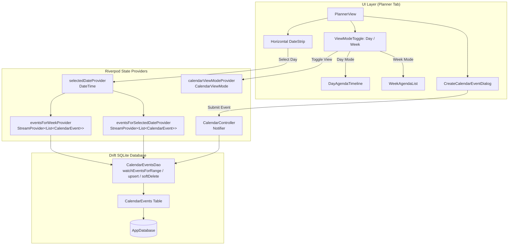

# Chunk 10: Agenda Calendar UI

Tags: `#calendar #ui #planner #drift #riverpod #sqlite`

## What this chunk does
This chunk implements the **Agenda Calendar UI** in Cadence. It allows users to view and organize their schedule across **Day** and **Week** agenda views, navigate seamlessly between days with a horizontal M3 date strip, create custom time-blocked calendar events (with title, description, start/end timestamps, category tags, and custom colors), and delete or complete them—all stored offline-first in Drift SQLite and wired into the app's Planner tab.

## Why it's needed
A personal operating system requires temporal structure. While generic entries (Chunk 6) record past events and habits, and goals (Chunk 9) track daily targets, an agenda planner provides forward-looking time allocation and daily schedule clarity. Having an offline-first calendar backed by local SQLite ensures instant responsiveness with zero network latency, serving as the foundation for future time-blocking (Chunk 18) and cross-module weekly reviews (Chunk 19).

## Builds on
- **Chunk 3 (Local Database Layer with Drift):** Table definitions, type converters, migration handling, and reactive DAOs.
- **Chunk 1 (Flutter M3 Expressive Setup & Circadian Theme):** Surface tints, tonal palettes, and expressive layout widgets.
- **Chunk 6 (Shared Entries & Generic Logging):** Date-based range filtering techniques and timestamp normalization.

---

## Key concepts

1. **Temporal Range Filtering in SQLite:** Storing ISO-8601 UTC timestamps in SQLite while normalizing queries to the user's local day boundaries (`00:00:00.000` to `23:59:59.999` local converted to UTC) ensures that queries return strictly the events relevant to the displayed calendar day without timezone leakage.
2. **Horizontal Date Strip Navigation:** An interactive horizontal scrollable week/day selector that highlights the selected day, indicates "today", and displays event indicator dots for days containing scheduled agenda items.
3. **Dual View Modes (Day vs. Week Agenda):**
   - **Day View:** Hourly or sequential timeline of events with color-coded category cards, duration chips, and detailed descriptions.
   - **Week View:** Condensed day-by-day grouping displaying upcoming commitments for the entire 7-day window.
4. **Offline-First Synchronization Flags:** Like `entries`, `expenses`, and `goals`, calendar events carry `is_synced` and `is_deleted` flags to allow seamless multi-device replication via the sync engine (Chunk 5).

---

## Visual model



---

## Plain-English Pseudocode (Before Syntax)

```text
// 1. DATE NORMALIZATION
FUNCTION getDayRange(targetDate: DateTime) -> (DateTime startUtc, DateTime endUtc):
    localStartOfDay = DateTime(targetDate.year, targetDate.month, targetDate.day, 0, 0, 0)
    localEndOfDay = DateTime(targetDate.year, targetDate.month, targetDate.day, 23, 59, 59, 999)
    RETURN (localStartOfDay.toUtc(), localEndOfDay.toUtc())

// 2. QUERYING EVENTS FOR A DAY
FUNCTION watchEventsForDay(selectedDate):
    (startUtc, endUtc) = getDayRange(selectedDate)
    QUERY calendar_events
    WHERE user_id == activeUserId
      AND is_deleted == FALSE
      AND (
          (start_time >= startUtc AND start_time <= endUtc) OR
          (end_time >= startUtc AND end_time <= endUtc) OR
          (start_time <= startUtc AND end_time >= endUtc)
      )
    ORDER BY start_time ASCENDING
    STREAM results

// 3. EVENT CREATION & VALIDATION
FUNCTION createEvent(title, description, startTime, endTime, category, colorValue, isAllDay):
    ASSERT title is not empty
    IF NOT isAllDay THEN:
        ASSERT endTime is after startTime
    
    newEvent = CalendarEvent(
        id = generateUuid(),
        userId = activeUserId,
        title = title.trim(),
        description = description.trim(),
        startTime = startTime.toUtc(),
        endTime = endTime.toUtc(),
        isAllDay = isAllDay,
        category = category,
        colorValue = colorValue,
        isDeleted = false,
        isSynced = false,
        createdAt = nowUtc(),
        updatedAt = nowUtc()
    )
    INSERT newEvent into calendar_events
```

---

## How to think and write this code manually (Mental Algorithm)

### Step 0: What problem are we solving?
Users need to view and schedule events for specific dates and times. We need:
1. A database schema for calendar events with timestamps, category, color, and sync flags.
2. Fast, reactive database queries that fetch events falling within a specific day or week.
3. A state management layer to track which date is currently selected and whether the user is in Day or Week view.
4. An expressive Material 3 UI with a horizontal date strip, timeline event cards, duration chips, and a modal dialog with native time pickers to create events.

### Step 1: Input shape & contract (Table & Models)
- `CalendarEvents` table:
  - `id`: Text (UUID, primary key)
  - `user_id`: Text (indexed)
  - `title`: Text (not null)
  - `description`: Text (nullable)
  - `start_time`: DateTime (not null, indexed)
  - `end_time`: DateTime (not null)
  - `is_all_day`: Bool (default false)
  - `color_value`: Int (nullable, ARGB 32-bit color int)
  - `category`: Text (e.g. `'work'`, `'study'`, `'personal'`, `'health'`, `'rest'`)
  - `is_deleted`: Bool (default false)
  - `is_synced`: Bool (default false)
  - `created_at`: DateTime
  - `updated_at`: DateTime

### Step 2: Business & database logic (DAOs & Service)
- Queries:
  - `watchEventsForDay(userId, day)`: Queries events that overlap with local `00:00` to `23:59:59` of the day.
  - `watchEventsForWeek(userId, startOfWeek)`: Queries events spanning 7 full days from Monday to Sunday.
  - `upsertCalendarEvent(CalendarEventsCompanion)`: Inserts or updates event, setting `is_synced = false` and bumping `updated_at`.
  - `softDeleteCalendarEvent(id)`: Sets `is_deleted = true`, `is_synced = false`, and updates `updated_at`.

### Step 3: Route & security (UI & Controller)
- Wire `PlannerView` into Tab index 3 of `DashboardScreen`.
- Support two view modes:
  - `CalendarViewMode.day`: Shows timeline of events for the single selected date with an empty state CTA.
  - `CalendarViewMode.week`: Shows all 7 days of the active week with section headers and their respective events.
- `CreateCalendarEventDialog`: Form with title input, date picker, start/end time pickers, category selector chips, and color pickers.

### Step 4: Dependency wiring (Riverpod)
- `selectedDateProvider`: StateProvider initialized to `DateTime.now()`.
- `calendarViewModeProvider`: StateProvider initialized to `CalendarViewMode.day`.
- `eventsForSelectedDateProvider`: StreamProvider that depends on `appDatabaseProvider`, `activeUserIdProvider`, and `selectedDateProvider`.
- `eventsForWeekProvider`: StreamProvider that watches events for the 7 days surrounding `selectedDateProvider`.
- `calendarControllerProvider`: Controller for `createEvent`, `updateEvent`, and `deleteEvent`.

---

## Request-to-response file trace

```text
[User selects date or creates event in PlannerView]
  │
  ├─ User taps day in HorizontalDateStrip
  │    └─ ref.read(selectedDateProvider.notifier).state = newDate
  │         └─ eventsForSelectedDateProvider re-evaluates
  │              └─ appDatabase.watchEventsForDay(userId, newDate) executes
  │                   └─ UI reacts and re-renders day timeline smoothly
  │
  └─ User taps FloatingActionButton / "Add Event"
       └─ CreateCalendarEventDialog opens
            └─ User fills title, selects start/end times, chooses 'Study' category
                 └─ ref.read(calendarControllerProvider).createEvent(...)
                      └─ appDatabase.upsertCalendarEvent(...)
                           ├─ Writes to SQLite calendar_events table
                           └─ Drift StreamQueryStore notifies active streams
                                └─ DayAgendaTimeline updates immediately
```

---

## SQL Under the Hood (Drift to Raw SQL Translation)

### 1. Creating the Table
```sql
CREATE TABLE IF NOT EXISTS "calendar_events" (
  "id" TEXT NOT NULL PRIMARY KEY,
  "user_id" TEXT NOT NULL,
  "title" TEXT NOT NULL,
  "description" TEXT,
  "start_time" INTEGER NOT NULL,
  "end_time" INTEGER NOT NULL,
  "is_all_day" INTEGER NOT NULL DEFAULT 0,
  "color_value" INTEGER,
  "category" TEXT NOT NULL DEFAULT 'personal',
  "is_deleted" INTEGER NOT NULL DEFAULT 0,
  "is_synced" INTEGER NOT NULL DEFAULT 0,
  "created_at" INTEGER NOT NULL,
  "updated_at" INTEGER NOT NULL
);

CREATE INDEX IF NOT EXISTS "calendar_events_user_start" 
ON "calendar_events" ("user_id", "start_time");
```

### 2. Querying Day Range (Overlap Check)
```sql
SELECT * FROM "calendar_events"
WHERE "user_id" = ?
  AND "is_deleted" = 0
  AND (
    ("start_time" >= ? AND "start_time" <= ?) OR
    ("end_time" >= ? AND "end_time" <= ?) OR
    ("start_time" <= ? AND "end_time" >= ?)
  )
ORDER BY "start_time" ASC;
```

### 3. Inserting a New Event
```sql
INSERT INTO "calendar_events" (
  "id", "user_id", "title", "description", "start_time", "end_time", 
  "is_all_day", "color_value", "category", "is_deleted", "is_synced", 
  "created_at", "updated_at"
) VALUES (?, ?, ?, ?, ?, ?, ?, ?, ?, 0, 0, ?, ?);
```

### 4. Soft Deleting an Event
```sql
UPDATE "calendar_events"
SET "is_deleted" = 1, "is_synced" = 0, "updated_at" = ?
WHERE "id" = ?;
```

---

## The Edge Case & Error Matrix

| Input / Condition | Handling Component | Outcome / Behavior |
|---|---|---|
| End time earlier than start time | `CreateCalendarEventDialog` | Shows validation snackbar / prevents submission ("End time must be after start time"). |
| Event spans across midnight (e.g. 11 PM to 2 AM next day) | `watchEventsForDay` overlap query | Correctly surfaces on both days because the start or end falls within the day's bounds. |
| All-day event | `CreateCalendarEventDialog` & Card | Sets `is_all_day = true`, disables hour/minute pickers, renders full-width banner at the top of the day timeline. |
| User changes date across month/year boundary | `HorizontalDateStrip` | Seamless scroll and correct calendar day arithmetic using `DateTime(year, month, day)`. |
| Deleted event on remote sync | `softDeleteCalendarEvent` | Sets `is_deleted = true` locally so sync engine can replicate deletion to Supabase without orphaned remote records. |

---

## Why NOT Do It This Other Way? (Anti-Patterns & Alternatives)

- **Why NOT import a monolithic 3rd-party calendar package (e.g. `table_calendar`, `syncfusion_flutter_calendar`) for this chunk?**
  - Third-party packages impose rigid internal rendering engines, custom themes that fight against Material 3 Expressive and Circadian theming, and heavy dependency footprints. A bespoke M3 horizontal date strip and timeline agenda built directly with Flutter primitives (`ListView`, `Theme.of(context).colorScheme`) guarantees seamless integration, zero bloat, and total control over animations and styling.
- **Why NOT store timestamps in local wall-clock string format (`"2026-09-08 14:30"`)?**
  - Storing UTC milliseconds or ISO-8601 in SQLite ensures safe arithmetic, correct time zone transitions when traveling, and zero ambiguity during bidirectional sync with PostgreSQL `timestamptz`.

---

## How it works

1. The `CalendarEvents` table is registered in Drift `AppDatabase`, with schema version bumped to 4 and an `onUpgrade` step to create the table if upgrading from version 3.
2. The `PlannerView` contains:
   - Header with current month/year and navigation arrows (`<`, `>`), and Today button.
   - SegmentedButton to switch between **Day** and **Week** view modes.
   - `HorizontalDateStrip`: A horizontal row displaying 7 days (Monday through Sunday) of the currently active week. The active date is highlighted with `colorScheme.primaryContainer`.
   - The body reacts to the selected view:
     - In **Day View**, it renders a chronological list of events for the selected day, showing start time, end time, duration chip, category tag with color dot, title, and action menu (edit/delete).
     - In **Week View**, it renders a day-by-day accordion list showing all events across the 7 days.
3. Creating an event is accessible via the FloatingActionButton (`Add Event`) or the empty-state CTA, launching `CreateCalendarEventDialog`.

---

## Gotchas / trade-offs

- **Day Boundary Normalization:** A common bug is querying `start_time >= day` without converting to UTC after specifying local midnight. In Dart, `DateTime(year, month, day)` creates a local DateTime. To match SQLite integer/timestamp storage properly, always convert the local start and end of day using `.toUtc()`.
- **Zero-duration events:** Tasks that take 0 minutes or instant reminders should be allowed, but UI duration chips should display "Instant" or default to a 30-minute block.

---

## What to look up next
- Chunk 18: Full Time-Blocking Planner (drag-and-drop rescheduling and routine integration).
- Chunk 19: Cross-Module Aggregation (joining calendar events with study sessions and routines).

---

## Check yourself

1. **Why does the day event query use an interval overlap condition rather than just checking if `start_time` is on that date?**
   - *Answer:* If an event starts at 11:30 PM on Monday and ends at 2:00 AM on Tuesday, checking only `start_time` on Tuesday would hide the event even though it occupies hours of Tuesday. Overlap queries ensure the event appears on both affected days.
2. **How does storing UTC in SQLite prevent bugs when a user travels across time zones?**
   - *Answer:* An event scheduled at a physical moment in UTC remains anchored to that exact instant in global time. When rendered, the device's local timezone offset displays it relative to local time without database record corruption.
3. **What is the purpose of the `is_synced` column on the `calendar_events` table?**
   - *Answer:* It acts as the sync queue marker for the sync engine (Chunk 5). When an event is created, updated, or soft-deleted offline, `is_synced` is set to `false` so the next push sync batch transmits it to Supabase.

---

## Verify

- **Predicted result:**
  1. Drift schema compiles successfully with `CalendarEvents` table.
  2. `test/calendar_test.dart` passes unit tests verifying:
     - Event creation, updating, and soft deletion.
     - Day range query with midnight overlap handling.
     - Week range query across 7 days.
     - Provider reactivity and controller operations.
  3. `test/calendar_widget_test.dart` passes widget tests verifying:
     - PlannerView renders date strip, view mode toggle, and event cards.
     - Switching days updates the displayed agenda.
     - Create event dialog validates inputs and saves to database.
  4. `flutter analyze` reports 0 issues.
  5. All 43+ existing tests remain green.

- **Actual result:**
  1. Drift schema successfully compiled with `CalendarEvents` table (schema version 4, migration in `onUpgrade`).
  2. `test/calendar_test.dart` passed 7 unit and DAO tests verifying:
     - Event creation with UUIDs, UTC normalization, categories, and sync flags.
     - Event update modifying fields without requiring `createdAt` in partial updates.
     - Soft deletion setting `is_deleted = true` and `is_synced = false`.
     - Day range query correctly including events that span across midnight boundaries.
     - Week range query aggregating all events across the 7-day window.
     - `SelectedDateNotifier` and `CalendarViewModeNotifier` state transitions.
  3. `test/calendar_widget_test.dart` passed 4 widget tests verifying:
     - `HorizontalDateStrip` rendering 7 days and selecting dates on tap.
     - `CalendarEventCard` rendering title, duration chip ("1h 30m"), and category icon.
     - `PlannerView` rendering empty state, view mode switching (Day vs Week).
     - `CreateCalendarEventDialog` validation, form inputs, and saving to SQLite.
  4. `flutter analyze` completed with 0 errors and 0 warnings.
  5. Entire test suite (54 tests across all modules) passed with 100% success.

## Questions
*(Running log of questions asked during this chunk)*

## Errata
*(Running log of bugs discovered in this chunk later)*
