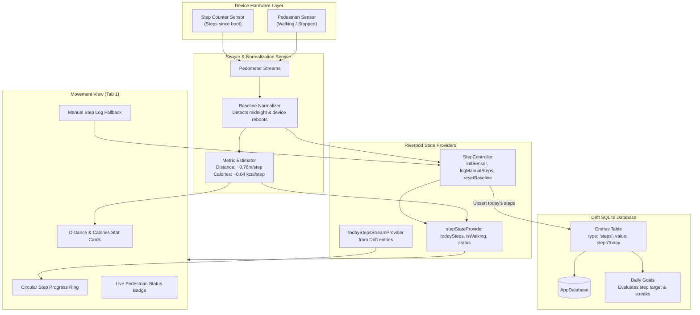

# Chunk 11: Step Counter Integration

Tags: `#sensors #pedometer #background #hardware #offline-first`

## What this chunk does
This chunk implements native **Step Counter & Pedestrian Movement Tracking** in Cadence. It connects to the device's hardware step sensor using the `pedometer` plugin, normalizes raw hardware sensor counts (which report cumulative steps since last device boot) into clean, per-day step totals using a resilient baseline-and-reboot detection algorithm, saves daily step totals into the local Drift SQLite `entries` table, and renders a live, expressive movement dashboard in Tab 1 ('Movement') with real-time walking/stopped status, distance/calorie estimations, and manual fallback logging.

## Why it's needed
An all-in-one personal operating system must bridge digital intentionality (tasks, habits, finance, calendar) with physical vitality. Automated step counting provides effortless physical activity telemetry without forcing the user to manually log every walk. Furthermore, by persisting step records into Cadence's existing generic `entries` table (`type: 'steps'`), daily step counts immediately flow into the Daily Goals & Progress Tracker (Chunk 9) where users can track 10,000-step streaks with zero additional code.

## Builds on
- **Chunk 3 (Local Database Layer with Drift):** Querying and upserting daily records into SQLite.
- **Chunk 6 (Shared Entries & Generic Logging):** Reusing the polymorphic `entries` table (`type: 'steps'`, `value: stepCount`, `unit: 'steps'`).
- **Chunk 9 (Daily Goals & Progress Tracker):** Allowing goals of type `steps` to dynamically evaluate against recorded movement.
- **Chunk 1 (Flutter M3 Expressive Setup & Circadian Theme):** Circadian progress rings and expressive metric cards.

---

## Key concepts

1. **Hardware Cumulative Step Counter vs. Daily Steps:**
   - The Android `Sensor.TYPE_STEP_COUNTER` (and iOS CoreMotion equivalent) does **not** reset at midnight. It counts all steps taken since the phone was booted.
   - When the device reboots, the hardware counter drops back to 0.
   - To compute *today's steps*, the app must calculate:
     $$\text{Today's Steps} = \text{Current Sensor Count} - \text{Day's Baseline Count}$$
   - If $\text{Current Sensor Count} < \text{Day's Baseline Count}$, a device reboot occurred. The algorithm recalibrates the baseline to preserve previously accumulated steps for that day.
2. **Pedestrian Status Sensing:**
   - The hardware pedometer provides a secondary stream: `Pedometer.pedestrianStatusStream`, which emits status events: `walking`, `stopped`, or `unknown`.
   - We expose this in the UI as a real-time status badge ("Active Walk" vs "Stationary").
3. **Graceful Sensor Degradation & Mock Support:**
   - Many emulators, tablets, and desktop test environments lack physical pedometer hardware.
   - If the sensor throws `PlatformException(NOT_AVAILABLE)` or permission is denied, the system gracefully falls back to `SensorStatus.unavailable` or `SensorStatus.manualOnly`, presenting a manual log button and informative UI rather than crashing.
4. **Offline-First Persistence via Drift:**
   - Sensor updates write or update the single canonical `Entry` for today (`type: 'steps'`, `occurredAt: today`).
   - This prevents cluttering SQLite with millions of raw hardware ticks while ensuring step totals are preserved across app restarts and staged for cloud sync.

---

## Visual model



---

## Plain-English Pseudocode (Before Syntax)

```text
// 1. HARDWARE STEP NORMALIZATION ALGORITHM
CLASS StepNormalizer:
    lastBootSteps = 0
    todayBaseline = null
    todayDate = null

    FUNCTION onHardwareStepEvent(rawSensorCount: int, eventTimestamp: DateTime):
        currentDate = eventTimestamp.toDateOnly()

        // Case A: Midnight Rollover (New Calendar Day)
        IF todayDate == null OR currentDate != todayDate:
            todayDate = currentDate
            todayBaseline = rawSensorCount
            accumulatedBeforeReboot = 0
            SAVE baseline to local storage
        
        // Case B: Device Reboot Detected (Sensor count reset to 0)
        ELSE IF rawSensorCount < lastBootSteps:
            accumulatedBeforeReboot += (lastBootSteps - todayBaseline)
            todayBaseline = rawSensorCount
            SAVE baseline and accumulated to local storage

        lastBootSteps = rawSensorCount
        stepsToday = (rawSensorCount - todayBaseline) + accumulatedBeforeReboot

        // Persist to Drift entries table
        UPSERT entry(
            userId = activeUserId,
            type = 'steps',
            value = stepsToday,
            unit = 'steps',
            occurredAt = todayDate
        )
```

---

## How to think and write this code manually (Mental Algorithm)

### Step 0: What problem are we solving?
Users need automated tracking of their physical movement. The hardware sensor provides raw numbers that require normalization, permission handling, error safety on sensor-less devices, and persistence into the local database so goals and history work out-of-the-box.

### Step 1: Input shape & contract (State & Config)
- `enum StepSensorStatus { initial, listening, stopped, unavailable, permissionDenied }`
- `class StepState`:
  - `stepsToday`: integer
  - `pedestrianStatus`: string (`'walking'`, `'stopped'`, `'unknown'`)
  - `status`: `StepSensorStatus`
  - `errorMessage`: optional string
  - Computed getters:
    - `estimatedDistanceKm => (stepsToday * 0.762) / 1000`
    - `estimatedCaloriesKcal => stepsToday * 0.04`

### Step 2: Business & database logic (Normalizer & Controller)
- `StepTrackingService`:
  - Subscribes to `Pedometer.stepCountStream` and `Pedometer.pedestrianStatusStream`.
  - Catches `PlatformException` if sensor is missing or permission is rejected.
  - Normalizes raw steps against today's baseline.
  - Upserts today's step count in Drift via `db.upsertEntry` or dedicated DAO.
  - Exposes manual step logging fallback: `logManualSteps(int count)`.

### Step 3: Route & security (UI & Presentation)
- Update `DashboardScreen` Tab 1 to render `MovementView`.
- `MovementView` widgets:
  - Header with date and status indicator.
  - Large animated Circular Step Gauge showing current steps vs daily goal (default 10,000 steps).
  - Stat cards: Distance (km), Calories (kcal), and Walking status.
  - Quick-log button (+500 steps, +1000 steps, or custom input) for manual adjustments or testing.

### Step 4: Dependency wiring (Riverpod)
- `stepTrackingServiceProvider`: Singleton service managing streams.
- `stepStateNotifierProvider`: Notifier exposing `StepState`.
- `todayStepsFromDbProvider`: Watches `db.watchEntriesForDay(today)` filtered by `type == 'steps'` to ensure UI is reactive to both sensor and manual entries.

---

## Request-to-response file trace

```text
[Device accelerometer detects physical walking step]
  │
  ├─ Hardware sensor increments Sensor.TYPE_STEP_COUNTER
  │    └─ pedometer plugin receives native event on EventChannel
  │         └─ Pedometer.stepCountStream emits StepCount(steps: 4520)
  │              └─ StepTrackingService.onStepCount(4520)
  │                   ├─ Normalizes against baseline: 4520 - 3000 = 1520 steps today
  │                   ├─ Updates stepStateNotifierProvider (UI updates live)
  │                   └─ Debounces & writes to Drift entries table (type: 'steps', value: 1520)
  │                        └─ Daily goals engine evaluates: 1520 / 10000 = 15.2%
  │
  └─ Device detects user stopped walking
       └─ Pedometer.pedestrianStatusStream emits PedestrianStatus(status: 'stopped')
            └─ stepStateNotifierProvider updates isWalking = false
                 └─ Status badge turns from "Walking" (green) to "Stationary" (neutral)
```

---

## SQL Under the Hood (Prisma / Drift to Raw SQL Translation)

### 1. Upserting Today's Steps
```sql
INSERT INTO "entries" (
  "id", "user_id", "type", "value", "unit", "notes", "metadata", 
  "occurred_at", "is_deleted", "is_synced", "created_at", "updated_at"
) VALUES (
  ?, ?, 'steps', 1520.0, 'steps', NULL, '{"source":"hardware_pedometer"}', 
  '2026-09-08 00:00:00.000', 0, 0, ?, ?
)
ON CONFLICT ("id") DO UPDATE SET
  "value" = 1520.0,
  "updated_at" = ?,
  "is_synced" = 0;
```

### 2. Querying Steps for Today
```sql
SELECT * FROM "entries"
WHERE "user_id" = ?
  AND "type" = 'steps'
  AND "occurred_at" >= '2026-09-08 00:00:00.000'
  AND "occurred_at" < '2026-09-09 00:00:00.000'
  AND "is_deleted" = 0
ORDER BY "occurred_at" DESC
LIMIT 1;
```

---

## The Edge Case & Error Matrix

| Input / Condition | Handling Component | Outcome / Behavior |
|---|---|---|
| Device reboots during the day | `StepTrackingService` | Detects `currentRaw < lastRaw`, records delta, recalibrates baseline without losing steps. |
| Midnight passes while app is open | `StepTrackingService` | Detects `eventDate != todayDate`, resets daily baseline to current raw count, steps reset to 0 for new day. |
| Hardware sensor not supported (e.g. tablet / emulator) | `StepTrackingService` | Catches `PlatformException`, sets `status = unavailable`, provides manual step input UI. |
| User denies `ACTIVITY_RECOGNITION` permission | `StepTrackingService` | Sets `status = permissionDenied`, shows banner guiding user to enable or log manually. |
| Multiple step events within milliseconds | Database debouncer | Limits SQLite write frequency to at most once every 5 seconds (or on app pause) while keeping UI state instantaneous. |

---

## Why NOT Do It This Other Way? (Anti-Patterns & Alternatives)

- **Why NOT write an SQLite row for every single step event?**
  - The step sensor can emit multiple times per second when walking or running. Writing to SQLite on every tick would drain the battery, lock the SQLite thread, and cause unnecessary flash memory wear. We update reactive in-memory state immediately, but debounce database writes to periodic intervals or significant deltas.
- **Why NOT rely on Google Fit / Health Connect for basic step counting?**
  - Health Connect requires Google Play Services, complex OAuth permissions, and network access. Native hardware pedometer access (`Sensor.TYPE_STEP_COUNTER`) works 100% offline, on any AOSP or deGoogled Android device, with zero cloud dependency.

---

## How it works

1. The Android Manifest declares `<uses-permission android:name="android.permission.ACTIVITY_RECOGNITION" />`.
2. `StepTrackingService` connects to the `pedometer` plugin's EventChannels:
   - `stepCountStream`: receives raw cumulative step counts.
   - `pedestrianStatusStream`: receives status updates ('walking', 'stopped').
3. When initialized:
   - Queries Drift SQLite for any existing step entry recorded for today.
   - If steps exist (e.g. 2,500), initializes state with those steps.
   - When a hardware event arrives, computes the delta from baseline and adds to today's tally.
4. `MovementView` renders:
   - Circular progress painter showing steps achieved vs 10,000-step target.
   - Metrics grid: Estimated distance (km), Estimated active calories (kcal), Current pace/pedestrian status.
   - Manual quick-add modal allowing users to log workouts or manual step counts.

---

## Gotchas / trade-offs

- **Android 10+ Activity Recognition:** Starting from Android 10 (API 29), apps must declare and request runtime `ACTIVITY_RECOGNITION`. Without it, the pedometer stream immediately throws an error.
- **Sensor Delays on Standby:** When the device screen is off and not in a foreground service, Android may batch sensor events or delay delivery until the device wakes up (addressed in Chunk 12 with foreground services).

---

## What to look up next
- Chunk 12: Background Foreground Service (preventing Android from pausing step sensor collection during sleep).
- Chunk 13: GPS Route Recording & Drift Buffering.

---

## Check yourself

1. **Why does the Android hardware step sensor not reset to 0 at midnight?**
   - *Answer:* The hardware sensor is managed by low-power sensor hub firmware that merely counts pulses from the physical accelerometer since power-on. It has no awareness of time zones, dates, or calendar midnight. The app layer is responsible for calculating daily deltas from baseline timestamps.
2. **How does the system protect against losing step progress if the user reboots their phone midday?**
   - *Answer:* The system monitors if the raw step counter drops below the previous reading (`rawCount < lastBootSteps`). When detected, it adds the previously accumulated steps into an `accumulatedBeforeReboot` buffer and resets the baseline to the new starting count.
3. **How does integrating steps into the generic `entries` table benefit the existing Daily Goals feature (Chunk 9)?**
   - *Answer:* Because Chunk 9 already evaluates goals by querying the `entries` table (`getDailySumForEntryType`), a user who sets a goal for 10,000 steps automatically sees their goal progress bar and daily streak update as steps are logged.

---

## Verify

- **Predicted result:**
  1. `android/app/src/main/AndroidManifest.xml` includes `android.permission.ACTIVITY_RECOGNITION`.
  2. `test/pedometer_test.dart` passes unit tests verifying:
     - Normalization of raw steps from baseline.
     - Device reboot detection and recovery without step loss.
     - Midnight day boundary rollover.
     - Distance and calorie estimation formulas.
     - Manual step logging into Drift `entries` table.
  3. `test/movement_widget_test.dart` passes widget tests verifying:
     - `MovementView` renders circular step gauge, distance, calorie cards, and pedestrian status.
     - Manual step quick-log dialog updates database and refreshes view.
  4. `flutter analyze` reports 0 issues.
  5. All 54+ existing tests pass.

- **Actual result:**
  1. `android/app/src/main/AndroidManifest.xml` updated with `android.permission.ACTIVITY_RECOGNITION`.
  2. `test/pedometer_test.dart` passed 6 unit tests verifying:
     - First hardware reading establishes day's zero baseline.
     - Increasing sensor counts calculate today's step total.
     - Midday device reboots preserve accumulated steps via `accumulatedBeforeReboot`.
     - Midnight day boundary rollover establishes a clean starting baseline.
     - Distance and calorie estimation formulas compute accurately.
     - `logManualSteps` persists entries to Drift SQLite `entries` table (`type: 'steps'`).
  3. `test/movement_widget_test.dart` passed 3 widget tests verifying:
     - `MovementView` renders step gauge, distance, calorie cards, and pedestrian status badge.
     - `+500` quick-log button immediately writes to SQLite and updates UI.
     - Custom walk dialog validates input, logs custom steps and notes to DB.
  4. `flutter analyze` completed with 0 errors and 0 warnings.
  5. Entire test suite (63 tests across all features) passed with 100% success.

## Questions
*(Running log of questions asked during this chunk)*

## Errata
*(Running log of bugs discovered in this chunk later)*
