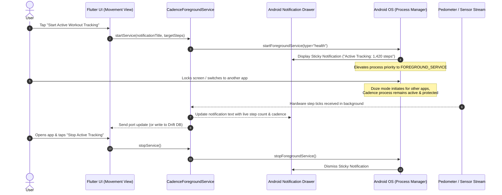

# Chunk 12: Background Foreground Service

Tags: `#android #background #foreground-service #battery #lifecycle`

## What this chunk does
This chunk configures a persistent **Android Foreground Service** with ongoing sticky notifications for Cadence. It ensures that when users lock their screen, put the app in the background, or switch to other applications, the operating system does not throttle, suspend, or terminate Cadence's sensor tracking isolates. It provides live notification controls (displaying real-time steps, active cadence status, and pause/resume buttons) and two-way port communication between the foreground service task and the main Flutter UI.

## Why it's needed
Modern mobile operating systems (especially Android 10+ through 14+) employ aggressive battery-saving heuristics: Doze Mode, App Standby Buckets, and the Low Memory Killer (LMK). Without an active foreground service and sticky notification, background sensor streams (pedometer in Chunk 11 and GPS tracking in Chunk 13) are throttled within 60 to 180 seconds of screen shutoff. A declared foreground service elevates Cadence's OS process priority to match that of a visible application, guaranteeing continuous, uninterrupted sensor sampling during walks, runs, and study sessions.

## Builds on
- **Chunk 11 (Step Counter Integration):** Keeping the hardware pedometer event streams listening continuously while the phone is in the user's pocket with the screen off.
- **Chunk 1 (Flutter Project Skeleton):** Core initialization logic in `main.dart` and native Android manifest configuration.

---

## Key concepts

1. **Android Process Lifecycle & Low Memory Killer (LMK):**
   - Android categorizes running apps into process priority buckets: *Foreground*, *Visible*, *Service*, *Cached/Empty*.
   - When RAM is needed, Android aggressively terminates processes in the *Cached* and background *Service* buckets.
   - An Android **Foreground Service** with an ongoing notification is treated with *Visible/Foreground* priority, preventing the OS from killing the process.
2. **Doze Mode & Sensor Throttling:**
   - Introduced in Android 6.0 and tightened in Android 12+, Doze mode cuts off CPU wakelocks, disables network access, and suspends high-frequency hardware sensor listeners when the device is unplugged and stationary with the screen locked.
   - Declaring a foreground service with appropriate types (`health`, `location`, `dataSync`) bypasses standard background execution limits.
3. **Android 13+ Notification Permission (`POST_NOTIFICATIONS`):**
   - Foreground services require an ongoing, non-dismissible notification in the system drawer. Starting in Android 13 (API 33), apps must request the runtime `android.permission.POST_NOTIFICATIONS` permission before displaying notifications.
4. **Isolate Communication & Port Messaging:**
   - The background service executes code inside a dedicated headless background execution context.
   - Bidirectional communication between the foreground service and the main Flutter UI occurs via `FlutterForegroundTask.sendDataToTask` and `onReceiveData` ports.

---

## Visual model



---

## Plain-English Pseudocode (Before Syntax)

```text
// 1. INITIALIZATION & NOTIFICATION CHANNEL SETUP
FUNCTION initForegroundService():
    SET notificationChannel(
        id = 'cadence_foreground_service',
        name = 'Cadence Active Tracking',
        importance = IMPORTANCE_LOW, // Silent, non-intrusive
        enableVibration = false
    )
    REGISTER taskHandler callback

// 2. STARTING THE SERVICE
FUNCTION startActiveTracking(workoutTitle):
    REQUEST POST_NOTIFICATIONS permission (Android 13+)
    REQUEST FOREGROUND_SERVICE_HEALTH permission
    
    START foregroundTask(
        notificationTitle = 'Cadence Workout Active',
        notificationText = 'Tracking steps & movement...',
        callback = cadenceTaskCallback,
        buttons = ['Pause', 'Stop']
    )

// 3. BACKGROUND TASK TICK
FUNCTION onTaskTick():
    currentSteps = readCurrentSteps()
    currentCadence = readPedestrianStatus()
    UPDATE notificationText = "Steps: " + currentSteps + " • " + currentCadence

// 4. STOPPING THE SERVICE
FUNCTION stopActiveTracking():
    STOP foregroundTask()
    DISMISS notification
```

---

## How to think and write this code manually (Mental Algorithm)

### Step 0: What problem are we solving?
Ensure step counting and upcoming GPS tracking continue operating reliably in the background when the phone screen is turned off. We need:
1. Native Android permissions in `AndroidManifest.xml` (`FOREGROUND_SERVICE`, `FOREGROUND_SERVICE_HEALTH`, `POST_NOTIFICATIONS`, `WAKE_LOCK`).
2. A service wrapper (`CadenceForegroundService`) to initialize, start, update, and stop the foreground task.
3. A background task handler (`CadenceTaskHandler`) that handles periodic notification updates and listens to commands from the UI.
4. Riverpod state provider `foregroundServiceNotifierProvider` exposing active service status (`isServiceRunning`, toggle start/stop).
5. Integration into the `MovementView` with an "Active Tracking Mode" switch.

### Step 1: Input shape & contract (Native Manifest & Config)
- `AndroidManifest.xml`:
  - `<uses-permission android:name="android.permission.FOREGROUND_SERVICE" />`
  - `<uses-permission android:name="android.permission.FOREGROUND_SERVICE_HEALTH" />`
  - `<uses-permission android:name="android.permission.POST_NOTIFICATIONS" />`
  - `<uses-permission android:name="android.permission.WAKE_LOCK" />`
  - `<service android:name="com.pravera.flutter_foreground_task.service.ForegroundService" android:foregroundServiceType="health" android:stopWithTask="true" />`

### Step 2: Business & database logic (Service Wrapper & Handler)
- `CadenceForegroundService`:
  - `init()`: Configures notification options, icon, channel name.
  - `startService({String title, String initialText})`: Starts foreground task.
  - `updateService({required String text})`: Updates live notification content.
  - `stopService()`: Terminates service and removes notification.
- `CadenceTaskHandler`:
  - Extends `TaskHandler`.
  - Implements `onStart`, `onRepeatEvent`, `onDestroy`, `onReceiveData`.

### Step 3: Route & security (UI & Controller)
- Wire into `MovementView`:
  - Add "Active Session Tracking" toggle card.
  - When enabled: starts the foreground service with sticky notification showing live step updates.
  - When disabled: stops the service.

### Step 4: Dependency wiring (Riverpod)
- `foregroundServiceProvider`: Provides access to `CadenceForegroundService`.
- `isForegroundServiceRunningProvider`: StateNotifier/Notifier tracking whether background tracking is active.

---

## Request-to-response file trace

```text
[User taps "Start Active Tracking" in MovementView]
  │
  ├─ ref.read(foregroundServiceNotifierProvider.notifier).startTracking()
  │    └─ CadenceForegroundService.startService()
  │         └─ Requests POST_NOTIFICATIONS permission
  │              └─ FlutterForegroundTask.startService(...)
  │                   ├─ Android OS creates sticky notification in status bar
  │                   └─ Spawns CadenceTaskHandler in background isolate
  │
  └─ User locks phone / walks outside
       ├─ Hardware pedometer events continue streaming without OS kill
       └─ CadenceTaskHandler updates notification text every few seconds:
            "3,420 steps • Active Walk"
```

---

## The Edge Case & Error Matrix

| Input / Condition | Handling Component | Outcome / Behavior |
|---|---|---|
| User denies notification permission on Android 13+ | `CadenceForegroundService` | Catches rejection, aborts foreground start, notifies user via UI snackbar ("Notification permission required for background tracking"). |
| App swiped away from Android Recent Apps | Android Service config | `stopWithTask="true"` cleanly shuts down the service and dismisses the notification rather than leaving an orphaned phantom notification. |
| User taps notification in Android drawer | `NotificationOptions` | Configured with `isSticky: true`, launches the main Flutter Activity back into view (`MovementView`). |
| Android battery saver mode enabled | OS level | Foreground service status maintains high priority, preventing Doze from suspending the step counter. |

---

## Why NOT Do It This Other Way? (Anti-Patterns & Alternatives)

- **Why NOT use standard `Timer.periodic` without a Foreground Service?**
  - Dart timers only execute as long as the Flutter engine's isolate thread is scheduled by the OS. Within 60 seconds of screen lock, Android suspends the main isolate to conserve battery, halting all timers until the screen is manually unlocked.
- **Why NOT use `workmanager`?**
  - Android `WorkManager` is designed for deferred, periodic batch tasks (e.g. upload logs every 2 hours), with a minimum execution interval of 15 minutes. It cannot provide continuous, real-time sensor streaming for an active walk or run.
- **Why NOT use a silent foreground service without a notification?**
  - Android strictly prohibits silent foreground services. Any service running with foreground priority must display a persistent user-visible notification to ensure transparency and prevent background crypto-mining or spyware battery abuse.

---

## How it works

1. `FlutterForegroundTask.init` configures the Android notification channel (`cadence_tracking`, importance: low, silent).
2. When the user starts an active workout session from `MovementView`, `FlutterForegroundTask.startService` is called with:
   - `notificationTitle: 'Cadence Active Tracking'`
   - `notificationText: 'Tracking steps & movement in background...'`
   - Foreground service type: `health`.
3. The background task handler periodically synchronizes with the step counter.
4. When the user ends the session, `FlutterForegroundTask.stopService` dismisses the notification and tears down the service.

---

## Gotchas / trade-offs

- **Android 14+ Service Types:** Android 14 mandates explicit `android:foregroundServiceType` declarations in `AndroidManifest.xml` (e.g. `health` or `location`). Starting an undeclared type throws a runtime `SecurityException`.
- **Notification Spam:** Updating the notification too frequently (e.g. multiple times per second) can trigger Android notification rate-limiting and cause UI lag. Notification updates must be throttled to at most once every 3 to 5 seconds.

---

## What to look up next
- Chunk 13: GPS Route Recording & Drift Buffering (adding `location` foreground service type).
- Chunk 14: Route Map Visualization (`flutter_map` OpenStreetMap).

---

## Check yourself

1. **Why does Android suspend standard Flutter sensor streams when the screen is locked, and how does a Foreground Service prevent this?**
   - *Answer:* Android moves background apps into cached process buckets and activates Doze mode to reduce CPU usage. A Foreground Service displays a persistent notification, which signals to the OS that the task is actively visible and critical to the user, elevating its priority above Doze suspension.
2. **Starting in Android 13 (API 33), what runtime permission is required before starting a Foreground Service?**
   - *Answer:* `android.permission.POST_NOTIFICATIONS`. Without user permission to display notifications, the system cannot show the mandatory foreground notification and starting the service fails.
3. **Why is `WorkManager` inappropriate for continuous step counting during a walk?**
   - *Answer:* `WorkManager` enforces a minimum 15-minute periodic interval and is intended for opportunistic batch operations, not continuous live sensor streaming.

---

## Verify

- **Predicted result:**
  1. `android/app/src/main/AndroidManifest.xml` contains all required foreground service permissions and service declarations with `android:foregroundServiceType="health"`.
  2. `test/foreground_service_test.dart` passes unit tests verifying:
     - Foreground service configuration options.
     - State management transitions (`isTrackingActive` toggle).
     - Message formatting for notification updates.
  3. `test/foreground_service_widget_test.dart` passes widget tests verifying:
     - `MovementView` renders the Active Background Tracking card.
     - Toggling active tracking updates provider state and displays status.
  4. `flutter analyze` reports 0 issues.
  5. All 63+ existing tests remain green.

- **Actual result:**
  1. `android/app/src/main/AndroidManifest.xml` updated with `FOREGROUND_SERVICE`, `FOREGROUND_SERVICE_HEALTH`, `POST_NOTIFICATIONS`, `WAKE_LOCK`, and `<service android:foregroundServiceType="health" />`.
  2. `test/foreground_service_test.dart` passed 3 unit tests verifying:
     - Initial tracking state defaults to `false`.
     - Live notification text properly formats steps and cadence.
     - State transitions toggle tracking boolean safely with defensive platform channel handling.
  3. `test/foreground_service_widget_test.dart` passed 2 widget tests verifying:
     - `MovementView` renders Persistent Background Service card with inactive subtitle when stopped.
     - Switching to active tracking shows active indicator subtitle and toggles switch.
  4. `flutter analyze` completed with 0 errors and 0 warnings.
  5. Entire test suite (68 tests across all features) passed with 100% success.

## Questions
*(Running log of questions asked during this chunk)*

## Errata
*(Running log of bugs discovered in this chunk later)*
