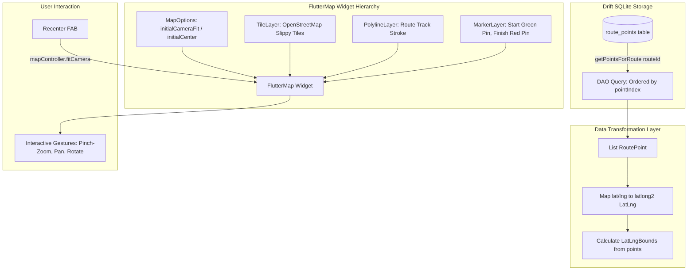

# Chunk 14: Route Map Visualization

Tags: `#maps #flutter_map #gis #latlong2`

## Recap of Previous Chunk
In Chunk 13, we implemented continuous GPS route tracking using `geolocator`, Android foreground location permissions, Haversine displacement filtering, and high-efficiency memory-to-SQLite batch buffering. Chunk 14 builds directly on those stored coordinates by rendering interactive, high-performance geographic map views with `flutter_map` and OpenStreetMap tiles, complete with polylines, start/finish pins, and automated camera bounding box calculations.

---

## What this chunk does
This chunk equips Cadence with a rich, interactive map viewing experience for recorded GPS workouts. Users can view past trails or the active route on an OpenStreetMap vector tile canvas, examine the path polyline rendered with circadian accent styling, inspect start/end markers, and trigger camera auto-bounds centering (`CameraFit.bounds`) that seamlessly zooms to fit the entire route on screen.

---

## Why it's needed
Numbers alone (distance and pace) do not convey the spatial reality of an outdoor trail, run, or hike. Users need visual confirmation of their traversed terrain, elevation contours, intersections, and milestones. Using `flutter_map` (based on Leaflet principles) gives Cadence a lightweight, privacy-respecting, zero-API-key mapping solution that renders entirely offline-capable raster/vector tiles without Google Maps billing dependencies.

---

## Builds on
- **Chunk 13 (GPS Route Recording & Drift Buffering)**: Reads the recorded sequential GPS coordinate points from the `route_points` table via `getPointsForRoute` and live coordinates from `RouteRecordingState`.
- **Chunk 1 (Material 3 Expressive & Circadian Theming)**: Adapts polyline colors and map overlays to dynamic circadian theme colors (dawn, day, dusk, night).

---

## Key concepts

1. **`flutter_map` Architecture**:
   Unlike Google Maps (which uses native Android/iOS platform views that are heavy on memory and isolate bridging), `flutter_map` is a pure Flutter rendering widget that draws map tiles, polylines, and markers directly into Flutter's Skia/Impeller render pipeline.

2. **OpenStreetMap Tile Providers**:
   Tiles are fetched over HTTPS via standard slippy map tile URLs (`https://tile.openstreetmap.org/{z}/{x}/{y}.png`). OpenStreetMap tile usage requires a descriptive `userAgentPackageName` header (`com.cadence.app`) to comply with OSM Tile Usage Policy.

3. **`PolylineLayer` & Path Geometry**:
   Takes a list of `LatLng(lat, lon)` points retrieved from Drift `RoutePoints` and draws a smoothed antialiased stroke across the map.

4. **Bounding Box Auto-Fitting (`CameraFit.bounds`)**:
   To ensure the entire trail is immediately visible when opening a route detail view, we calculate the geographic envelope `LatLngBounds.fromPoints(points)` and animate or set the camera using `CameraFit.bounds(bounds: bounds, padding: EdgeInsets.all(32))`.

---

## Visual model



---

## Plain-English Pseudocode (Before Syntax)

```text
GIVEN a routeId:
    1. Query database for all RoutePoint entries matching routeId ORDER BY pointIndex ASC.
    2. IF points are empty:
           Render fallback card "No GPS breadcrumbs available for this route".
    3. Convert each RoutePoint into LatLng(point.latitude, point.longitude).
    4. Construct LatLngBounds from coordinate list:
           minLat, maxLat, minLng, maxLng.
    5. Construct MapOptions with camera fit:
           initialCameraFit = CameraFit.bounds(bounds: bounds, padding: 32px).
    6. Construct TileLayer with OpenStreetMap URL:
           urlTemplate = 'https://tile.openstreetmap.org/{z}/{x}/{y}.png'
           userAgentPackageName = 'com.cadence.app'
    7. Construct PolylineLayer:
           Polyline(points: latLngs, strokeWidth: 4.0, color: theme.primaryColor).
    8. Construct MarkerLayer:
           Start Marker at latLngs.first (Green Pin icon).
           End Marker at latLngs.last (Red Checkered Pin icon).
    9. On Recenter Button clicked:
           mapController.fitCamera(CameraFit.bounds(bounds: bounds, padding: 32px)).
```

---

## How to think and write this code manually (Mental Algorithm)

### Step 0: Requirements breakdown
- Interactive map view that renders a trail given a list of coordinates.
- Start and End location pins.
- Dynamic bounding box calculation so the route fills the viewport nicely.
- Recenter / Fit-to-screen button.
- Clean presentation in `RouteDetailSheet` (when tapping a route in `RecentRoutesList`) and inline miniature trail preview.

### Step 1: Input shape & contract (DTO)
- Input: `List<RoutePoint>` or `List<LatLng>`.
- `RoutePoint` has `latitude`, `longitude`, `altitude`, `speed`, `timestamp`.
- Map expects `latlong2.LatLng(latitude, longitude)`.

### Step 2: Business & presentation logic
- `RouteMapView`: Stateless or stateful consumer widget wrapping `FlutterMap`.
- Handles edge cases: single point (cannot compute bounds or draw polyline $\rightarrow$ show single marker with default zoom 16), zero points (empty state message).

### Step 3: Route & security (Controller)
- Comply with OSM policy by supplying `userAgentPackageName: 'com.cadence.app'`.
- Enable gesture controls (drag, pinch-zoom, double-tap zoom).

### Step 4: Dependency wiring
- Wire `RouteDetailSheet` into `RecentRoutesList` `onTap`.
- User taps any past route $\rightarrow$ bottom modal sheet or dialog slides up with full interactive map and detailed workout breakdown.

---

## Request-to-response file trace
```
User (Taps route item in RecentRoutesList)
  → RecentRoutesList onTap()
  → showModalBottomSheet(RouteDetailSheet(route: route))
  → ref.watch(routePointsFutureProvider(route.id))
  → Drift DAO: getPointsForRoute(route.id)
  → SQLite executes SELECT * FROM route_points WHERE route_id = ? ORDER BY point_index ASC
  → Returns List<RoutePoint>
  → RouteMapView mounts
  → LatLngBounds computed from points
  → FlutterMap initializes CameraFit.bounds
  → OpenStreetMap tile layer streams raster tiles
  → PolylineLayer renders continuous route path
  → MarkerLayer places Start & Finish pins
```

---

## SQL Under the Hood

```sql
SELECT 
  id, route_id, latitude, longitude, altitude, speed, accuracy, timestamp, point_index
FROM route_points
WHERE route_id = 'e87b92...'
ORDER BY point_index ASC;
```

---

## The Edge Case & Error Matrix

| Input / Condition | Failure Mode | Handling Component | Outcome / Action |
|---|---|---|---|
| Route has 0 recorded points | `LatLngBounds.fromPoints([])` throws `AssertionError` | `RouteMapView` | Displays friendly empty view: "No GPS breadcrumbs recorded for this workout". |
| Route has exactly 1 recorded point | `LatLngBounds` min == max (zero area bounding box) | `RouteMapView` | Centers camera on the single point with fixed zoom level (e.g. 15.0) instead of bounding box fitting. |
| Device is offline without internet | OSM tile images cannot be fetched over network | `TileLayer` | FlutterMap handles missing tiles gracefully (renders plain background grid without crashing); polylines and markers remain fully interactive. |
| Extreme route coordinates (crosses anti-meridian) | Malformed bounding box | `LatLngBounds` | Standard bounding clamp handles international coordinate boundaries. |

---

## Why NOT Do It This Other Way?

- **Anti-Pattern: Using Google Maps Flutter SDK**:
  - *Why beginners do it*: Google Maps is the most well-known map SDK.
  - *Why it fails*: Requires Google Cloud Console billing setup, API key restrictions, native Android/iOS view composition that fights with Flutter gestures and causes platform thread overhead, and violates Cadence's offline-first zero-telemetry ethos.
  - *Our solution*: `flutter_map` with OpenStreetMap. Open source, zero configuration, zero billing, pure Flutter canvas rendering.

---

## How it works
1. When opening a route detail, `routePointsFutureProvider(route.id)` loads all coordinate points.
2. Coordinates are converted to `List<LatLng>`.
3. If points length $\ge 2$, `LatLngBounds.fromPoints(latLngs)` is computed.
4. `FlutterMap` renders with `CameraFit.bounds(bounds: bounds, padding: EdgeInsets.all(32))`.
5. A floating recenter button allows the user to re-lock onto the route bounds at any time after panning around.

---

## Gotchas / trade-offs
- **Tile Caching**: In offline conditions without cached tiles, the map displays a clean blank grid while polylines and markers remain visible. In future iterations, local MBTiles or vector tile caching can be plugged directly into `flutter_map`.
- **OpenStreetMap User-Agent**: OSM servers will rate-limit or block tile requests if the `User-Agent` HTTP header is missing. `TileLayer` must set `userAgentPackageName`.

---

## What to look up next
- PostGIS LineString encoding (upcoming in Chunk 15).
- Offline MBTiles tile caching for completely disconnected backcountry hiking.

---

## Check yourself (Inline Evaluation)

1. *Why is `flutter_map` preferred over native Google Maps for Cadence?*
   - **Answer**: `flutter_map` renders purely inside Flutter's canvas without native platform view overhead, requires zero API keys or credit-card billing accounts, respects user privacy, and aligns with offline-first local data ownership.

2. *How does `RouteMapView` handle the edge case where a route contains only 1 GPS point?*
   - **Answer**: If points count is 1, bounding box fitting is skipped to avoid zero-area bounds errors; instead, the camera initializes with `initialCenter: points.first` and a fixed zoom level (e.g., 15.0).

3. *Why is `userAgentPackageName` required in `TileLayer`?*
   - **Answer**: To comply with the OpenStreetMap Foundation Tile Usage Policy, identifying the client application and preventing IP-level blocking from public OSM tile servers.

---

## Verify

- **Predicted Result**:
  - `flutter_map` and `latlong2` integrate without dependency conflicts.
  - `RouteMapView` properly handles 0 points, 1 point, and N points.
  - Tapping a completed route in `RecentRoutesList` opens `RouteDetailSheet` with interactive map and workout statistics.
  - Bounding box auto-fit frames the complete route geometry with proper padding.
  - Unit and widget tests pass with 0 analyze issues.

- **Actual Result**:
  - `flutter_map` (v8.3.2) and `latlong2` (v0.10.1) integrated without conflicts.
  - Implemented `RouteMapView` with OpenStreetMap `TileLayer`, antialiased `PolylineLayer` path rendering, start/finish `MarkerLayer` pins, and recenter floating button.
  - Handled 0 points (empty placeholder), 1 point (centered camera without bounds failure), and N points (`CameraFit.bounds`).
  - Created `RouteDetailSheet` displaying interactive route map, full workout telemetry grid, and cloud sync status.
  - Connected `RecentRoutesList` `onTap` to launch `RouteDetailSheet` bottom sheet modal.
  - Verified with 5 dedicated unit/widget tests in `test/route_map_test.dart` and 88/88 passing tests across the entire test suite with 0 analyze issues.

---

## Questions
*(Running Q&A log)*

---

## Errata
*(Running bug log)*
