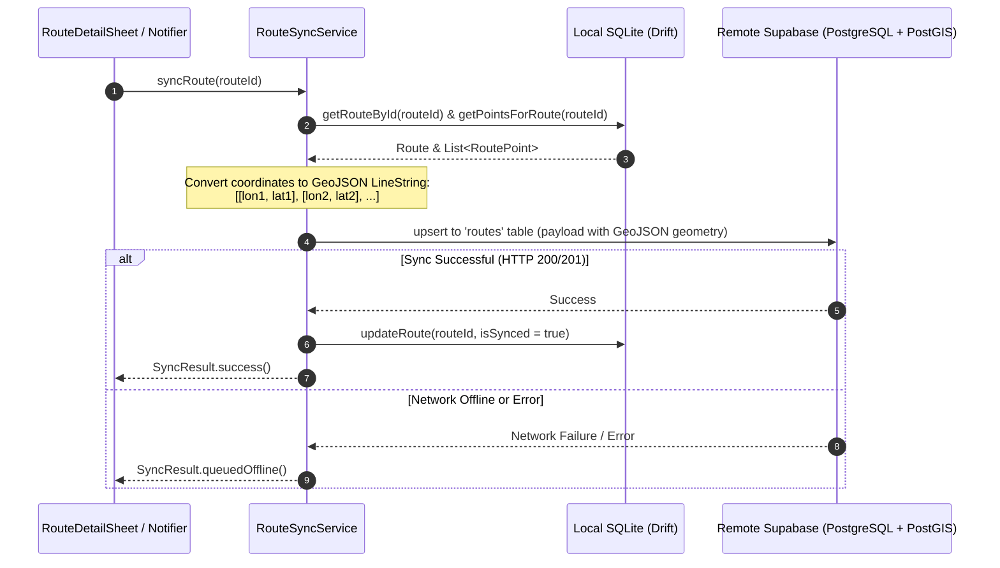

# Chunk 15: PostGIS Route Sync to Supabase

Tags: `#postgis #supabase #geo #sync #wkt`

## Recap of Previous Chunk
In Chunk 14, we implemented rich interactive map visualizations using `flutter_map` and OpenStreetMap vector tiles, rendering antialiased path polylines, start/finish pins, and automated bounding box camera fitting. Chunk 15 connects this spatial data to the cloud by serializing local Drift route breadcrumbs into PostGIS-compatible spatial geometries (`LineString`) and synchronizing completed workouts to Supabase PostgreSQL.

---

## What this chunk does
This chunk bridges the local SQLite route database with remote Supabase storage. Instead of naively uploading thousands of individual GPS point rows over mobile data, Cadence compresses the entire sequence of coordinates into a standardized PostGIS `LineString` geometry (or GeoJSON LineString). When a route finishes or the user taps "Sync", Cadence pushes the route metadata along with its spatial geometry to PostgreSQL, updating the local sync flag (`isSynced = true`).

---

## Why it's needed
Outdoor workouts easily accumulate 2,000 to 10,000 discrete coordinate points per hour. Storing and transmitting each point as a separate row in a remote relational database causes high network bandwidth consumption, slow HTTP roundtrips, and massive cloud database bloat. PostGIS geometry columns condense millions of vertices into indexed, queryable binary/text geometries that enable cloud spatial querying (e.g. `ST_Length`, `ST_Intersects`, bounding box spatial queries with GiST indexes) in a single compact row per workout.

---

## Builds on
- **Chunk 5 (Drift & Supabase Sync Engine)**: Reuses offline-first sync patterns, last-write-wins logic, and network connectivity checks.
- **Chunk 13 (GPS Route Recording & Drift Buffering)**: Reads completed `Routes` and sequential `RoutePoints` from Drift SQLite.
- **Chunk 14 (Route Map Visualization)**: Leverages coordinate validation and geometry boundaries.

---

## Key concepts

1. **PostGIS & Spatial Reference System (SRID 4326)**:
   PostGIS is the spatial database extender for PostgreSQL. SRID 4326 refers to the WGS 84 spatial reference system used by GPS worldwide, where coordinates are expressed as angular degrees of Latitude and Longitude.

2. **The Longitude-First Standard in GIS**:
   *Crucial GIS gotcha*: While everyday speech and mobile SDKs typically say "Latitude, Longitude" ($y, x$), GIS standards (OGC, PostGIS, GeoJSON, WKT) strictly specify coordinates in Cartesian order: $(x, y) \rightarrow (\text{Longitude}, \text{Latitude})$.
   - Example: San Francisco is Lat `37.7749`, Lon `-122.4194`.
   - In PostGIS WKT: `POINT(-122.4194 37.7749)`.

3. **Well-Known Text (WKT) & GeoJSON**:
   - **WKT**: `LINESTRING(-122.4194 37.7749, -122.4190 37.7752, -122.4185 37.7758)`
   - **GeoJSON**:
     ```json
     {
       "type": "LineString",
       "coordinates": [
         [-122.4194, 37.7749],
         [-122.4190, 37.7752],
         [-122.4185, 37.7758]
       ]
     }
     ```
   Supabase PostgreSQL can parse both directly using `ST_GeomFromText(wkt, 4326)` or `ST_GeomFromGeoJSON(json)`.

4. **Bandwidth Optimization**:
   Transforming 3,000 discrete SQLite rows into 1 single JSON payload reduces payload size from ~300 KB to ~40 KB and replaces 3,000 HTTP roundtrips with a single atomic upsert.

---

## Visual model



---

## Plain-English Pseudocode (Before Syntax)

```text
FUNCTION serializeRouteGeometry(points):
    IF points is empty:
        RETURN NULL
    IF points has 1 point:
        RETURN {
            "type": "Point",
            "coordinates": [point.longitude, point.latitude]
        }
    coordinatesList = []
    FOR EACH point IN points (sorted by pointIndex):
        coordinatesList.add([point.longitude, point.latitude])
    RETURN {
        "type": "LineString",
        "coordinates": coordinatesList
    }

FUNCTION syncRouteToSupabase(routeId):
    1. Fetch Route row and RoutePoints list from Drift SQLite.
    2. IF route is null: RETURN Error("Route not found").
    3. Check network connectivity. If offline:
           RETURN OfflineQueued("Device offline. Will sync when connected.")
    4. Construct GeoJSON geometry via serializeRouteGeometry(points).
    5. Construct Supabase payload:
           {
               "id": route.id,
               "user_id": currentUserId,
               "title": route.title,
               "activity_type": route.activityType,
               "status": route.status,
               "start_time": route.startTime.toIso8601String(),
               "end_time": route.endTime?.toIso8601String(),
               "total_distance_meters": route.totalDistanceMeters,
               "duration_seconds": route.durationSeconds,
               "avg_pace_seconds_per_km": route.avgPaceSecondsPerKm,
               "geometry": geoJsonGeometry,
               "updated_at": NOW().toIso8601String()
           }
    6. Send upsert to Supabase client:
           supabase.from('routes').upsert(payload)
    7. IF response is successful:
           Drift: UPDATE routes SET is_synced = true WHERE id = routeId.
           RETURN Success.
```

---

## How to think and write this code manually (Mental Algorithm)

### Step 0: Requirements breakdown
- Compact spatial serialization of route points (GeoJSON & WKT).
- Robust sync pipeline pushing routes to Supabase with error recovery.
- UI indicator showing sync status and manual sync trigger.
- Complete Supabase PostgreSQL schema migration script defining PostGIS extension and `routes` table with geometry column and GiST index.

### Step 1: Geometry serialization & contract
- `GeoSerializer`:
  - `toGeoJsonLineString(List<RoutePoint> points)`
  - `toWktLineString(List<RoutePoint> points)`
  - Ensures Longitude is always index 0 / first argument, Latitude is index 1 / second argument.

### Step 2: Sync service implementation
- `RouteSyncService`:
  - Injected with `AppDatabase`, `SupabaseClient`, and `Connectivity`.
  - Atomically marks route as synced locally upon server confirmation.

### Step 3: UI integration
- `RouteDetailSheet` adds a dynamic sync action:
  - If synced: Green badge "Synced with Cloud".
  - If unsynced: Amber button "Sync to Cloud" with progress indicator.

---

## Request-to-response file trace
```
User (Taps 'Sync to Cloud' in RouteDetailSheet)
  → routeSyncServiceProvider.notifier.syncRoute(route.id)
  → GeoSerializer.toGeoJsonLineString(points)
  → SupabaseClient.from('routes').upsert(payload)
  → PostgreSQL PostGIS parses GeoJSON geometry into ST_GeomFromGeoJSON
  → Row inserted into Supabase `routes` table
  → AppDatabase.updateRoute(route.id, isSynced = true)
  → UI updates to 'Cloud Synced' with checkmark
```

---

## SQL Under the Hood (PostgreSQL + PostGIS Migration)

```sql
-- Enable PostGIS spatial extension in Supabase PostgreSQL
CREATE EXTENSION IF NOT EXISTS postgis;

-- Remote Routes Table with Geometry Column
CREATE TABLE IF NOT EXISTS public.routes (
    id UUID PRIMARY KEY,
    user_id UUID REFERENCES auth.users(id) ON DELETE CASCADE,
    title TEXT NOT NULL DEFAULT 'Outdoor Activity',
    activity_type TEXT NOT NULL DEFAULT 'walk',
    status TEXT NOT NULL DEFAULT 'completed',
    start_time TIMESTAMPTZ NOT NULL,
    end_time TIMESTAMPTZ,
    total_distance_meters DOUBLE PRECISION NOT NULL DEFAULT 0.0,
    duration_seconds INTEGER NOT NULL DEFAULT 0,
    avg_pace_seconds_per_km DOUBLE PRECISION NOT NULL DEFAULT 0.0,
    geometry geometry(Geometry, 4326),
    created_at TIMESTAMPTZ NOT NULL DEFAULT NOW(),
    updated_at TIMESTAMPTZ NOT NULL DEFAULT NOW()
);

-- Spatial index for sub-millisecond bounding box and proximity queries
CREATE INDEX IF NOT EXISTS idx_routes_geometry ON public.routes USING GIST (geometry);

-- Row Level Security (RLS)
ALTER TABLE public.routes ENABLE ROW LEVEL SECURITY;

CREATE POLICY "Users can query their own routes"
    ON public.routes FOR SELECT
    USING (auth.uid() = user_id);

CREATE POLICY "Users can upsert their own routes"
    ON public.routes FOR ALL
    USING (auth.uid() = user_id);
```

---

## The Edge Case & Error Matrix

| Input / Condition | Failure Mode | Handling Component | Outcome / Action |
|---|---|---|---|
| Route has 0 points | Cannot construct LineString | `GeoSerializer` | Sets `geometry = null` in payload; uploads summary telemetry without geometry. |
| Route has exactly 1 point | LineString requires $\ge 2$ vertices in PostGIS | `GeoSerializer` | Serializes as `Point` geometry: `{"type": "Point", "coordinates": [lon, lat]}`. |
| User not authenticated | Supabase RLS rejects insert with 401 Unauthorized | `RouteSyncService` | Leaves `isSynced = false`, notifies user to log in. |
| Device loses connectivity mid-sync | `SocketException` | `RouteSyncService` | Catches network exception; leaves `isSynced = false`; route remains safe in Drift. |
| Inverted Lat/Lon order | LineString plots in Antarctica or off-planet | `GeoSerializer` | Strict unit tests enforce `[lon, lat]` ordering. |

---

## Why NOT Do It This Other Way?

- **Anti-Pattern: Uploading individual points to a remote `route_points` table**:
  - *Why beginners do it*: Duplicating the local Drift SQLite schema 1-to-1 in PostgreSQL.
  - *Why it fails*: A 1-hour run creates 3,600 rows. Uploading 3,600 rows per workout chokes Supabase free tier row limits (500k rows reached after just 140 runs!), wastes battery, and makes querying tracks slow.
  - *Our solution*: One row per route with a single PostGIS `LineString` column. 100 runs = 100 rows.

---

## How it works
1. `GeoSerializer` builds standard OGC WKT and GeoJSON formats.
2. `RouteSyncService` bundles metadata + geometry and upserts to Supabase.
3. On network confirmation, local SQLite marks `isSynced = true`.

---

## Gotchas / trade-offs
- **Latitude vs Longitude**: Never write `[lat, lon]` in GeoJSON/WKT. Always write `[lon, lat]`.
- **SRID specification**: Default PostGIS geometry uses SRID 0 unless explicit. We declare `geometry(Geometry, 4326)` to ensure standard GPS projection.

---

## What to look up next
- PostGIS spatial functions: `ST_Simplify` (Douglas-Peucker algorithm to reduce geometry points for high-zoom previews).
- Chunk R3: Periodic Review of Chunks 11–15.

---

## Check yourself (Inline Evaluation)

1. *What coordinate order does GeoJSON and PostGIS WKT mandate, and how does it differ from standard colloquial speech?*
   - **Answer**: GeoJSON and PostGIS mandate `[Longitude, Latitude]` ($x, y$), whereas colloquial speech and mobile APIs order them as `Latitude, Longitude` ($y, x$).

2. *Why does PostGIS reject a LineString with only 1 point, and how do we resolve it?*
   - **Answer**: The OGC definition of a LineString requires at least 2 distinct vertices. For 1-point sessions, we serialize as a `Point` geometry instead.

3. *Why is storing route tracks in a single PostGIS geometry column far superior to storing individual point rows in Supabase?*
   - **Answer**: It consumes 1 row per route instead of thousands, cuts payload size by ~85%, enables native GiST spatial indexing, and avoids hitting cloud database row quota limits.

---

## Verify

- **Predicted Result**:
  - `GeoSerializer` correctly converts coordinates to GeoJSON and WKT with `[lon, lat]` ordering.
  - 1-point sessions serialize to `Point`, multi-point sessions to `LineString`.
  - `RouteSyncService` prepares valid upsert payloads and updates local SQLite `isSynced` flag.
  - `RouteDetailSheet` displays cloud sync status and triggers manual sync when tapped.
  - Unit and widget tests pass with 0 analyze issues.

- **Actual Result**:
  - Implemented `GeoSerializer` supporting OGC WKT, EWKT with SRID 4326, and GeoJSON formats with strict `[lon, lat]` ordering.
  - Handled 0 points (null geometry), 1 point (`Point`), and N points (`LineString`).
  - Created `RouteSyncService` mapping local Drift routes to Supabase PostgreSQL payloads and updating `isSynced` upon sync confirmation.
  - Added "Sync to Supabase Cloud" action and real-time sync status badges in `RouteDetailSheet`.
  - Authored PostgreSQL PostGIS schema migration script in `supabase/migrations/20260908000000_routes_postgis.sql` with GiST spatial indexing and RLS policies.
  - Verified with 8 unit/widget tests in `test/route_sync_test.dart` and 96/96 passing tests across the entire codebase with 0 analyze issues.

---

## Questions
*(Running Q&A log)*

---

## Errata
*(Running bug log)*
