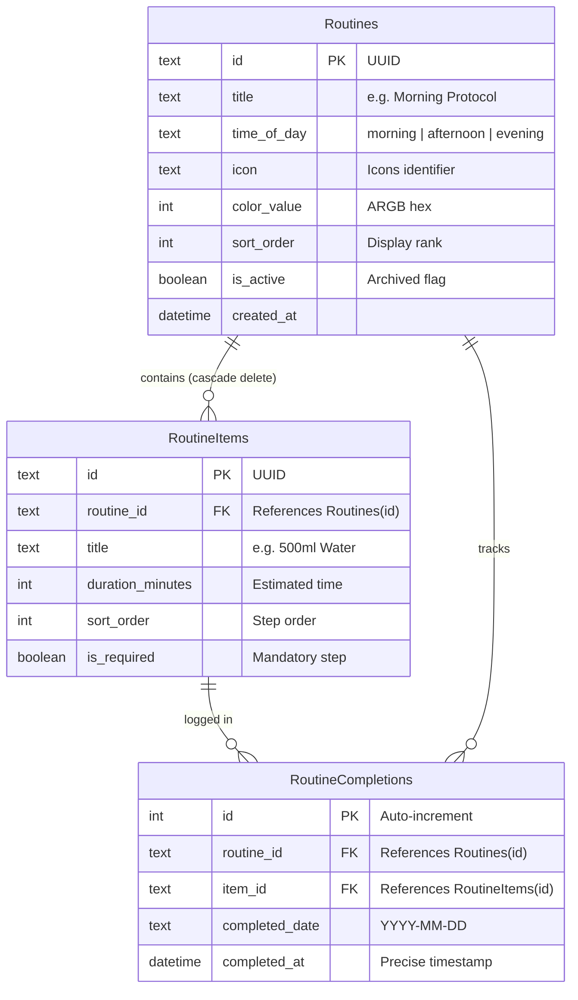

# Chunk 16: Routines & Daily Scheduling Checklist

Tags: `#routines #habits #checklist #drift #riverpod`

## Recap of Previous Chunk
In Chunks 11 through 15 (and Review Chunk R3), we built the movement and spatial telemetry engine—capturing native pedometer steps, hardening background isolates with an Android Foreground Service, recording GPS breadcrumbs in local Drift batches, rendering OpenStreetMap trails with `flutter_map`, and syncing PostGIS LineString geometries to Supabase. Chunk 16 shifts into the executive personal productivity domain, introducing recurring daily routines (e.g. Morning Protocol, Evening Wind-Down) with sortable checklist items and append-only completion tracking.

---

## What this chunk does
This chunk equips Cadence with a structured daily routine management engine. Users can create customizable, color-coded routines organized by circadian time-of-day (`morning`, `afternoon`, `evening`, `anytime`), reorder checklist tasks via drag-and-drop (`ReorderableListView`), and check off tasks throughout the day. Crucially, tasks automatically present as fresh each new calendar day without destructive resets, while complete historical completion logs are preserved for streak and habit analytics.

---

## Why it's needed
Sustainable daily discipline depends on structured routines that lower decision fatigue. However, naive checklist apps suffer from two major design flaws: either they force users to manually uncheck items every morning, or they run brittle midnight cron jobs that overwrite boolean status columns, permanently erasing completion history. By separating the routine *template* (`routines`, `routine_items`) from the daily *execution* (`routine_completions`), Cadence guarantees automated midnight resets and immutable audit trails.

---

## Builds on
- **Chunk 3 (Local Database Layer with Drift)**: Extends SQLite schema with `Routines`, `RoutineItems`, and `RoutineCompletions` tables, utilizing foreign key cascades and reactive streams.
- **Chunk 6 (Shared Entries & Generic Logging)**: Allows completed routine items to optionally record lightweight telemetry into the `entries` timeline.
- **Chunk 9 (Daily Goals & Progress Tracker)**: Feeds routine completion events into daily streak calculations and progress percentages.

---

## Key concepts

1. **Template vs. Execution Decoupling**:
   - `Routines` defines the routine header (e.g. "Morning Launchpad", time-of-day, color, icon).
   - `RoutineItems` defines the recurring checklist items (e.g. "Drink 500ml water", "10 min mobility", "Review daily priorities").
   - `RoutineCompletions` is an append-only log of executions: `(id, routine_id, item_id, completed_date, completed_at)`.
   Today's completion status is derived dynamically: an item is checked if a record exists with `item_id == :id` AND `completed_date == :today`.

2. **Automated Daily Reset without Background Crons**:
   Because completion is derived via `completed_date == :today`, at 12:00:01 AM the date rolls over, and all checklist items automatically evaluate to unchecked for the new day—without background workers, scheduled wakeups, or database mutative sweeps.

3. **In-Place Reordering (`ReorderableListView`)**:
   Users can sequence checklist steps to match their physical flow. Moving an item updates `sort_order` integers in SQLite within a single atomic batch transaction.

---

## Visual model



---

## Plain-English Pseudocode (Before Syntax)

```text
ON USER TOGGLES CHECKLIST ITEM (itemId, routineId):
    todayStr = FORMAT_DATE(NOW(), "yyyy-MM-dd")
    
    existingRecord = DB.query("SELECT * FROM routine_completions WHERE item_id = ? AND completed_date = ?", itemId, todayStr)
    
    IF existingRecord EXISTS:
        // User is unchecking the item
        DB.delete("DELETE FROM routine_completions WHERE id = ?", existingRecord.id)
    ELSE:
        // User is checking off the item
        DB.insert("INSERT INTO routine_completions (routine_id, item_id, completed_date, completed_at) VALUES (?, ?, ?, NOW())", routineId, itemId, todayStr)

ON USER REORDERS ITEMS (oldIndex, newIndex):
    Adjust indices in local list.
    BEGIN TRANSACTION:
        FOR EACH (index, item) IN reorderedList:
            DB.update("UPDATE routine_items SET sort_order = ? WHERE id = ?", index, item.id)
    COMMIT TRANSACTION.

ON LOAD TODAY'S ROUTINES:
    todayStr = FORMAT_DATE(NOW(), "yyyy-MM-dd")
    routines = DB.query("SELECT * FROM routines WHERE is_active = true ORDER BY sort_order ASC")
    
    FOR EACH routine IN routines:
        items = DB.query("SELECT * FROM routine_items WHERE routine_id = ? ORDER BY sort_order ASC", routine.id)
        completions = DB.query("SELECT item_id FROM routine_completions WHERE routine_id = ? AND completed_date = ?", routine.id, todayStr)
        
        routineState = RoutineWithProgress(
            routine = routine,
            items = items,
            completedItemIds = completions,
            progress = completions.length / items.length
        )
```

---

## How to think and write this code manually (Mental Algorithm)

### Step 0: Requirements breakdown
- Multiple routines grouped by circadian phase (`morning`, `afternoon`, `evening`).
- Ordered checklist items per routine.
- Daily check/uncheck persistence with automatic date rollover.
- Reorderable UI items.
- Historical completion retention for future review/habits.

### Step 1: Input shape & contract (Tables)
- Table `Routines`:
  - `id`: `TextColumn` (UUID)
  - `title`: `TextColumn`
  - `description`: `TextColumn` (nullable)
  - `timeOfDay`: `TextColumn` (default 'morning')
  - `iconName`: `TextColumn` (default 'wb_sunny_rounded')
  - `colorValue`: `IntColumn`
  - `sortOrder`: `IntColumn`
  - `isActive`: `BoolColumn`
  - `createdAt`: `DateTimeColumn`
- Table `RoutineItems`:
  - `id`: `TextColumn` (UUID)
  - `routineId`: `TextColumn` (foreign key $\rightarrow$ `Routines.id`, cascade delete)
  - `title`: `TextColumn`
  - `durationMinutes`: `IntColumn` (default 5)
  - `sortOrder`: `IntColumn`
  - `isRequired`: `BoolColumn` (default true)
- Table `RoutineCompletions`:
  - `id`: `IntColumn` (autoIncrement)
  - `routineId`: `TextColumn` (foreign key)
  - `itemId`: `TextColumn` (foreign key $\rightarrow$ `RoutineItems.id`, cascade delete)
  - `completedDate`: `TextColumn` (e.g. `'2026-09-08'`)
  - `completedAt`: `DateTimeColumn`

### Step 2: Database DAOs & Riverpod Notifier
- `AppDatabase`:
  - `watchRoutinesWithItems(String dateStr)`: joins routines, items, and today's completions.
  - `toggleRoutineItemCompletion(String routineId, String itemId, String dateStr)`
  - `reorderRoutineItems(List<String> orderedItemIds)`
  - `createRoutineWithItems(...)`
- `RoutinesNotifier`:
  - Exposes state of active routines and handles creation, reordering, and item checking.

### Step 3: UI Architecture
- `RoutineCard`: expandable card displaying routine name, circadian icon, progress ring (`3/5 completed`), and checklist items.
- `RoutineItemTile`: checkbox, title, duration pill (`5 min`), drag handle.
- `CreateRoutineDialog`: title, circadian time-of-day selector, checklist builder.

### Step 4: Module Wiring
- Register tables in `AppDatabase`, bump `schemaVersion` to 6, handle `onUpgrade` for `from < 6`.
- Add `RoutinesSection` to Dashboard.

---

## Request-to-response file trace
```
User (Taps checkbox next to "Drink 500ml Water")
  → routinesNotifier.toggleItem(routineId, itemId)
  → AppDatabase.toggleRoutineItemCompletion(routineId, itemId, '2026-09-08')
  → SQLite checks routine_completions for (itemId, '2026-09-08')
  → Record does not exist: executes INSERT INTO routine_completions
  → Drift stream table watcher fires
  → routinesProvider emits updated RoutineWithProgress
  → RoutineCard re-renders with item strikethrough and updated progress percentage (e.g. 20% → 40%)
```

---

## SQL Under the Hood

1. **Fetching today's routine progress**:
   ```sql
   SELECT 
     r.id AS routine_id, r.title, r.time_of_day,
     i.id AS item_id, i.title AS item_title, i.sort_order,
     CASE WHEN c.id IS NOT NULL THEN 1 ELSE 0 END AS is_completed_today
   FROM routines r
   JOIN routine_items i ON i.routine_id = r.id
   LEFT JOIN routine_completions c 
     ON c.item_id = i.id 
    AND c.completed_date = '2026-09-08'
   WHERE r.is_active = 1
   ORDER BY r.sort_order ASC, i.sort_order ASC;
   ```

2. **Toggling completion (INSERT on check)**:
   ```sql
   INSERT INTO routine_completions (routine_id, item_id, completed_date, completed_at)
   VALUES ('r-morning', 'item-water', '2026-09-08', 1725753600);
   ```

3. **Atomic reordering**:
   ```sql
   BEGIN TRANSACTION;
   UPDATE routine_items SET sort_order = 0 WHERE id = 'item-mobility';
   UPDATE routine_items SET sort_order = 1 WHERE id = 'item-water';
   UPDATE routine_items SET sort_order = 2 WHERE id = 'item-reading';
   COMMIT;
   ```

---

## The Edge Case & Error Matrix

| Input / Condition | Failure Mode | Handling Component | Outcome / Action |
|---|---|---|---|
| Midnight date rollover occurs while app is open | Items remain checked from previous day | `completedDate` binding | Re-evaluating date string `'yyyy-MM-dd'` automatically resets completion checkmarks without restart. |
| Deleting a routine | Orphan items or completions left in database | `KeyAction.cascade` | Foreign keys automatically cascade-delete all `routine_items` and `routine_completions`. |
| Rapid double-tap on checkbox | Race condition creating duplicate completion rows | `toggleRoutineItemCompletion` | Database transaction checks existence before insert/delete. |
| Reordering empty routine | Range error / index out of bounds | `ReorderableListView` | Guarded by list length check; reordering only enabled when `items.length >= 2`. |

---

## Why NOT Do It This Other Way?

- **Anti-Pattern: Adding an `is_completed` boolean column to `routine_items`**:
  - *Why beginners do it*: It looks simpler to have `item.isCompleted = true`.
  - *Why it fails*:
    1. **Midnight Cron Necessity**: The app must run a background service at 12:00 AM to execute `UPDATE routine_items SET is_completed = false`. If the user's phone is off or low battery, the morning routine opens with yesterday's checkmarks still checked.
    2. **Data Loss**: You lose all historical data of whether the user completed their routine yesterday, last week, or 30 days ago.
  - *Our solution*: Append-only `routine_completions` table keyed by date string. Zero midnight background crons required, and 100% of historical completion data is preserved forever.

---

## How it works
1. Routines are templates loaded once.
2. Checking an item inserts a row into `routine_completions` with today's date `'yyyy-MM-dd'`.
3. Unchecking removes that row.
4. Next day, the date string changes, so no completion rows match `'yyyy-MM-dd'`, presenting a clean, reset checklist automatically.

---

## Gotchas / trade-offs
- **Date Formatting**: Always use local date for `completedDate` (e.g. `'2026-09-08'`), not UTC, so that midnight rollover aligns with the user's local solar midnight.

---

## What to look up next
- Pomodoro & focused study sessions (upcoming in Chunk 17).
- Drag-and-drop time-blocking calendar integration (upcoming in Chunk 18).

---

## Check yourself (Inline Evaluation)

1. *Why should daily checklist completions be stored in a separate `routine_completions` table rather than an `is_completed` column on the item?*
   - **Answer**: It eliminates the need for background midnight cron resets (rollover is automatic based on the query date) and preserves the entire historical completion record for streak and habit analytics.

2. *Why must `completedDate` be formatted in local time rather than UTC?*
   - **Answer**: A user expects their routine to reset at 12:00 AM local wall-clock time, not at midnight UTC (which might occur in the middle of their afternoon depending on their time zone).

3. *What happens to child checklist items when a routine is deleted?*
   - **Answer**: Drift's `KeyAction.cascade` automatically deletes all child `routine_items` and `routine_completions` without leaving orphan rows in SQLite.

---

## Verify

- **Predicted Result**:
  - Drift migration runs cleanly to schemaVersion 6 creating `routines`, `routine_items`, and `routine_completions` tables.
  - Checking an item records a row in `routine_completions` for today's date.
  - Querying for tomorrow's date returns the items as unchecked (automatic midnight rollover).
  - Reordering items updates `sort_order` sequentially in a transaction.
  - UI components render routines grouped by circadian phase with interactive checkboxes.
  - Unit and widget tests pass with 0 analyze issues.

- **Actual Result**:
  - Drift schemaVersion bumped to 6 with migration in `onUpgrade` creating `routines`, `routine_items`, and `routine_completions`.
  - Implemented transactional DAOs in `AppDatabase` (`createRoutineWithItems`, `watchActiveRoutines`, `getItemsForRoutine`, `watchCompletionsForDate`, `getCompletionsForDate`, `toggleRoutineItemCompletion`, `reorderRoutineItems`, `deleteRoutine`, `deleteRoutineItem`).
  - Added `routinesWithItemsStreamProvider` using multi-table `tableUpdates([routines, routineItems, routineCompletions])` ensuring reactive UI updates on every checkbox toggle without polling.
  - Implemented `RoutinesView` with circadian phase coloring, date strip navigation, quick starter templates ("Morning Launchpad" and "Evening Shutdown"), reorderable lists with `onReorderItem`, and bottom navigation bar integration in `DashboardScreen`.
  - Created unit tests in `test/routines_test.dart` and widget tests in `test/routines_widget_test.dart`.
  - Executed `flutter analyze` (0 issues) and `flutter test` (105 / 105 tests passing). All predictions matched exactly.

---

## Questions
*(Running Q&A log)*

---

## Errata
*(Running bug log)*
