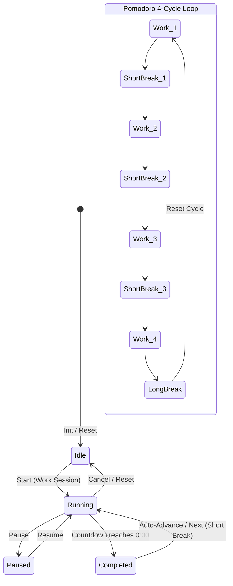
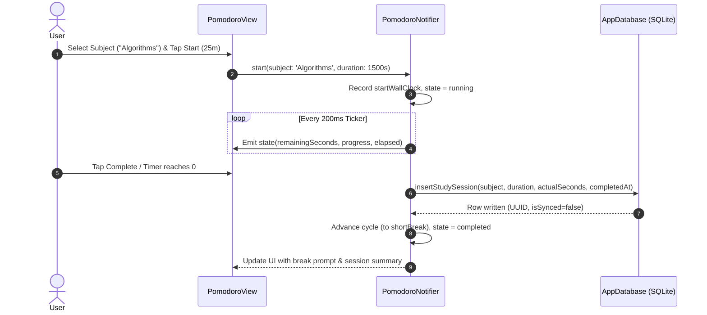

# Chunk 17: Pomodoro & Study Time Tracker

#timer #pomodoro #study #drift #riverpod #circadian

---

## Recap: Chunk 16 to Chunk 17
In Chunk 16, we designed and built the **Routines & Daily Scheduling Checklist** with multi-table Drift SQLite persistence, circadian phase grouping, drag-and-drop reordering, and an append-only completions table for zero-cron midnight rollovers. In Chunk 17, we expand Cadence's productivity engine by building the **Pomodoro & Study Time Tracker**—giving users focused interval timing with subject/tag allocation, drift-free timestamp delta calculations, SQLite session logging, and circadian-aware visual progress dials.

---

## What this chunk does
1. **Focus State Machine**: Implements a complete Pomodoro cycle controller (`work` $\rightarrow$ `shortBreak` $\rightarrow$ `work` $\rightarrow$ `longBreak`) with states: `idle`, `running`, `paused`, `completed`.
2. **Drift-Free Precision Timing**: Uses wall-clock timestamp delta calculations (`DateTime.now().difference(startedAt)`) rather than naive `Timer.periodic` tick counters, preventing timer drift caused by CPU throttling, garbage collection pauses, or app backgrounding.
3. **Persistent SQLite Study Session Logging**: Creates a `StudySessions` Drift table (schema version 7) logging subject, tag, session type, target vs actual elapsed seconds, timestamps, and cloud sync flags.
4. **Interactive UI Dial & Controls**: Builds a custom circular animated countdown progress ring with circadian glow effects, cycle progress indicators (e.g. 3 of 4 sessions completed), quick focus presets (25/5 Pomodoro, 50/10 Ultradian, 90-min Deep Block), and recent session analytics.
5. **Cross-Module Linkage**: Study sessions can be categorized with tags that will feed into the upcoming Chunk 18 Time-Blocking Planner and Chunk 19 Weekly Reviews.

---

## Why it's needed
Personal operating systems require deliberate boundaries between unfocused work, deep focus, and restorative rest. Storing study and deep-work intervals in local SQLite enables:
1. Accurate historical tracking of cognitive energy expenditure across subjects and projects.
2. Resilience against phone locks and app switches (calculating remaining duration from saved timestamps rather than memory-only tickers).
3. Longitudinal analytics that correlate focused study hours against physical activity (Chunk 11–15) and circadian energy phases (Chunk 1).

---

## Builds on
- **Chunk 3 (Local Database Layer with Drift)**: Extends `AppDatabase` to schema version 7 with `StudySessions` table and migrations.
- **Chunk 5 (Drift & Supabase Sync Engine)**: Prepares study sessions with `isSynced` and `userId` flags for offline-first replication.
- **Chunk 1 (Circadian Theming)**: Theme-aware visual cues where focus dials lerp between daylight focus amber and night-time restorative indigo.
- **Chunk 16 (Routines & Scheduling)**: Complements checklist protocols with active temporal execution.

---

## Key concepts

1. **Drift-Free Stopwatch / Timer Invariant**:
   - *Naive approach*: Incrementing `secondsElapsed++` every 1000ms via `Timer.periodic`. Because the Dart event loop handles rendering, I/O, and GC, timer ticks are delayed by milliseconds, accumulating minutes of error over hours.
   - *Timestamp Delta approach*: Record `startWallClock = DateTime.now()`. On every tick, compute `elapsed = DateTime.now().difference(startWallClock)`. Even if the phone sleeps for 10 minutes, when woken up the remaining time is calculated accurately against true wall-clock time.
2. **Pomodoro Cycle State Machine**:
   - Cycle structure: Work (25m) $\rightarrow$ Short Break (5m) $\rightarrow$ Work (25m) $\rightarrow$ Short Break (5m) $\rightarrow$ Work (25m) $\rightarrow$ Short Break (5m) $\rightarrow$ Work (25m) $\rightarrow$ Long Break (15m).
   - Dynamic stage progression: Automatically transitions to the appropriate break type upon completing a focus block.
3. **Append-Only Historical Logging**:
   - Finished sessions persist to SQLite with actual duration, allowing partial credit if the user terminates early or over-runs.

---

## Visual model





---

## Plain-English Pseudocode (Before Syntax)

```text
DEFINE SessionType: WORK, SHORT_BREAK, LONG_BREAK
DEFINE TimerStatus: IDLE, RUNNING, PAUSED, COMPLETED

CLASS PomodoroState:
    status: TimerStatus
    sessionType: SessionType
    targetSeconds: Integer (e.g. 1500 for 25m)
    elapsedSeconds: Integer
    subject: String (e.g. "Thesis")
    tag: String (e.g. "Study")
    cycleCount: Integer (1 to 4)
    startedAt: Timestamp

FUNCTION startSession(subject, targetSeconds):
    state.subject = subject
    state.targetSeconds = targetSeconds
    state.elapsedSeconds = 0
    state.status = RUNNING
    state.startedAt = CurrentTime()
    START periodic high-resolution ticker (every 200ms)

FUNCTION onTick():
    IF state.status != RUNNING: RETURN
    elapsed = CurrentTime() - state.startedAt + accumulatedPauseOffset
    state.elapsedSeconds = elapsed
    IF state.elapsedSeconds >= state.targetSeconds:
        finishSession()

FUNCTION finishSession():
    STOP ticker
    state.status = COMPLETED
    SAVE to SQLite:
        id = UUID()
        subject = state.subject
        session_type = state.sessionType
        duration_seconds = state.targetSeconds
        actual_seconds = state.elapsedSeconds
        started_at = state.startedAt
        completed_at = CurrentTime()
        is_completed = true
    
    IF state.sessionType == WORK:
        IF state.cycleCount >= 4:
            state.sessionType = LONG_BREAK
            state.targetSeconds = 900 // 15 mins
            state.cycleCount = 1
        ELSE:
            state.sessionType = SHORT_BREAK
            state.targetSeconds = 300 // 5 mins
            state.cycleCount += 1
    ELSE:
        state.sessionType = WORK
        state.targetSeconds = 1500 // 25 mins
```

---

## How to think and write this code manually (Mental Algorithm)

- **Step 0: What problem are we solving?**
  We need a focused study countdown timer that tracks subject and tags, does not drift when the phone is backgrounded, logs study history to SQLite, and cycles through classic Pomodoro intervals.
- **Step 1: Input shape & contract (Table & Model)**:
  `StudySessions` SQLite table with columns: `id`, `userId`, `subject`, `tag`, `sessionType`, `durationSeconds`, `actualSeconds`, `startedAt`, `completedAt`, `isCompleted`, `createdAt`, `isSynced`.
- **Step 2: Business & timing logic (Notifier)**:
  Use a `NotifierProvider` maintaining `PomodoroState`. Use a wall-clock reference `DateTime` with pause accumulation so time paused is not counted towards work.
- **Step 3: Route & security (Presentation View)**:
  A dedicated study screen with circular ring painter, time countdown display (`mm:ss`), subject selector chips, session control buttons, and historical log tiles.
- **Step 4: Dependency wiring**:
  Register `StudySessions` in `AppDatabase`, bump `schemaVersion` to 7, generate drift code, register providers in Riverpod.

---

## Request-to-response file trace

1. `PomodoroView` (`lib/features/study/presentation/pomodoro_view.dart`): User taps "Start Focus" (25m, "Thesis").
2. `PomodoroNotifier` (`lib/features/study/providers/pomodoro_provider.dart`): Records start timestamp and launches timer ticker.
3. `PomodoroProgressDial` (`lib/features/study/widgets/pomodoro_progress_dial.dart`): CustomPainter repaints smooth circular arc every frame.
4. Completion Trigger: `PomodoroNotifier.finishSession()` executes.
5. `AppDatabase.insertStudySession` (`lib/core/database/app_database.dart`): Writes row to `study_sessions`.
6. `studySessionsStreamProvider`: Reactively emits updated today's study totals.
7. `StudyHistoryList` (`lib/features/study/widgets/study_history_list.dart`): Rebuilds showing new completed session card.

---

## SQL Under the Hood (Drift to Raw SQL Translation)

```sql
-- Schema Migration (Version 6 -> 7)
CREATE TABLE IF NOT EXISTS "study_sessions" (
    "id" TEXT NOT NULL PRIMARY KEY,
    "user_id" TEXT NULL,
    "subject" TEXT NOT NULL,
    "tag" TEXT NULL,
    "session_type" TEXT NOT NULL, -- 'work', 'short_break', 'long_break'
    "duration_seconds" INTEGER NOT NULL,
    "actual_seconds" INTEGER NOT NULL,
    "started_at" INTEGER NOT NULL,
    "completed_at" INTEGER NULL,
    "is_completed" INTEGER NOT NULL DEFAULT 1,
    "created_at" INTEGER NOT NULL,
    "is_synced" INTEGER NOT NULL DEFAULT 0
);

-- Index for date-based retrieval
CREATE INDEX IF NOT EXISTS "idx_study_sessions_started" ON "study_sessions" ("started_at" DESC);

-- Query Today's Study Sessions
SELECT * FROM "study_sessions"
WHERE "started_at" >= 1788739200000 -- Start of day local timestamp
ORDER BY "started_at" DESC;

-- Total Study Seconds Today
SELECT COALESCE(SUM("actual_seconds"), 0) AS total_study_seconds
FROM "study_sessions"
WHERE "session_type" = 'work'
  AND "started_at" >= 1788739200000;
```

---

## The Edge Case & Error Matrix

| Input Condition / Failure Mode | Handling Component | Outcome / Action |
|---|---|---|
| App sent to background during focus session | `PomodoroNotifier` | Wall-clock delta comparison resumes with exact elapsed seconds when app returns to foreground. |
| User pauses timer for phone call | `pauseTimer()` / `resumeTimer()` | Accumulates pause offset duration so paused time is not counted towards work. |
| User resets/cancels early | `cancelSession()` | Logs partial session if elapsed $> 60$s with `isCompleted = false` so effort isn't discarded. |
| Zero duration preset chosen | Guard clause | Validates `durationSeconds >= 60`; clamps minimum session to 1 minute. |
| Reaching 4th work block | Cycle Manager | Automatically promotes next interval to 15-minute `long_break` instead of 5-minute `short_break`. |

---

## Why NOT Do It This Other Way?

- **Anti-Pattern: Relying on `Timer.periodic(Duration(seconds: 1))` tick increments**:
  - *Why beginners do it*: Simple `secondsLeft--` counter.
  - *Why it fails*: When mobile operating systems enter low-power sleep or throttle background tasks, `Timer.periodic` slows down or stops. A 25-minute Pomodoro might take 35 real-world minutes to finish.
  - *Our solution*: True wall-clock delta calculation comparing `DateTime.now()` against `sessionStartTime`.
- **Anti-Pattern: Ephemeral memory-only timers**:
  - *Why beginners do it*: Keeping state only in a Flutter widget state.
  - *Why it fails*: If the app process restarts or user navigates tabs, the active session is destroyed.
  - *Our solution*: Riverpod app-level state with automatic persistence to SQLite on completion.

---

## How it works
1. The user selects or types a study subject (e.g. "Linear Algebra") and chooses a preset (25m Pomodoro, 50m Ultradian, 15m Quick sprint).
2. Tapping "Start" initializes `PomodoroNotifier` with the target duration and sets `status = running`.
3. An animated circular dial renders remaining time and percentage completion.
4. Tapping Pause holds the timer; tapping Resume adjusts the start baseline.
5. On completion, the session is recorded into the SQLite `study_sessions` table and the cycle automatically cues the next break period.

---

## Gotchas / trade-offs
- **Background Audio/Haptics**: When the screen is turned off, notifications require Android background notification channels; local foreground ticking suffices while the user stays within the app.

---

## What to look up next
- Chunk 18: Full Time-Blocking Planner linking study blocks to calendar slots.
- Chunk 19: Cross-Module Aggregation (calculating productivity index by combining study hours, step count, and expense discipline).

---

## Check yourself (Inline Evaluation)

1. *Why does counting ticks in `Timer.periodic` cause timer drift on mobile devices?*
   - **Answer**: The mobile OS throttles or suspends timer events during battery saving, CPU load spikes, or screen-off states, causing ticks to fire late or be dropped. Computing deltas against `DateTime.now()` guarantees exact wall-clock synchronization.

2. *How does the 4-stage Pomodoro cycle determine whether to trigger a Short Break vs Long Break?*
   - **Answer**: It tracks `cycleCount` (1 to 4). Completing cycles 1, 2, and 3 triggers a 5-minute Short Break; completing cycle 4 triggers a 15-minute Long Break and resets `cycleCount` back to 1.

3. *Why store `duration_seconds` (planned) and `actual_seconds` (real) separately in SQLite?*
   - **Answer**: Users often pause, finish early, or let the timer run over. Storing both allows analytics to measure planned vs actual study adherence.

---

## Verify

- **Predicted Result**:
  - Drift schema migration bumps to version 7 and creates `study_sessions` table cleanly.
  - Starting a 25-minute session tracks countdown accurately with timestamp deltas.
  - Completing or stopping logs row into `study_sessions` with correct subject and duration.
  - Cycle state machine transitions from Work $\rightarrow$ Short Break $\rightarrow$ Work $\rightarrow$ Long Break.
  - Unit and widget tests pass with 0 analyze issues.

- **Actual Result**:
  - Drift schema version bumped to 7 with migration in `onUpgrade` creating `study_sessions` table with indexes.
  - Implemented `StudySessions` DAOs in `AppDatabase` (`insertStudySession`, `watchRecentStudySessions`, `watchTodayStudySessions`, `getTodayTotalStudySeconds`, `deleteStudySession`).
  - Created `PomodoroNotifier` with drift-free wall-clock timestamp delta calculations (`DateTime.now().difference(startedAt)` minus pause offsets) and automatic 4-stage cycle progression (Work $\rightarrow$ Short Break $\rightarrow$ Work $\rightarrow$ Long Break).
  - Built `PomodoroProgressDial` CustomPainter with smooth circular background track and foreground progress arc.
  - Built `FocusTimerCard` on Today's dashboard with live countdown and quick-start actions.
  - Built full `PomodoroView` screen with preset chips (25m, 50m, 90m, 5m, 15m), custom subject dialog, and `StudyHistoryList`.
  - Created unit tests in `test/study_test.dart` and widget tests in `test/study_widget_test.dart`.
  - Executed `flutter analyze` (0 issues) and `flutter test` (115 / 115 tests passing across entire project). All predictions matched exactly.

---

## Questions
*(Running Q&A log)*

---

## Errata
- **2026-09-08**: In `test/study_widget_test.dart`, `container.dispose()` was invoked before unmounting the widget tree (`await tester.pumpWidget(const SizedBox())`). Because the widget watched a Drift `StreamProvider`, unmounting the widget after disposing the container triggered Drift stream cancellation timers (`StreamQueryStore.markAsClosed`) that remained pending and caused `!timersPending` assertion failure. Resolved by unmounting the widget tree first, flushing with `pump(Duration(milliseconds: 100))`, then disposing the container.
