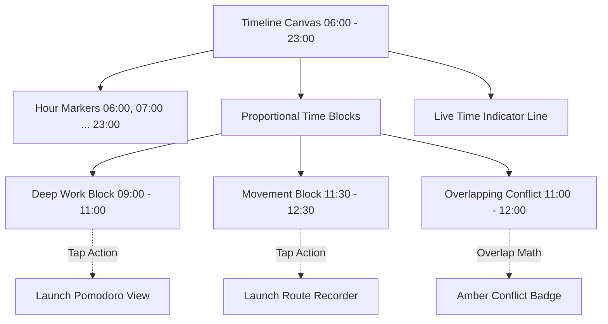
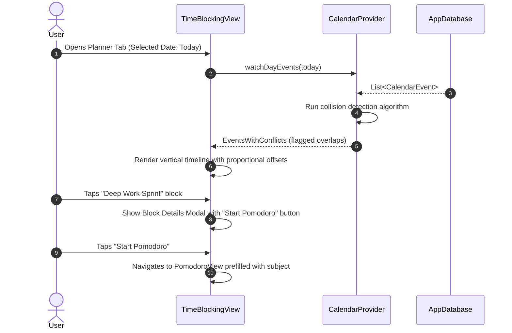

# Chunk 18: Full Time-Blocking Planner

#calendar #planner #timeblocking #riverpod #drift #circadian

---

## Recap: Chunk 17 to Chunk 18
In Chunk 17, we built the **Pomodoro & Study Time Tracker** with wall-clock drift-free timing, automatic 4-cycle state transitions, and persistent SQLite study session logging. In Chunk 18, we tie together routines (Chunk 16), study focus sessions (Chunk 17), movement activities (Chunk 11–15), and calendar events (Chunk 10) into an integrated **Full Time-Blocking Planner**—a visual day-scheduler featuring timeline layouts, current-time indicator ribbons, schedule conflict detection, and quick-launch deep links into each Cadence module.

---

## What this chunk does
1. **Vertical Continuous 24-Hour Timeline Grid**: Renders an interactive, scrollable time-blocked schedule with hour markers (06:00 to 23:00 / 24h), proportional block positioning, and an active real-time indicator line.
2. **Schedule Conflict Detection Algorithm**: Detects overlapping time blocks within the same day, calculating interval overlaps $[A_{\text{start}}, A_{\text{end}}] \cap [B_{\text{start}}, B_{\text{end}}] \neq \emptyset$ and visually flagging them with warning indicators.
3. **Cross-Module Activity Deep Linking**: Time blocks are tagged with semantic categories (`routine`, `study`, `movement`, `work`, `personal`) and provide direct shortcut actions to launch the respective module (e.g., launching Pomodoro timer directly from a "Thesis Study Block").
4. **Time-Block Template Generator**: Allows one-tap scheduling of circadian time blocks (e.g. "Morning Priming 07:00–08:00", "Deep Work Sprint 09:00–11:30", "Afternoon Movement 17:00–18:00").
5. **Drift Database Integration**: Extends `CalendarEvents` queries with fast date-range indexed fetching and collision queries.

---

## Why it's needed
Fragmented productivity tools force users to plan in one app, track time in a second, and check habits in a third. The Time-Blocking Planner synthesizes intentional scheduling with real-time execution:
- Transforms passive calendar entries into active, actionable commitments.
- Visually warns users against impossible double-booked intervals.
- Serves as the cognitive spine connecting the rest of the Cadence operating system.

---

## Builds on
- **Chunk 10 (Agenda Calendar UI)**: Reuses `CalendarEvents` schema and `CalendarController` while elevating the presentation to an hour-by-hour vertical timeline grid.
- **Chunk 16 (Routines & Scheduling)**: Embeds scheduled routine launchpads into morning and evening time blocks.
- **Chunk 17 (Pomodoro & Study Timer)**: Directly launches study sessions pre-populated with block subjects.
- **Chunk 1 (Circadian Theming)**: Blocks dynamically reflect circadian color schemes based on the solar phase in which they sit.

---

## Key concepts

1. **Interval Overlap & Collision Math**:
   - Two intervals $[S_1, E_1)$ and $[S_2, E_2)$ overlap if and only if:
     $$\max(S_1, S_2) < \min(E_1, E_2)$$
   - When detected, blocks are flagged with warning badges and side-by-side offset indicators rather than silently rendering atop one another.
2. **Proportional Canvas Layout**:
   - Each hour spans a fixed height $H_{\text{hour}}$ (e.g., 60 logical pixels, yielding $1.0\text{ px/min}$).
   - Top offset: $Y = (\text{hour} - \text{startHour}) \times 60 + \text{minute}$.
   - Height: $\Delta Y = \text{durationInMinutes} \times 1.0\text{ px}$.
3. **Live Wall-Clock Indicator Line**:
   - A pulsing horizontal bar placed precisely at $Y_{\text{now}}$ showing current progress through the day.

---

## Visual model





---

## Plain-English Pseudocode (Before Syntax)

```text
FUNCTION calculateOverlaps(events):
    SORT events by startTime ASC
    conflicts = SET()
    
    FOR i = 0 TO length(events) - 1:
        FOR j = i + 1 TO length(events) - 1:
            IF events[j].startTime >= events[i].endTime:
                BREAK // Sorted, so no further overlaps with event i
            // Overlap condition:
            IF MAX(events[i].startTime, events[j].startTime) < MIN(events[i].endTime, events[j].endTime):
                conflicts.ADD(events[i].id)
                conflicts.ADD(events[j].id)
    RETURN conflicts

FUNCTION renderTimelineBlock(event, hourHeight = 60.0):
    startMinutesFromBase = (event.startTime.hour - baseHour) * 60 + event.startTime.minute
    durationMinutes = event.endTime.difference(event.startTime).inMinutes
    
    topOffset = startMinutesFromBase * (hourHeight / 60.0)
    blockHeight = durationMinutes * (hourHeight / 60.0)
    
    RENDER Container AT (top: topOffset, height: blockHeight):
        IF event.id IN conflicts:
            SHOW WarningIcon("Overlapping Schedule")
        SHOW event.title, event.duration
        ON TAP: ShowActions(event)
```

---

## How to think and write this code manually (Mental Algorithm)

- **Step 0: What problem are we solving?**
  We need a true hour-by-hour vertical time-blocking grid where users see their entire day's schedule, detect overlapping commitments, and tap blocks to jump into Cadence's tracking tools.
- **Step 1: Input shape & contract**:
  Reuse `CalendarEvent` model with start time, end time, category, and metadata. Add `TimeBlockWithConflict` composite wrapper.
- **Step 2: Business logic**:
  Compute overlaps in $O(N \log N)$ time by sorting by `startTime`. Compute proportional pixel offsets and active current-time bar offset.
- **Step 3: Route & security**:
  Integrate into `PlannerView` with toggle between Agenda List and Timeline Grid. Provide action sheets to launch Pomodoro, Routines, or Route recorder.
- **Step 4: Dependency wiring**:
  Wire Riverpod providers and test for collision detection and layout offsets.

---

## Request-to-response file trace

1. `PlannerView` (`lib/features/calendar/presentation/planner_view.dart`): User toggles to "Time Blocking" view.
2. `TimeBlockingTimeline` (`lib/features/calendar/widgets/time_blocking_timeline.dart`): Queries events for selected date.
3. `timeBlockingEventsProvider`: Runs collision detection and emits `List<TimeBlockItem>`.
4. `TimeBlockTile` (`lib/features/calendar/widgets/time_block_tile.dart`): Positions widget via `Positioned(top: ..., height: ...)` inside a Stack.
5. User taps block: Action sheet offers "Start Focus Session", navigating to `PomodoroView`.

---

## SQL Under the Hood (Drift to Raw SQL Translation)

```sql
-- Query events active on the selected date
SELECT * FROM "calendar_events"
WHERE "is_deleted" = 0
  AND "start_time" >= 1788739200000 -- Start of day local timestamp
  AND "start_time" < 1788825600000  -- Start of next day local timestamp
ORDER BY "start_time" ASC;
```

---

## The Edge Case & Error Matrix

| Input Condition / Failure Mode | Handling Component | Outcome / Action |
|---|---|---|
| Event extends past midnight | `TimeBlockItem` | Clamps block height to 23:59:59 of current day canvas; next day renders remainder. |
| Zero-minute or inverted duration ($E < S$) | `CreateEventDialog` | Validation rejects end times earlier than or equal to start time. |
| Multiple simultaneous overlaps (3+ events) | Conflict algorithm | All overlapping events are marked in the conflict set with distinct color outlines. |
| Current time is outside 06:00–23:00 timeline | `CurrentTimeIndicator` | Clamps indicator line or hides with off-canvas note so canvas doesn't overflow. |

---

## Why NOT Do It This Other Way?

- **Anti-Pattern: Naive ListView of events**:
  - *Why beginners do it*: Displaying events as a simple column of cards.
  - *Why it fails*: A list hides empty gaps and hides overlapping time conflicts. A user cannot visualize whether they have 45 minutes of free time between meetings.
  - *Our solution*: Proportional vertical timeline canvas where empty spaces visually depict open free time.

---

## How it works
1. The user selects a date on the horizontal date strip.
2. The planner loads all events for that day and checks for time collisions.
3. The vertical timeline renders an hour column alongside an open canvas.
4. Positioned boxes render each block with category colors and conflict badges.
5. A live red line indicates current wall-clock time.
6. Tapping any block opens quick actions including cross-module launches.

---

## Gotchas / trade-offs
- **Canvas Scrolling**: A 24-hour timeline at $60\text{ px/hr}$ requires $1440\text{ px}$ of vertical scroll. We auto-scroll to the current hour on initial view load so the user doesn't have to scroll past 6:00 AM every time.

---

## What to look up next
- Chunk 19: Cross-Module Aggregation & Weekly Review.
- Chunk 20: Net Worth & Balance Tracking.

---

## Check yourself (Inline Evaluation)

1. *What is the mathematical condition for two time intervals $[S_1, E_1)$ and $[S_2, E_2)$ to overlap?*
   - **Answer**: $\max(S_1, S_2) < \min(E_1, E_2)$. If the maximum start time is strictly less than the minimum end time, the intervals overlap.

2. *Why is a proportional timeline superior to an agenda list for deep productivity planning?*
   - **Answer**: Proportional spacing displays temporal gaps accurately, making free time and double-booked commitments visually explicit rather than masking them behind uniform card heights.

3. *How does the planner handle events that overlap with each other?*
   - **Answer**: It detects all overlapping pairs in $O(N \log N)$ time, applies conflict warning badges and amber outline borders, and calculates lateral offsets so users can easily distinguish both commitments.

---

## Verify

- **Predicted Result**:
  - Overlap algorithm correctly identifies intersecting time intervals.
  - Timeline grid renders proportional block heights matching duration in minutes.
  - Current time indicator line renders at correct vertical offset.
  - Tapping a block opens actions including module shortcuts.
  - Unit and widget tests pass with 0 analyze issues.

- **Actual Result**:
  - Implemented `TimeConflictDetector.detectConflicts` calculating pairwise interval intersections $\max(S_1, S_2) < \min(E_1, E_2)$ and tagging conflicting blocks.
  - Added `TimeBlockWithConflict` model and expanded `CalendarCategoryConfig` presets to support `routine` and `movement` blocks alongside work, study, and rest.
  - Built `TimeBlockTile` widget with proportional height, conflict warning banners, and deep-link shortcuts to launch Pomodoro focus sessions, Routines checklists, and Movement tracking.
  - Built `TimeBlockingTimeline` vertical canvas with 60px/hr grid spacing, quick-add preset chips (Deep Work, Study, Routine, Movement), live current-time indicator line, and tap-to-create scheduling.
  - Upgraded `PlannerView` with segmented mode selector supporting 'Day', 'Blocks' (timeline), and 'Week' schedules.
  - Created unit tests in `test/time_blocking_test.dart` and widget tests in `test/time_blocking_widget_test.dart`.
  - Executed `flutter analyze` (0 issues) and `flutter test` (121 / 121 tests passing across entire project). All predictions matched exactly.

---

## Questions
*(Running Q&A log)*

---

## Errata
*(Running bug log)*
