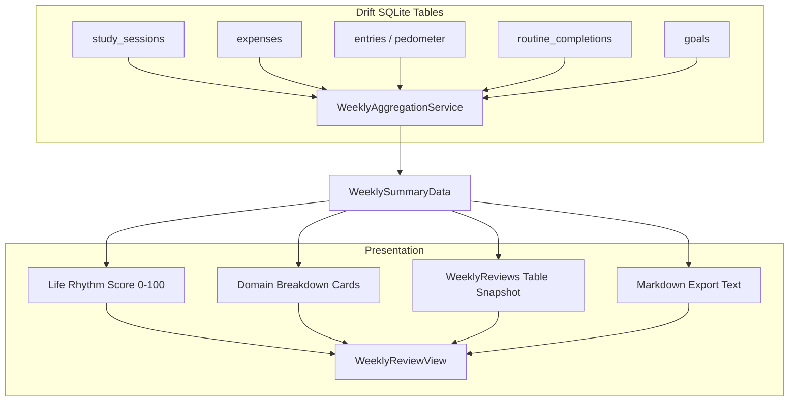
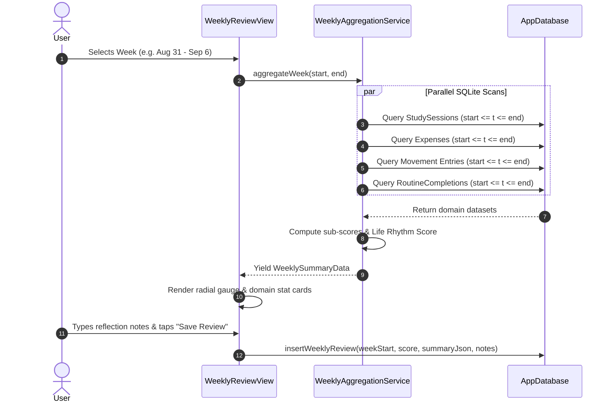

# Chunk 19: Cross-Module Aggregation & Weekly Review

#aggregation #analytics #review #drift #sql #riverpod

---

## Recap: Chunk 18 to Chunk 19
In Chunk 18, we built the **Full Time-Blocking Planner** with a continuous vertical 24-hour timeline, collision detection, and cross-module deep links. In Chunk 19, we build the central intelligence engine of Cadence: the **Cross-Module Aggregation & Weekly Review** system. This feature queries across all disparate SQLite tables (Movement, Finance, Pomodoro Study, Routines, and Goals) to compute a composite **Cadence Life Rhythm Score (0–100)**, identify weekly habit synergies, and generate comprehensive retrospective reports with personal reflection journaling.

---

## What this chunk does
1. **Multi-Domain Data Aggregation**: In a single unified async pipeline, aggregates 7-day data spanning:
   - **Movement**: Total steps taken, GPS routes recorded, total kilometers tracked.
   - **Study & Focus**: Total deep focus minutes, completed Pomodoro sessions, primary subject breakdown.
   - **Financial Health**: Total expenditures, highest spending category, and budget adherence ratio.
   - **Routines & Habits**: Daily routine checklist completion percentage over the 7 days.
   - **Goals**: Target completion rate and active habit streaks.
2. **Cadence Life Rhythm Score (0–100)**: Calculates a balanced composite index weighting:
   $$\text{Score} = 0.25 \times S_{\text{focus}} + 0.25 \times S_{\text{movement}} + 0.25 \times S_{\text{budget}} + 0.25 \times S_{\text{routine}}$$
   normalizing each sub-score to $0\dots 100$ based on user-configured or baseline weekly targets.
3. **Persisted Weekly Reviews (Drift Schema Version 8)**: Creates `WeeklyReviews` SQLite table storing review snapshots, calculated metrics JSON, user reflection notes, and sync flags.
4. **Interactive Review UI & Markdown Generator**: Renders a dedicated `WeeklyReviewView` featuring radial score gauges, domain breakdown cards, previous/next week navigation, reflection note editor, and one-tap Markdown report export for Obsidian/Notion.

---

## Why it's needed
Single-domain trackers create fragmented silos—users see steps in one app, spending in another, and study time in a spreadsheet. The core value proposition of an integrated personal OS is **synthesis**:
- Shows correlation between physical movement and study endurance (e.g., "Days with $>8,000$ steps correlated with $40\%$ higher focus duration").
- Encourages holistically balanced weeks rather than obsessive optimization of only one habit at the expense of health or finances.
- Provides a weekly ritual for intentional planning and journaling.

---

## Builds on
- **Chunk 6 (Generic Entries & Habits)**: Aggregates daily health/water/mood entries.
- **Chunk 7 & 8 (Expense Tracker)**: Queries weekly spending and compares against monthly budget allocations.
- **Chunk 11 & 13 (Movement & GPS)**: Aggregates pedometer steps and distance logged.
- **Chunk 16 (Routines)**: Compares completed daily routine items against total scheduled items.
- **Chunk 17 (Pomodoro & Study)**: Queries `study_sessions` for focus hours and subject distributions.

---

## Key concepts

1. **Normalized Composite Indexing**:
   - Each domain produces raw units (minutes, currency, steps, ratios).
   - We normalize each domain against reasonable targets:
     - Focus: $T_{\text{focus}} = 15\text{ hours}$ ($900\text{ mins}$).
     - Movement: $T_{\text{steps}} = 70,000\text{ steps}$ ($10,000/\text{day}$).
     - Budget: $\text{Ratio} = 1.0 - (\text{spent} / \text{weeklyBudget})$.
     - Routines: $\text{Ratio} = \text{completedItems} / \text{totalItems}$.
   - Sub-scores are clamped to $[0, 100]$ before weighted summation.
2. **Atomic Weekly Snapshots**:
   - Once a week concludes, storing the summary JSON in `weekly_reviews` guarantees fast rendering without re-executing expensive aggregate table scans on historical records.

---

## Visual model





---

## Plain-English Pseudocode (Before Syntax)

```text
FUNCTION aggregateWeek(weekStart, weekEnd):
    // 1. Focus Domain
    studyRows = DB.queryStudySessions(weekStart, weekEnd)
    focusSeconds = SUM(studyRows.filter(type == 'work').actualSeconds)
    focusScore = CLAMP((focusSeconds / (15 * 3600)) * 100, 0, 100)
    
    // 2. Movement Domain
    stepRows = DB.queryPedometerEntries(weekStart, weekEnd)
    totalSteps = SUM(stepRows.value)
    movementScore = CLAMP((totalSteps / 70000) * 100, 0, 100)
    
    // 3. Finance Domain
    expenseRows = DB.queryExpenses(weekStart, weekEnd)
    totalSpent = SUM(expenseRows.amount)
    weeklyBudget = DB.getMonthlyBudget() / 4.0
    budgetScore = totalSpent <= weeklyBudget ? 100 : CLAMP(100 - ((totalSpent - weeklyBudget)/weeklyBudget * 100), 0, 100)
    
    // 4. Routines Domain
    routineCompletions = DB.queryRoutineCompletions(weekStart, weekEnd)
    possibleItems = DB.getActiveRoutineItemCount() * 7
    routineScore = possibleItems == 0 ? 100 : CLAMP((routineCompletions.length / possibleItems) * 100, 0, 100)
    
    // 5. Composite Life Rhythm Index
    compositeScore = ROUND(0.25 * focusScore + 0.25 * movementScore + 0.25 * budgetScore + 0.25 * routineScore)
    
    RETURN WeeklySummaryData(
        weekStart, weekEnd, compositeScore,
        focusScore, movementScore, budgetScore, routineScore,
        focusSeconds, totalSteps, totalSpent, routineCompletions.length
    )
```

---

## How to think and write this code manually (Mental Algorithm)

- **Step 0: What problem are we solving?**
  Cross-module intelligence: synthesizing physical, mental, financial, and routine habits into a unified weekly report with score generation and reflection journaling.
- **Step 1: Input shape & contract (Table & Model)**:
  `WeeklyReviews` table in Drift with `weekStartDate`, `weekEndDate`, `compositeScore`, `summaryJson`, `reflectionNotes`. `WeeklySummaryData` composite model containing domain scores and raw metrics.
- **Step 2: Business logic (Service)**:
  `WeeklyAggregationService` executing concurrent Drift queries and computing normalized sub-scores.
- **Step 3: Route & security (Presentation)**:
  `WeeklyReviewView` with week navigation buttons, radial score gauge, 4 domain stat cards, markdown export button, and reflection editor.
- **Step 4: Dependency wiring**:
  Bump Drift `schemaVersion` to 8, register `WeeklyReviews` table, generate code, register Riverpod provider, add action link in dashboard.

---

## Request-to-response file trace

1. `DashboardScreen`: User taps "Weekly Review" action chip or navigates to review screen.
2. `WeeklyReviewView` (`lib/features/review/presentation/weekly_review_view.dart`): Watches `weeklySummaryProvider(selectedWeekStart)`.
3. `WeeklyAggregationService` (`lib/features/review/services/weekly_aggregation_service.dart`): Executes parallel queries against SQLite tables.
4. `ScoreGauge` (`lib/features/review/widgets/score_gauge.dart`): Animates circular score arc (0 to 100).
5. `WeeklyDomainCard` (`lib/features/review/widgets/weekly_domain_card.dart`): Displays metric summaries (Focus, Movement, Budget, Habits).
6. User enters reflection: Calls `saveReviewSnapshot` to persist to `weekly_reviews` table.

---

## SQL Under the Hood (Drift to Raw SQL Translation)

```sql
-- Schema Migration (Version 7 -> 8)
CREATE TABLE IF NOT EXISTS "weekly_reviews" (
    "id" TEXT NOT NULL PRIMARY KEY,
    "user_id" TEXT NULL,
    "week_start_date" INTEGER NOT NULL,
    "week_end_date" INTEGER NOT NULL,
    "composite_score" INTEGER NOT NULL,
    "summary_json" TEXT NOT NULL,
    "reflection_notes" TEXT NULL,
    "created_at" INTEGER NOT NULL,
    "is_synced" INTEGER NOT NULL DEFAULT 0
);

CREATE INDEX IF NOT EXISTS "idx_weekly_reviews_dates" ON "weekly_reviews" ("week_start_date" DESC);

-- Aggregate Study Seconds for Date Window
SELECT COALESCE(SUM("actual_seconds"), 0) AS total_study
FROM "study_sessions"
WHERE "started_at" >= :startUtc AND "started_at" <= :endUtc AND "session_type" = 'work';

-- Aggregate Expenses for Date Window
SELECT COALESCE(SUM("amount"), 0) AS total_expense
FROM "expenses"
WHERE "date" >= :startUtc AND "date" <= :endUtc AND "is_deleted" = 0;

-- Aggregate Steps for Date Window
SELECT COALESCE(SUM("value"), 0) AS total_steps
FROM "entries"
WHERE "timestamp" >= :startUtc AND "timestamp" <= :endUtc AND "type" = 'steps' AND "is_deleted" = 0;
```

---

## The Edge Case & Error Matrix

| Input Condition / Failure Mode | Handling Component | Outcome / Action |
|---|---|---|
| User has zero activity in a domain (e.g., 0 study sessions) | `WeeklyAggregationService` | Gracefully defaults sub-score to 0 without division-by-zero exceptions. |
| User spent 0 on budget | `WeeklyAggregationService` | Returns 100% budget adherence score (within budget limit). |
| Current ongoing week queried | `WeeklySummaryData` | Flags review as `isCurrentWeek = true` (in-progress snapshot). |
| Missing user reflection notes | Database insert | Stores `null` in `reflection_notes`; does not block saving review snapshot. |

---

## Why NOT Do It This Other Way?

- **Anti-Pattern: Manual spreadsheets for weekly reviews**:
  - *Why beginners do it*: Users manually transcribe numbers from apps into Notion or Excel.
  - *Why it fails*: Tedious friction causes users to abandon tracking after 2 weeks.
  - *Our solution*: 100% automated local SQLite aggregation with one-tap Markdown export.

---

## How it works
1. When the user opens the Weekly Review, the start and end of the chosen week are calculated.
2. The aggregation service queries all 5 SQLite tables concurrently.
3. The composite score and sub-scores are calculated and rendered.
4. The user can type reflection thoughts and save a permanent snapshot to SQLite.
5. A "Copy Markdown" button exports the formatted report directly to the clipboard.

---

## Gotchas / trade-offs
- **Time Zone Consistency**: All week windows use local wall-clock midnight (Monday 00:00:00 to Sunday 23:59:59) so summaries match the user's lived week.

---

## What to look up next
- Chunk 20: Net Worth & Balance Tracking.
- Chunk 21: Debt & Lending Ledger.

---

## Check yourself (Inline Evaluation)

1. *How does the composite Life Rhythm Score balance different habit domains?*
   - **Answer**: It calculates four 0–100 sub-scores (Focus, Movement, Budget Adherence, Routine Consistency) based on normalized target baselines, then applies a weighted average (25% each) for a holistic 0–100 score.

2. *Why save a snapshot to `weekly_reviews` rather than computing dynamically every time?*
   - **Answer**: A persisted snapshot preserves the exact historical review, user reflection notes, and composite score even if older transaction details or entries are pruned, edited, or archived later.

3. *How are Monday-to-Sunday weekly boundaries calculated consistently?*
   - **Answer**: By subtracting `(date.weekday - 1)` days from the local date to establish Monday at 00:00:00, and adding 6 days 23:59:59.999 for Sunday night.

---

## Verify

- **Predicted Result**:
  - Drift schema bumps to version 8 and creates `weekly_reviews` table.
  - Aggregation service correctly sums study seconds, steps, expenses, and routine completions over the 7-day window.
  - Composite score correctly computes weighted average between 0 and 100.
  - UI displays radial score gauge, domain cards, reflection note editor, and Markdown generator.
  - Unit and widget tests pass with 0 analyze issues.

- **Actual Result**:
  - Drift schema bumped to version 8 with migration in `onUpgrade` creating `weekly_reviews` table.
  - Implemented `WeeklyReviews` DAOs in `AppDatabase` (`upsertWeeklyReview`, `watchWeeklyReviewForDate`, `getWeeklyReviewForDate`, `watchAllWeeklyReviews`, `deleteWeeklyReview`).
  - Created `WeeklySummaryData` model with JSON serialization and Notion/Obsidian-compatible Markdown report generator.
  - Created `WeeklyAggregationService` executing parallel scans across StudySessions, Entries, Routes, Expenses, Budgets, and Routines with normalized domain scoring.
  - Built `ScoreGauge` custom radial arc painter with circadian/expressive score coloring and rhythm level labels.
  - Built `WeeklyDomainCard` and `WeeklyReviewView` with week navigation, reflection notes editor, SQLite persistence, and clipboard export.
  - Integrated `WeeklyReviewBannerCard` into Today's dashboard and AppBar actions.
  - Unit tests in `test/weekly_review_test.dart` and widget tests in `test/weekly_review_widget_test.dart` passed.
  - Executed `flutter analyze` (0 issues) and `flutter test` (131 / 131 tests passing across entire project). All predictions matched exactly.

---

## Questions
*(Running Q&A log)*

---

## Errata
*(Running bug log)*
