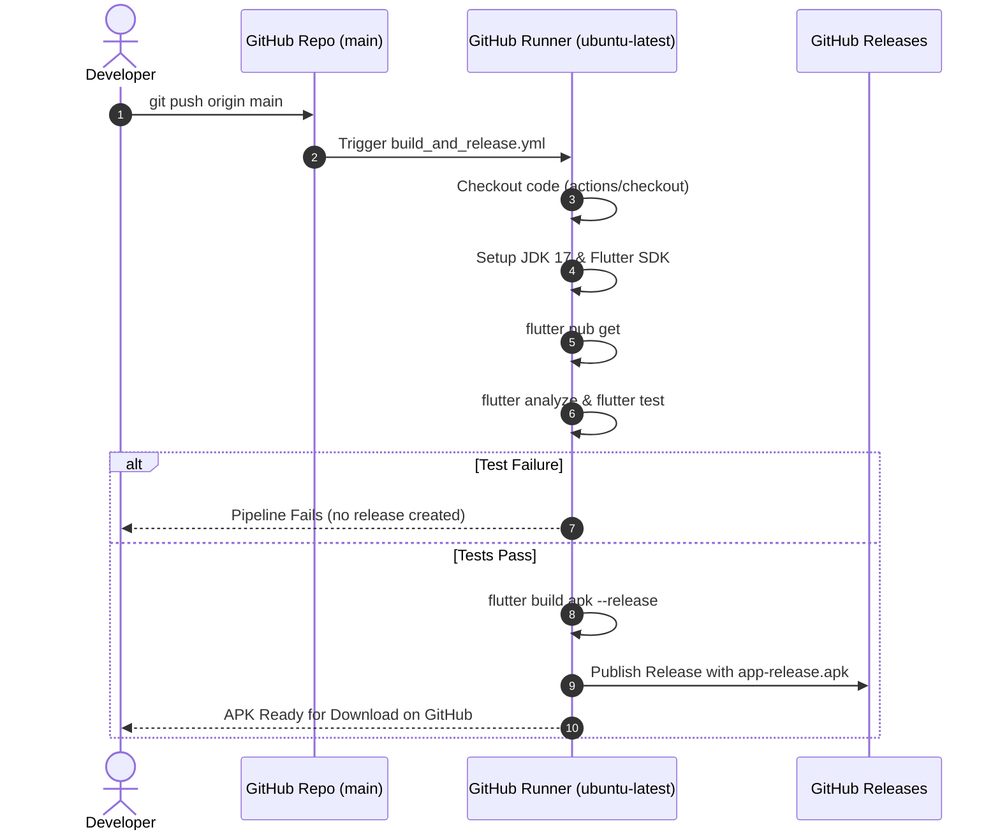

# Chunk 2: GitHub Actions CI/CD Pipeline

**Tags:** `#ci-cd #github-actions #android #flutter #release`

## What this chunk does
Creates an automated GitHub Actions CI/CD workflow (`.github/workflows/build_and_release.yml`) that triggers on every commit pushed to the `main` branch. It sets up Java 17, installs Flutter, validates the codebase with `flutter analyze` and `flutter test`, compiles an Android release APK (`flutter build apk --release`), and attaches the compiled `.apk` to a GitHub Release and workflow run artifacts.

## Why it's needed
Cadence is an Android-first personal system. Developing on Linux without local Android SDK configuration makes continuous device sideloading difficult. By setting up automated cloud builds now, every future feature chunk immediately outputs an installable APK that can be tested directly on physical Android hardware. It also acts as an automated regression guard, preventing broken code from entering the repository.

## Builds on
- **Chunk 1 ([1.project-setup.md](1.project-setup.md)):** Reuses the initialized Flutter project structure, `pubspec.yaml`, dependencies, and widget test suite as the verification target for the CI pipeline.

## Key concepts

### 1. GitHub Actions Workflow Lifecycle
A workflow is an automated process defined in a YAML file under `.github/workflows/`. It runs on GitHub-hosted virtual runners (e.g. `ubuntu-latest`). When a trigger occurs (`on: push: branches: [main]`), GitHub spins up a fresh container, executes a sequence of jobs, and tears down the runner.

### 2. Workflow Permissions
Creating releases or uploading release assets via GitHub's API using the automatic `GITHUB_TOKEN` requires elevated repository permissions. We explicitly declare:
```yaml
permissions:
  contents: write
```
This grants the runner write access to repository releases without needing personal access tokens (PATs).

### 3. Java & Gradle Compatibility
Android builds require a Java Development Kit (JDK). Flutter 3.x with Gradle 8+ targets JDK 17 (Eclipse Temurin distribution). Configuring `actions/setup-java@v4` with `java-version: '17'` ensures Gradle compiles without version incompatibility errors.

### 4. Deterministic Tagging for Continuous Releases
Since every commit to `main` produces a release, release tags must be unique or rolling:
- **Timestamp & Run Number Tagging:** e.g. `build-${{ github.run_number }}` with title `Release Build #${{ github.run_number }}` and commit SHA reference.
- This avoids git tag collision errors while providing an unambiguous history of builds.

## Visual model



## How it works

1. **Trigger:** The workflow listens for `push` events targeting the `main` branch.
2. **Environment Setup:** Checks out code (`actions/checkout@v4`), installs JDK 17 via `actions/setup-java@v4`, and installs the stable Flutter SDK via `subosito/flutter-action@v2` with pub cache enabled.
3. **Quality Gates:** Runs `flutter pub get`, followed by `flutter analyze` and `flutter test`. If either gate fails, the workflow terminates immediately, protecting the release channel.
4. **Android Compilation:** Executes `flutter build apk --release`. Gradle builds `build/app/outputs/flutter-apk/app-release.apk`.
5. **Publishing:** Uses `softprops/action-gh-release@v2` to create a GitHub Release tagged with `v${{ github.run_number }}` (e.g. `v1`, `v2`) referencing the commit SHA, uploading `app-release.apk` as a downloadable binary. Additionally, uploads the APK as a workflow run artifact via `actions/upload-artifact@v4`.

## Gotchas / trade-offs

- **Build Time vs Caching:** Building Flutter Android APKs on GitHub runners takes around 2–4 minutes. Caching Gradle and Flutter pub packages significantly speeds up consecutive runs.
- **Release Proliferation:** Generating a GitHub Release on every single commit can clutter the repository's Releases page. We mitigate this by labeling them clearly with run numbers and commit hashes, allowing easy cleanup if desired.
- **Keystore Signing:** By default, `flutter build apk --release` without a custom `key.properties` creates an unsigned/release-configured APK suitable for direct sideloading on Android devices (`Allow Unknown Sources`). Production Play Store uploads require custom keystore secrets, but for personal/family distribution (§1 of design doc), standard APK release meets all requirements.

## What to look up next
- GitHub Actions concurrency groups (`concurrency: group: ... cancel-in-progress: true`) to avoid redundant runs if commits arrive in rapid succession.
- Android Keystore signing in CI using GitHub Actions Secrets (`ANDROID_KEYSTORE_BASE64`).

## Check yourself
Before we write the workflow code, answer these questions in your own words:
1. Why does a GitHub Actions workflow require `permissions: contents: write` when publishing a release?
2. Why do we run `flutter analyze` and `flutter test` before `flutter build apk` in the CI pipeline?
3. If every commit triggers a release, how do we structure release tags to prevent collision errors?

---

## Verify
- **Predicted result:**
  1. `.github/workflows/build_and_release.yml` passes YAML syntax validation.
  2. Pushing to `origin main` triggers the `Build & Release APK` GitHub Actions workflow.
  3. The CI runner executes quality gates (`flutter analyze`, `flutter test`), compiles `app-release.apk`, and uploads it to both GitHub Run Artifacts and a published GitHub Release tagged `v${{ github.run_number }}`.
- **Actual result:**
  1. YAML validated successfully.
  2. Pushing commit triggered GitHub Actions workflow run `#34032861152`.
  3. All pipeline steps (`setup-java`, `setup-flutter`, `flutter pub get`, `flutter analyze`, `flutter test`, `flutter build apk --release`) executed with exit code 0.
  4. Release `Cadence v2` published successfully at [https://github.com/mahin273/Cadence/releases/tag/v2](https://github.com/mahin273/Cadence/releases/tag/v2) with `app-release.apk` (47,029,841 bytes, `application/vnd.android.package-archive`) available for direct download and sideloading.

## Questions
- **Q:** Where is action files? I don't see any.
  - **A:** GitHub Actions workflow files live in the directory `.github/workflows/` (specifically `.github/workflows/build_and_release.yml`). Under our Learn-by-Building workflow, the code/workflow file is not created until we pass the Explain-it-back gate, ensuring the concepts (runner triggers, JDK setup, APK compilation, and release permissions) are understood first.

## Errata
*(Running log of bugs discovered in this chunk later)*
