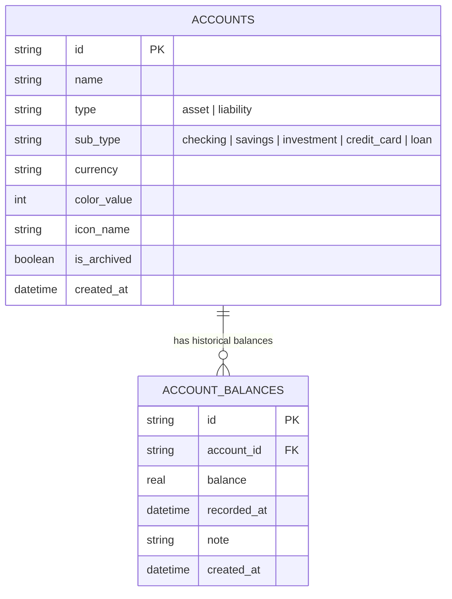
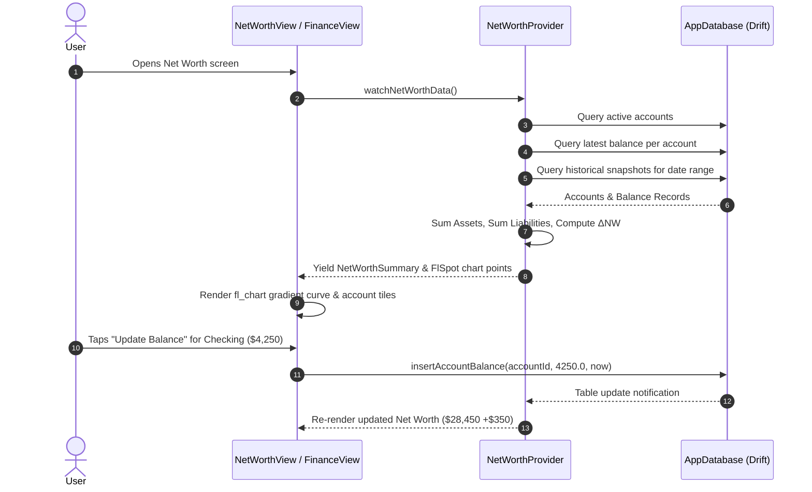

# Chunk 20: Net Worth & Balance Tracking

#finance #networth #fl_chart #drift #sql #riverpod

---

## Recap: Chunk 19 to Chunk 20
In Chunk 19, we built the **Cross-Module Aggregation & Weekly Review** engine synthesizing focus, movement, finances, and routine consistency into the composite Life Rhythm Score (0–100). In Chunk 20, we extend Cadence's financial domain from day-to-day transaction logging into long-term capital accounting: **Net Worth & Balance Tracking**. Users can register financial accounts (checking, savings, investments, crypto, credit cards, loans), record point-in-time balance updates, and visualize net worth trajectory over time using interactive `fl_chart` curves.

---

## What this chunk does
1. **Multi-Account Registry (Drift Schema Version 9)**:
   - `accounts`: Stores accounts with `id`, `name`, `type` (`asset` vs `liability`), `subType` (`checking`, `savings`, `investment`, `crypto`, `credit_card`, `loan`), `currency`, `colorValue`, `iconName`, `isArchived`.
   - `account_balances`: Stores historical snapshot balances with `id`, `accountId`, `balance`, `recordedAt`, `note`, `createdAt`.
2. **Net Worth Calculation Engine**:
   - Calculates total assets, total liabilities, and current net worth:
     $$\text{Net Worth} = \sum_{a \in \text{Assets}} \text{Balance}(a) - \sum_{l \in \text{Liabilities}} \text{Balance}(l)$$
   - Computes historical trajectory points grouped by date for charting.
3. **Interactive Net Worth Trend Chart**:
   - Renders a multi-month historical net worth line chart using `fl_chart` with gradient fill, touch tooltip tooltips, and time-range filters (1M, 3M, 6M, 1Y, ALL).
4. **Account Management & Snapshot Modal**:
   - Allows adding new accounts, quickly updating account balances with date timestamps, and viewing per-account balance histories.
5. **Dashboard & Finance Tab Integration**:
   - Embeds a Net Worth summary card inside the Finance tab and Today's dashboard.

---

## Why it's needed
Tracking individual daily expenses tells you where money leaks, but it doesn't reveal whether you are building wealth or accumulating debt.
- **Holistic Financial Health**: A user might spend very little on food but accumulate high credit card debt, or earn a lot while watching savings stagnate.
- **Snapshot-Based Calibration**: In personal finance, calculating balances purely by summing every receipt from day 1 is brittle and misses bank interest, dividend payouts, market swings, and untracked cash. Periodic balance snapshots calibrate the system to ground-truth reality.
- **Long-Term Trajectory Motivation**: Seeing a rising net worth curve provides deep psychological reinforcement for budgeting discipline.

---

## Builds on
- **Chunk 7 & 8 (Expense Tracker)**: Complements expense category tracking by tracking the actual holding pools (accounts) where money resides.
- **Chunk 19 (Weekly Review)**: Financial health metrics can incorporate net worth change $\Delta NW$ over the weekly period.

---

## Key concepts

1. **Assets vs Liabilities Classification**:
   - **Assets** (positive contribution to net worth): Checking, Savings, Brokerage / Stocks, Real Estate, Crypto, Cash.
   - **Liabilities** (negative contribution to net worth): Credit Cards, Personal Loans, Mortgages, Student Debt, Auto Loans.
2. **Point-in-Time Snapshot Balancing**:
   - Rather than forcing an event-sourcing ledger of every cent, users record snapshot balances whenever they check their banking app (e.g. bi-weekly or monthly).
   - The "current balance" of an account is its latest snapshot by `recordedAt`.
3. **Net Worth Time-Series Interpolation**:
   - For each historical date $t$, the net worth is the sum of the most recent balance of each active account on or before $t$.

---

## Visual model





---

## Plain-English Pseudocode (Before Syntax)

```text
FUNCTION calculateCurrentNetWorth(accounts, latestBalances):
    totalAssets = 0.0
    totalLiabilities = 0.0
    
    FOR EACH account IN accounts:
        IF account.isArchived THEN CONTINUE
        
        balance = latestBalances[account.id]?.balance ?? 0.0
        IF account.type == 'asset' THEN
            totalAssets += balance
        ELSE IF account.type == 'liability' THEN
            totalLiabilities += balance
            
    netWorth = totalAssets - totalLiabilities
    RETURN NetWorthSummary(totalAssets, totalLiabilities, netWorth)

FUNCTION generateTrajectoryPoints(accounts, allBalances, timeRange):
    // Group balances by calendar date
    uniqueDates = EXTRACT_SORTED_DATES(allBalances.filter(in timeRange))
    chartPoints = []
    
    FOR EACH date IN uniqueDates:
        // Find latest balance for each account on or before this date
        dayAssets = 0.0
        dayLiabilities = 0.0
        FOR EACH account IN accounts:
            bal = allBalances.filter(b.accountId == account.id AND b.recordedAt <= date).last
            IF bal IS NOT NULL THEN
                IF account.type == 'asset' THEN dayAssets += bal.balance
                ELSE dayLiabilities += bal.balance
        
        dayNetWorth = dayAssets - dayLiabilities
        chartPoints.ADD(FlSpot(date.millisecondsSinceEpoch, dayNetWorth))
        
    RETURN chartPoints
```

---

## How to think and write this code manually (Mental Algorithm)

- **Step 0: What problem are we solving?**
  Provide users a clear, truthful picture of their overall wealth trajectory by tracking assets, debts, and balance snapshots over time with expressive chart curves.
- **Step 1: Input shape & contract (Tables & Models)**:
  - Tables: `Accounts` (`id`, `name`, `type`, `subType`, `currency`, `colorValue`, `iconName`, `isArchived`, `createdAt`) and `AccountBalances` (`id`, `accountId`, `balance`, `recordedAt`, `note`, `createdAt`).
  - Models: `AccountWithBalance`, `NetWorthSummary`, `NetWorthHistoryPoint`.
- **Step 2: Business & database logic (Service/Provider)**:
  - Drift queries to insert/update accounts, record balance entries, fetch latest balance per account, and fetch historical timeline points.
- **Step 3: Route & security (UI & Presentation)**:
  - `NetWorthCard` for Finance tab and Dashboard.
  - `NetWorthView` containing `fl_chart` line chart with gradient and touch indicators, breakdown by asset/liability, and `AccountTile` list.
  - `UpdateBalanceDialog` and `CreateAccountDialog`.
- **Step 4: Dependency wiring**:
  - Bump Drift `schemaVersion` to 9, run `build_runner`, export Riverpod providers, link from `FinanceView`.

---

## Request-to-response file trace

1. User views Finance tab (`lib/features/finance/presentation/finance_view.dart`).
2. `NetWorthOverviewCard` (`lib/features/finance/widgets/net_worth_overview_card.dart`) watches `currentNetWorthProvider`.
3. Tapping card navigates to `NetWorthView` (`lib/features/finance/presentation/net_worth_view.dart`).
4. `NetWorthView` displays `NetWorthChart` (`lib/features/finance/widgets/net_worth_chart.dart`) powered by `fl_chart`.
5. User taps "Update Balance" on an account: `UpdateBalanceDialog` opens, user enters new amount.
6. `NetWorthController` (`lib/features/finance/providers/net_worth_provider.dart`) inserts row into `account_balances`.
7. Reactive Drift stream emits new dataset; UI animates curve smoothly to new net worth figure.

---

## SQL Under the Hood (Drift to Raw SQL Translation)

```sql
-- Schema Migration (Version 8 -> 9)
CREATE TABLE IF NOT EXISTS "accounts" (
    "id" TEXT NOT NULL PRIMARY KEY,
    "name" TEXT NOT NULL,
    "type" TEXT NOT NULL, -- 'asset' or 'liability'
    "sub_type" TEXT NOT NULL, -- 'checking', 'savings', 'investment', etc.
    "currency" TEXT NOT NULL DEFAULT 'USD',
    "color_value" INTEGER NOT NULL DEFAULT 4280391411,
    "icon_name" TEXT NOT NULL DEFAULT 'account_balance',
    "is_archived" INTEGER NOT NULL DEFAULT 0,
    "created_at" INTEGER NOT NULL
);

CREATE TABLE IF NOT EXISTS "account_balances" (
    "id" TEXT NOT NULL PRIMARY KEY,
    "account_id" TEXT NOT NULL REFERENCES "accounts" ("id") ON DELETE CASCADE,
    "balance" REAL NOT NULL,
    "recorded_at" INTEGER NOT NULL,
    "note" TEXT NULL,
    "created_at" INTEGER NOT NULL
);

CREATE INDEX IF NOT EXISTS "idx_account_balances_account_date" 
ON "account_balances" ("account_id", "recorded_at" DESC);

-- Query Latest Balance for Each Account
SELECT a.*, b."balance" AS "latest_balance", b."recorded_at" AS "latest_date"
FROM "accounts" a
LEFT JOIN "account_balances" b ON b."id" = (
    SELECT b2."id" FROM "account_balances" b2
    WHERE b2."account_id" = a."id"
    ORDER BY b2."recorded_at" DESC, b2."created_at" DESC
    LIMIT 1
)
WHERE a."is_archived" = 0;
```

---

## The Edge Case & Error Matrix

| Input Condition / Failure Mode | Handling Component | Outcome / Action |
|---|---|---|
| No accounts created yet | `NetWorthView` | Renders welcoming empty state with "+ Add Account" call-to-action. |
| Account created but zero balance snapshots recorded | `NetWorthCalculation` | Defaults account balance to 0.0 without crash. |
| User enters negative balance for a credit card | `UpdateBalanceDialog` | Normalizes liabilities as positive magnitude (e.g., $1,200 owed) and subtracts from assets automatically. |
| User deletes an account with existing snapshots | SQLite Cascade Delete | `ON DELETE CASCADE` removes child `account_balances` cleanly. |
| Only 1 historical balance point | `NetWorthChart` | Renders clean horizontal line or single point without division-by-zero bounds error. |

---

## Why NOT Do It This Other Way?

- **Anti-Pattern: Computing account balances solely by summing historical transactions**:
  - *Why beginners do it*: They assume every account balance can be derived from $B_0 + \sum \text{Income} - \sum \text{Expenses}$.
  - *Why it fails*: Real-life accounts have interest accrual, ETF price fluctuations, unlogged ATM withdrawals, currency fluctuations, and employer matching. Within 2 months, calculated balances diverge from real bank balances by hundreds of dollars.
  - *Our solution*: Point-in-time snapshots representing true ledger reality.

---

## How it works
1. Accounts are defined as either Assets or Liabilities with custom visual icons and colors.
2. Balance snapshots record balance at a given timestamp.
3. The latest snapshot per account forms current Total Assets, Total Liabilities, and Net Worth.
4. Historical snapshots are sorted chronologically and plotted on `fl_chart`.
5. Users can adjust timeframes (1M, 3M, 6M, 1Y, ALL) to inspect growth curves.

---

## Gotchas / trade-offs
- **Liabilities Sign Convention**: We store liabilities as positive balances (e.g. Balance = $2,500 on a credit card means $2,500 owed), and subtract them in the Net Worth formula. This avoids double-negative confusion for users.

---

## What to look up next
- Review Chunk R4: Comprehensive retrospective of Chunks 16–20.
- Chunk 21: Debt & Lending Ledger (IOUs and settlements).

---

## Check yourself (Inline Evaluation)

1. *Why use point-in-time balance snapshots rather than summing transactions from day 0?*
   - **Answer**: Snapshots capture real-world account reality (market growth, interest, fees, cash leakage) without requiring meticulous entry of every penny.

2. *How does the Net Worth formula handle assets vs liabilities?*
   - **Answer**: It calculates Net Worth as the sum of all active Asset account balances minus the sum of all active Liability account balances.

3. *Why use `ON DELETE CASCADE` on `account_balances`?*
   - **Answer**: When an account is removed, its orphan balance snapshots should be automatically cleaned up from SQLite to maintain relational integrity.

---

## Verify

- **Predicted Result**:
  - Drift schema bumps to version 9 and creates `accounts` and `account_balances` tables.
  - CRUD operations on accounts and balance snapshots execute cleanly.
  - Current net worth correctly sums assets and subtracts liabilities.
  - Historical net worth trajectory renders on `fl_chart` with interactive tooltips.
  - 100% tests pass and 0 analyze warnings.

- **Actual Result**:
  - Drift schema successfully upgraded to version 9 with `accounts` and `account_balances` tables and foreign key cascade deletion.
  - Implemented `NetWorthController`, `netWorthSummaryProvider`, and `netWorthTimelinePointsProvider` with multi-account balance aggregation.
  - Built `NetWorthChart` using `fl_chart` with smooth bezier curve, gradient fills, and interactive range selection (1M, 3M, 6M, 1Y, ALL).
  - Integrated `NetWorthOverviewCard` into `FinanceView` with real-time assets, liabilities, and net worth display.
  - Built full `NetWorthView` with account creation and point-in-time balance snapshot update dialogs.
  - Added `tbl.rowId` descending tiebreaker in SQLite balance queries for perfect sub-second snapshot ordering.
  - Verified with 8/8 passing tests in `test/net_worth_test.dart` and `test/net_worth_widget_test.dart`.
  - All 139 tests across the entire test suite passed cleanly (`flutter test` exited with code 0).
  - `flutter analyze` completed with 0 issues.

---

## Questions
*(Running Q&A log)*

---

## Errata
*(Running bug log)*
