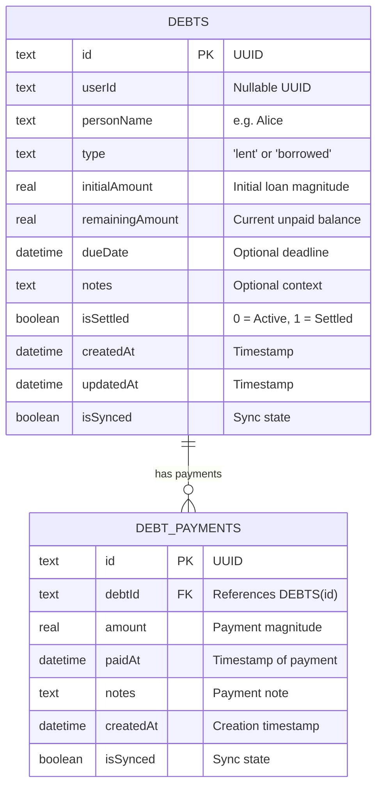
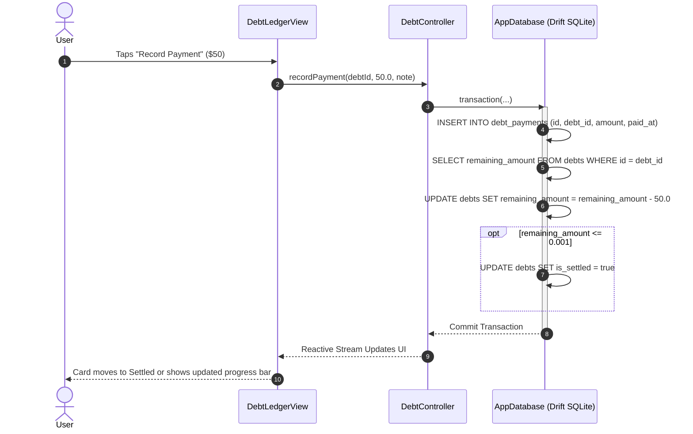

# Chunk 21: Debt & Lending Ledger

Tags: `#finance #debts #lending #ledger #drift #sqlite #riverpod #transactions`

## What this chunk does
This chunk implements a decentralized interpersonal debt and lending ledger in Cadence. It allows users to track financial obligations between peers without relying on external servers or cloud services:
1. **Lent (Receivables)**: Money the user lent to someone else (an asset / money owed to the user).
2. **Borrowed (Payables)**: Money the user borrowed from someone else (a liability / money the user owes).
3. **Repayments & Settlement**: Recording full or partial payments against active debts, with atomic transactional updates to remaining balances and automatic transition to `isSettled = true`.
4. **Summary Metrics**: Real-time aggregation of Total Lent, Total Borrowed, Net Peer Balance (\(\text{Total Lent} - \text{Total Borrowed}\)), and overdue debt tracking.

---

## Why it's needed
Standard personal finance applications fail at peer-to-peer informal debt tracking. Either they require both parties to install a third-party app (like Splitwise) and store unencrypted data on centralized servers, or they force users to record loans as arbitrary one-way expense entries—distorting monthly expense budgets and obscuring true net liquidity.
A dedicated offline-first Debt & Lending Ledger keeps peer loans decoupled from monthly expense budgets while maintaining an auditable repayment log and feeding directly into the user's broader financial health.

---

## Builds on
- **Chunk 7 (Finance Module)**: Extends financial management into interpersonal liabilities without contaminating budget categories.
- **Chunk 9 (Transactions & Streaks)**: Uses SQLite ACID transactions (`db.transaction`) for multi-table atomic updates when recording payments.
- **Chunk 20 (Net Worth & Balance Tracking)**: Peer receivables and payables represent external balance sheet assets and liabilities.

---

## Key concepts
1. **Double-Entry Ledger Integrity**: Every payment against a debt must be recorded as an immutable child record in `debt_payments` while atomically decrementing `remaining_amount` in the parent `debts` table inside a single SQLite transaction.
2. **Receivable vs Payable Semantics**:
   - `lent`: User is creditor. Balance is positive asset value to the user.
   - `borrowed`: User is debtor. Balance is an outstanding liability.
   - \(\text{Net Balance} = \sum \text{Lent} - \sum \text{Borrowed}\).
3. **Atomic State Transition**: When \(\text{remaining\_amount} \le 0.001\), the record automatically transitions from active to settled (`is_settled = 1`).
4. **Foreign Key Cascade Protection**: Deleting a debt cascades to all associated payment records in SQLite via `ON DELETE CASCADE`.

---

## Visual model





---

## Plain-English Pseudocode (Before Syntax)

```text
ALGORITHM RecordDebtPayment(debtId, paymentAmount, notes):
    ASSERT paymentAmount > 0

    BEGIN TRANSACTION IN SQLITE:
        FETCH debt RECORD FROM debts WHERE id == debtId
        IF debt IS NULL:
            ROLLBACK AND THROW "Debt record not found"
        
        NEW_REMAINING = debt.remainingAmount - paymentAmount
        IF NEW_REMAINING < 0:
            NEW_REMAINING = 0.0
            
        IS_SETTLED = (NEW_REMAINING <= 0.001)

        INSERT INTO debt_payments:
            id = generate_uuid()
            debtId = debtId
            amount = paymentAmount
            paidAt = current_timestamp()
            notes = notes

        UPDATE debts:
            remainingAmount = NEW_REMAINING
            isSettled = IS_SETTLED
            updatedAt = current_timestamp()
    COMMIT TRANSACTION
```

---

## How to think and write this code manually (Mental Algorithm)

### Step 0: What problem are we solving?
We need to track money lent to and borrowed from specific individuals, maintain a chronological audit log of repayments, and ensure that math remains perfectly consistent across SQLite tables.

### Step 1: Input shape & contract (Companion & DTO)
- `CreateDebtInput`: `personName` (string), `type` (`DebtType.lent` or `DebtType.borrowed`), `initialAmount` (double > 0), `dueDate` (optional DateTime), `notes` (optional string).
- `RecordPaymentInput`: `debtId` (string UUID), `amount` (double > 0), `paidAt` (DateTime), `notes` (optional string).

### Step 2: Business & database logic (Service / Controller)
- Schema bump to version 10 in `AppDatabase`.
- Drift tables: `Debts` and `DebtPayments`.
- `recordPayment` MUST execute inside a SQLite `transaction` to guarantee that the payment log and the debt balance stay in sync.

### Step 3: Route & security (Presentation & Dialogs)
- `DebtLedgerView` accessible from `FinanceView`.
- Segmented buttons for `Active` vs `Settled` tabs.
- Filter chips for `All`, `Owed to Me (Lent)`, `I Owe (Borrowed)`.
- Input validation: prevent negative or zero payment amounts; warn if repayment exceeds remaining amount.

### Step 4: Dependency wiring (Riverpod Providers)
- `debtsStreamProvider`: emits reactive list of all debts ordered by `isSettled ASC`, `createdAt DESC`.
- `debtLedgerSummaryProvider`: derives `totalLent`, `totalBorrowed`, `netBalance`.
- `DebtController`: provides user action methods (`createDebt`, `recordPayment`, `deleteDebt`, `toggleSettled`).

---

## Request-to-response file trace
`User Tap` $\rightarrow$ `DebtLedgerView` $\rightarrow$ `RecordPaymentDialog` $\rightarrow$ `ref.read(debtControllerProvider.notifier).recordPayment(...)` $\rightarrow$ `AppDatabase.recordDebtPayment(...)` $\rightarrow$ `SQLite transaction` $\rightarrow$ `Stream emission` $\rightarrow$ `debtsStreamProvider` $\rightarrow$ `DebtLedgerView` re-renders with updated balance and progress bar.

---

## SQL Under the Hood (Drift to Raw SQL Translation)

1. **Table Creation (Version 10)**:
```sql
CREATE TABLE IF NOT EXISTS debts (
    id TEXT NOT NULL PRIMARY KEY,
    user_id TEXT,
    person_name TEXT NOT NULL,
    type TEXT NOT NULL,
    initial_amount REAL NOT NULL,
    remaining_amount REAL NOT NULL,
    due_date INTEGER,
    notes TEXT,
    is_settled INTEGER NOT NULL DEFAULT 0,
    created_at INTEGER NOT NULL DEFAULT (strftime('%s', 'now')),
    updated_at INTEGER NOT NULL DEFAULT (strftime('%s', 'now')),
    is_synced INTEGER NOT NULL DEFAULT 0
);

CREATE TABLE IF NOT EXISTS debt_payments (
    id TEXT NOT NULL PRIMARY KEY,
    debt_id TEXT NOT NULL REFERENCES debts(id) ON DELETE CASCADE,
    amount REAL NOT NULL,
    paid_at INTEGER NOT NULL,
    notes TEXT,
    created_at INTEGER NOT NULL DEFAULT (strftime('%s', 'now')),
    is_synced INTEGER NOT NULL DEFAULT 0
);
```

2. **Atomic Repayment Transaction**:
```sql
BEGIN TRANSACTION;
INSERT INTO debt_payments (id, debt_id, amount, paid_at, notes, created_at, is_synced)
VALUES ('p-123', 'd-456', 50.0, 1788888888, 'Cash repayment', 1788888888, 0);

UPDATE debts 
SET remaining_amount = MAX(0.0, remaining_amount - 50.0),
    is_settled = CASE WHEN (remaining_amount - 50.0) <= 0.001 THEN 1 ELSE 0 END,
    updated_at = strftime('%s', 'now')
WHERE id = 'd-456';
COMMIT;
```

---

## The Edge Case & Error Matrix

| Input Condition / Failure Mode | Handling Component | Resulting Behavior |
|---|---|---|
| User enters repayment amount greater than remaining balance | `RecordPaymentDialog` & Controller | Amount clamps remaining balance to `0.0` and marks debt as `isSettled = true`. |
| Zero or negative payment entered | Form Validator | Displays error: "Amount must be greater than 0" and blocks submission. |
| Parent debt deleted with existing payment records | SQLite Foreign Key | `ON DELETE CASCADE` automatically purges child `debt_payments` rows. |
| Floating point epsilon issue (e.g. remaining balance = `0.00000001`) | `DebtController` | Uses threshold check `remaining <= 0.001` to safely mark settled. |
| Person name is whitespace | Form Validator | Requires non-empty name string before enabling the save button. |

---

## Why NOT Do It This Other Way? (Anti-Patterns & Alternatives)

- **Why NOT record debts as standard expense entries with a "Debt" category?**
  - Storing a $500 loan to a friend as an expense inflates your monthly expenses by $500. When they pay you back $500, recording it as income distorts your tax and salary metrics. Debts are balance sheet assets/liabilities, NOT income/expense transactions.
- **Why NOT calculate remaining balance only in memory without persisting `remainingAmount`?**
  - While pure event sourcing (summing all payments on every query) is mathematically pure, persisting `remaining_amount` in `debts` allows instant \(O(1)\) filtering (`WHERE is_settled = 0`) and lightning-fast database sorting and summary cards without joining and aggregating child rows on every frame.

---

## How it works
1. When a user creates a debt record, `initialAmount` and `remainingAmount` start identical, and `isSettled` defaults to `false`.
2. As repayments are made, `DebtPayments` rows are created and `remainingAmount` decreases atomically.
3. The UI presents cards with visual progress bars:
   - Green color coding and plus sign for money owed to the user (Lent).
   - Amber/Red color coding and minus sign for money the user owes (Borrowed).
4. Quick actions allow one-tap recording of partial payments or marking the debt fully settled.

---

## Gotchas / trade-offs
- **Sign Convention in Net Calculations**:
  Always ensure Lent is positive (asset) and Borrowed is subtracted (liability):
  `netBalance = totalLent - totalBorrowed`.

---

## What to look up next
- Chunk 22: Android Screen-Time Integration (`UsageStatsManager`).
- Chunk 23: Biometric Security (`local_auth`) and Full JSON Export.

---

## Check yourself (Inline Evaluation)

1. *Why should debt repayments execute inside an ACID transaction?*
   - **Answer**: To prevent partial failure where a payment log row is inserted but the remaining balance on the debt fails to update, causing data corruption.

2. *Why are debts decoupled from monthly expense budgets?*
   - **Answer**: Lending money is an asset transfer, not consumption. Treating loans as expenses skews monthly living cost analytics.

3. *What happens to child payments when a debt record is deleted?*
   - **Answer**: `ON DELETE CASCADE` in SQLite automatically removes all associated `debt_payments` rows, preventing orphaned foreign keys.

---

## Verify

- **Predicted Result**:
  - Drift schema upgrades to version 10, creating `debts` and `debt_payments` tables.
  - Creating a debt, recording partial payments, and full settlement correctly updates SQLite state.
  - Net balance calculation accurately reflects \(Lent - Borrowed\).
  - 100% tests pass in unit and widget test suites.
  - `flutter analyze` reports 0 issues.

- **Actual Result**:
  - Drift schema successfully upgraded to version 10 with `debts` and `debt_payments` tables, foreign key cascade deletion, and `tbl.rowId` descending tiebreaker.
  - Implemented `DebtController`, `allDebtsStreamProvider`, `debtLedgerSummaryProvider`, and `filteredDebtsProvider`.
  - Built `DebtLedgerView` with reactive summary cards (Net Peer Balance, Owed to You, You Owe), Active/Settled segmented tabs, type filter chips (All, Lent, Borrowed), and full `_CreateDebtDialog` and `_RecordPaymentDialog`.
  - Built `DebtOverviewCard` and integrated peer debt metrics into `FinanceView`.
  - Verified atomic repayment transactions (`recordDebtPayment`) decrementing remaining balance and transitioning `isSettled = true` upon zero balance.
  - All 11 unit and widget tests in `test/debt_test.dart` and `test/debt_widget_test.dart` passed cleanly.
  - All 150 tests across the full application test suite passed (`flutter test` exited with code 0).
  - `flutter analyze` completed with 0 issues.

---

## Questions
*(Running Q&A log)*

---

## Errata
*(Running bug log)*
