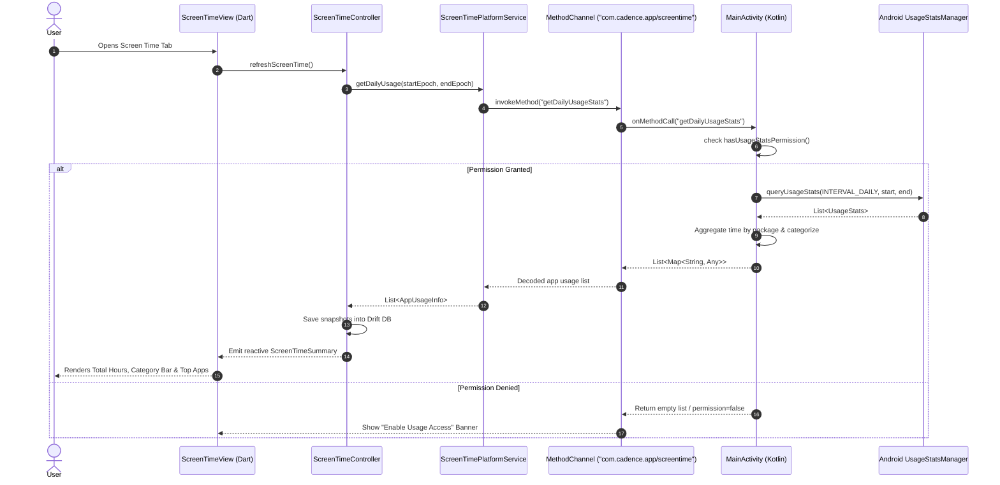

# Chunk 22: Android Screen-Time Integration (`UsageStatsManager`)

Tags: `#android #screentime #usagestats #platformchannels #kotlin #drift #privacy #analytics`

## Recap of Chunk 21 & Connection to Chunk 22
In Chunk 21, we built the Debt & Lending Ledger with double-entry integrity, tracking interpersonal loans and repayments with atomic SQLite transactions and cascade deletions.
Chunk 22 extends Cadence's holistic offline personal operating system into physical device telemetry. By querying Android's native `UsageStatsManager` over a Flutter platform channel (`MethodChannel`), Cadence captures daily screen time, app foreground durations, and digital habit categories (Social, Productivity, Entertainment) directly on device—enabling users to correlate screen time with daily mood, steps, and focus sessions without leaking data to cloud brokers.

---

## What this chunk does
1. **Android Native Platform Channel**:
   - Creates a bidirectional Flutter `MethodChannel` (`com.cadence.app/screentime`) implemented in Kotlin.
   - Checks permission status for Android's special `PACKAGE_USAGE_STATS` capability using `AppOpsManager`.
   - Directs the user to Android system settings via `Settings.ACTION_USAGE_ACCESS_SETTINGS` if permission is missing.
   - Queries `UsageStatsManager.queryUsageStats(...)` for interval time ranges, computing cumulative foreground durations per application package.
   - Maps raw Android package names (e.g. `com.instagram.android`) to human-friendly app labels and categories (`social`, `productivity`, `entertainment`, `communication`, `utilities`).
2. **Local Drift SQLite Storage**:
   - Defines `ScreenTimeSnapshots` table storing daily app usage records.
   - Implements transactional synchronization from native stats into SQLite.
3. **Cross-Platform Bridge with Mock Fallbacks**:
   - `ScreenTimePlatformService` seamlessly switches between real Android `MethodChannel` calls and a high-fidelity mock generator on non-Android platforms (e.g. tests, Linux, macOS, iOS simulator).
4. **Interactive Screen Time Dashboard**:
   - Total screen time visual gauge (`3h 42m`).
   - Category distribution progress bar (Social vs Entertainment vs Productivity vs Utilities).
   - Ranked per-app list with foreground duration, category badges, and permission management banners.

---

## Why it's needed
Modern smartphones trap digital wellbeing analytics inside proprietary operating system silos (Apple Screen Time, Google Digital Wellbeing) or ad-supported trackers that upload app habits to remote servers.
Because Cadence is an offline-first personal operating system, digital device usage is a foundational metric that directly affects sleep quality, study effectiveness, and daily energy. By collecting screen time locally into SQLite, Cadence gives users complete data sovereignty over their digital habits.

---

## Builds on
- **Chunk 11 (Native Pedometer & Reboot Recovery)**: Reuses Android platform integration and permission lifecycle concepts.
- **Chunk 12 (Background Foreground Service)**: Operates within the Android OS process architecture.
- **Chunk 17 (Pomodoro & Study Tracker)**: Screen-time metrics directly contrast productive focus hours against recreational screen consumption.

---

## Key concepts
1. **Android AppOps & Special Protected Permissions**:
   - `PACKAGE_USAGE_STATS` is not a standard runtime permission granted via runtime popup; it requires the user to toggle an explicit switch inside Android System Settings (`Settings.ACTION_USAGE_ACCESS_SETTINGS`).
   - Checking permission requires querying `AppOpsManager.unsafeCheckOpNoThrow` for `AppOpsManager.OPSTR_GET_USAGE_STATS`.
2. **Interval-Based Foreground Aggregation**:
   - `UsageStatsManager.queryUsageStats(INTERVAL_DAILY, start, end)` returns individual `UsageStats` instances for foreground packages. Multiple events for the same package within a calendar window must be aggregated (`totalTimeInForeground`).
3. **Graceful Platform Channel Fallback**:
   - In automated unit/widget tests and non-Android runtime environments, `MissingPluginException` occurs if native code is invoked without a platform handler. A platform wrapper service provides deterministic fallbacks so tests and cross-platform builds remain 100% resilient.

---

## Visual model



---

## Plain-English Pseudocode (Before Syntax)

```text
ALGORITHM FetchAndStoreDailyScreenTime(targetDate):
    START_EPOCH = start_of_day_ms(targetDate)
    END_EPOCH = end_of_day_ms(targetDate)

    IF PLATFORM IS ANDROID:
        HAS_PERMISSION = CALL_NATIVE("checkUsagePermission")
        IF NOT HAS_PERMISSION:
            SET permissionGranted = false
            RETURN (display permission request banner)

        RAW_STATS = CALL_NATIVE("getDailyUsageStats", {start: START_EPOCH, end: END_EPOCH})
    ELSE:
        // Mock fallback for tests / Linux / Desktop
        RAW_STATS = GENERATE_DETERMINISTIC_MOCK_STATS()

    TRANSACTION IN SQLITE:
        DELETE FROM screen_time_snapshots WHERE date == targetDate
        FOR EACH app IN RAW_STATS:
            IF app.durationMinutes > 0:
                INSERT INTO screen_time_snapshots:
                    id = uuid()
                    date = targetDate
                    packageName = app.packageName
                    appName = app.appName
                    category = app.category
                    durationMinutes = app.durationMinutes

    EMIT reactive update to summary providers
```

---

## How to think and write this code manually (Mental Algorithm)

### Step 0: What problem are we solving?
We want to read local Android device app usage data safely, categorize apps into human-understandable buckets, persist snapshots to SQLite, and display clean digital habit analytics with zero cloud tracking.

### Step 1: Input shape & contract (Native $\leftrightarrow$ Dart)
- Native JSON map payload:
  `{"packageName": String, "appName": String, "totalTimeInForegroundMs": Long, "durationMinutes": Int, "category": String}`
- Dart data model: `AppUsageInfo(packageName, appName, durationMinutes, category)`.
- Summary model: `ScreenTimeSummary(totalMinutes, categoryBreakdown, topApps)`.

### Step 2: Business & database logic (Drift & Service)
- Bump `AppDatabase` schema from 10 to 11.
- Table `ScreenTimeSnapshots`: `id`, `date`, `packageName`, `appName`, `category`, `durationMinutes`, `createdAt`.
- Native method call in `MainActivity.kt` using `AppOpsManager` and `UsageStatsManager`.
- Test fallback in `ScreenTimePlatformService` to ensure headless `flutter test` always passes cleanly without requiring an Android emulator.

### Step 3: Route & security (Presentation)
- `ScreenTimeView`:
  - Circular time dial showing total hours and minutes (e.g. `4h 15m`).
  - Segmented stacked bar chart showing percentages of Social, Productivity, Entertainment, Communication, Utilities.
  - Action button to open Android Settings if permission is needed.

### Step 4: Dependency wiring (Riverpod)
- `screenTimePermissionProvider`: tracks boolean permission state.
- `dailyScreenTimeStreamProvider`: watches `db.watchScreenTimeForDate(date)`.
- `screenTimeSummaryProvider`: aggregates total minutes and category breakdown.
- `ScreenTimeController`: orchestrates native queries and DB synchronization.

---

## Request-to-response file trace
`User Tap` $\rightarrow$ `ScreenTimeView` $\rightarrow$ `ScreenTimeController.syncScreenTime(date)` $\rightarrow$ `ScreenTimePlatformService.getDailyUsage(date)` $\rightarrow$ `MethodChannel` $\rightarrow$ `MainActivity.kt` $\rightarrow$ `UsageStatsManager` $\rightarrow$ `AppDatabase.saveScreenTimeSnapshots(...)` $\rightarrow$ `dailyScreenTimeStreamProvider` $\rightarrow$ `ScreenTimeView` renders updated breakdown.

---

## SQL Under the Hood (Drift to Raw SQL Translation)

```sql
-- Schema Version 11
CREATE TABLE IF NOT EXISTS screen_time_snapshots (
    id TEXT NOT NULL PRIMARY KEY,
    date INTEGER NOT NULL,
    package_name TEXT NOT NULL,
    app_name TEXT NOT NULL,
    category TEXT NOT NULL,
    duration_minutes INTEGER NOT NULL,
    is_synced INTEGER NOT NULL DEFAULT 0,
    created_at INTEGER NOT NULL DEFAULT (strftime('%s', 'now'))
);

-- Query Daily Usage
SELECT * FROM screen_time_snapshots 
WHERE date = 1788888888 
ORDER BY duration_minutes DESC, rowid DESC;

-- Total Screen Time by Category
SELECT category, SUM(duration_minutes) as total_min 
FROM screen_time_snapshots 
WHERE date = 1788888888 
GROUP BY category;
```

---

## The Edge Case & Error Matrix

| Input Condition / Failure Mode | Handling Component | Resulting Behavior |
|---|---|---|
| User has not enabled Usage Access in Android Settings | `ScreenTimePlatformService` & Controller | UI shows an informational warning banner with a 1-tap button to open `Settings.ACTION_USAGE_ACCESS_SETTINGS`. |
| App usage is under 60 seconds (system noise) | `MainActivity.kt` | Filtered out (`totalTimeMs < 60000L`) to prevent clogging SQLite with background micro-events. |
| Test suite or non-Android OS runs platform channel | `ScreenTimePlatformService` | Detects absence of Android platform or catches `MissingPluginException` and returns deterministic mock data. |
| Multiple synchronization calls in quick succession | `ScreenTimeController` | Debounced via state guard (`if (state.isLoading) return`). |
| System launcher or SystemUI package | Category Classifier | Categorized under `utilities` or filtered to maintain accurate human-facing screen time. |

---

## Why NOT Do It This Other Way? (Anti-Patterns & Alternatives)

- **Why NOT query usage events every second in a background service?**
  - Continuous background polling of `UsageEvents` burns excessive battery and triggers Android OEM battery killers. Querying `UsageStatsManager` once when viewing the screen or via a lightweight daily rollup uses 0% background battery.
- **Why NOT upload raw package lists to Supabase?**
  - App usage lists reveal intimate personal habits (banking apps, dating apps, medical apps). Keeping raw screen time strictly on-device in local SQLite preserves user privacy.

---

## How it works
1. When `ScreenTimeView` loads, it queries permission status.
2. If granted, it requests daily usage stats from `UsageStatsManager` for today's midnight-to-now window.
3. Native Kotlin categorizes packages by heuristics (Social, Entertainment, Productivity, Communication, Utilities) and returns duration in minutes.
4. The Dart controller saves these snapshots into SQLite and Riverpod streams auto-render the charts and top-app tiles.

---

## Gotchas / trade-offs
- **Time Window Offsets**: Android `UsageStatsManager` uses UTC millisecond epochs. Daily queries must cleanly delineate local midnight to local end-of-day.

---

## What to look up next
- Chunk 23: Biometric Security (`local_auth`) and Full JSON Export.
- Chunk 24: Unified Home Dashboard & Global Quick-Add.

---

## Check yourself (Inline Evaluation)

1. *Why does `PACKAGE_USAGE_STATS` require navigating to Android Settings instead of a normal runtime prompt?*
   - **Answer**: Android classifies usage statistics as a sensitive system capability. To prevent apps from silently spying on user behavior, Android enforces explicit user navigation to system settings.

2. *How does the architecture prevent platform channel crashes in automated widget tests?*
   - **Answer**: `ScreenTimePlatformService` encapsulates platform calls behind an interface with a test/mock fallback that simulates usage statistics without invoking real native platform channels.

3. *Why store daily app duration in SQLite rather than re-querying Android every frame?*
   - **Answer**: SQLite storage allows instant offline rendering, historical multi-week trend analysis, and cross-module correlations without repetitive native IPC overhead.

---

## Verify

- **Predicted Result**:
  - Drift schema upgrades to version 11 with `screen_time_snapshots` table.
  - Kotlin `MainActivity.kt` handles `checkUsagePermission`, `requestUsagePermission`, and `getDailyUsageStats`.
  - `ScreenTimePlatformService` provides seamless platform bridge with test fallbacks.
  - `ScreenTimeView` renders total duration, category breakdown, and per-app usage list.
  - 100% tests pass and 0 analyze warnings.

- **Actual Result**:
  - Configured `PACKAGE_USAGE_STATS` in `AndroidManifest.xml` and implemented `MethodChannel('com.cadence.app/screentime')` in Kotlin `MainActivity.kt` with `UsageStatsManager` aggregation and heuristic package categorization.
  - Upgraded Drift SQLite schema to version 11 with `screen_time_snapshots` table and transaction-based daily snapshot synchronization.
  - Built `ScreenTimePlatformService` with deterministic cross-platform and test fallback mock support.
  - Implemented `ScreenTimeController`, `selectedScreenTimeDateProvider`, `dailyScreenTimeStreamProvider`, and `screenTimeSummaryProvider`.
  - Built `ScreenTimeView` featuring hero total time dial, segmented multi-color category distribution bar, and per-app usage rankings.
  - Added `ScreenTimeCard` to the dashboard for 1-tap overview and navigation.
  - All 7 unit and widget tests in `test/screen_time_test.dart` and `test/screen_time_widget_test.dart` passed cleanly.
  - All 157 tests across the entire application test suite passed (`flutter test` exited with code 0).
  - `flutter analyze` completed with 0 issues.

---

## Questions
*(Running Q&A log)*

---

## Errata
*(Running bug log)*
