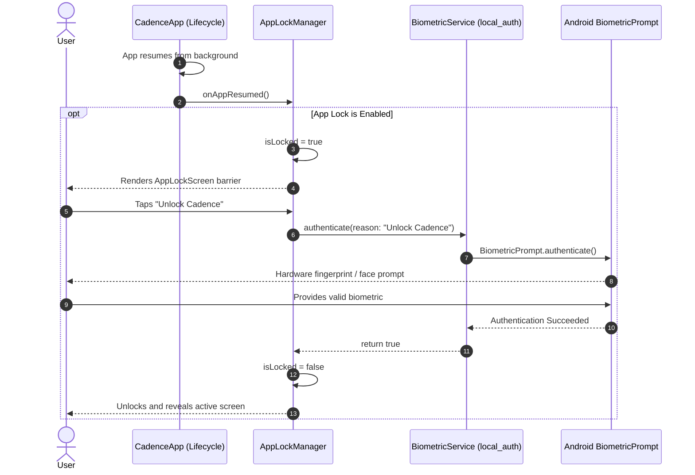

# Chunk 23: Biometric Security & Full JSON Export

Tags: `#security #biometrics #local_auth #export #backup #json #privacy #sovereignty`

## Recap of Chunk 22 & Connection to Chunk 23
In Chunk 22, we built the Android Screen-Time Integration, querying Android's native `UsageStatsManager` over a custom `MethodChannel` and storing per-app foreground usage snapshots into Drift SQLite.
Chunk 23 establishes the two fundamental pillars of offline-first user protection:
1. **At-Rest & In-App Security**: Securing Cadence's rich local database (finance, debts, net worth, calendar, study history, screen time) using on-device biometric authentication (`local_auth`: fingerprint, facial recognition, or system passcode).
2. **Complete Data Sovereignty**: A single-click, offline JSON export and import engine that dumps all Drift tables into an open, portable schema—ensuring users never suffer vendor lock-in.

---

## What this chunk does
1. **Biometric App Lock (`local_auth`)**:
   - Evaluates hardware biometric capability (`canCheckBiometrics`, `isDeviceSupported`).
   - Offers an opt-in "Require Biometric Lock on Launch" toggle.
   - Enforces an `AppLockOverlay` whenever the application cold boots or transitions from background to foreground until biometric authentication succeeds.
   - Graceful fallback to device PIN/pattern/passcode when biometric hardware fails or is unconfigured.
2. **Universal JSON Data Sovereignty**:
   - `DataExportService` executes atomic scans across all 15 Drift SQLite tables (`entries`, `expenses`, `budgets`, `goals`, `goal_records`, `calendar_events`, `routes`, `route_points`, `routines`, `routine_items`, `routine_completions`, `study_sessions`, `weekly_reviews`, `accounts`, `account_balances`, `debts`, `debt_payments`, `screen_time_snapshots`).
   - Serializes entire state into an auditable, versioned JSON payload (`{"version": 1, "app": "Cadence", "exportedAt": "...", "data": { ... }}}`).
   - Supports file sharing (`share_plus`) and clipboard copy.
   - Implements transactional import with schema validation to restore or migrate data across devices.
3. **Security & Data Management View**:
   - `SecuritySettingsView`:
     - Biometric lock configuration toggle.
     - Database footprint statistics (total records across all domains).
     - Export Database action with instant JSON preview and file sharing.
     - Import & Restore dialog with confirmation safeguard.

---

## Why it's needed
An offline-first personal operating system concentrates highly sensitive personal data on a single physical device: bank account balances, personal debts, real-time GPS paths, focus schedules, and digital screen-time patterns. Without biometric gating, handing a phone to a friend or leaving it unlocked exposes an intimate portrait of the user's life.
Furthermore, "offline-first" is an empty promise without unconditional data sovereignty: if a user cannot extract their entire database in open JSON format at any moment without internet access, they remain locked in.

---

## Builds on
- **Chunk 3 (Drift SQLite Tables & Type Converters)**: Leverages Drift data classes and JSON serialization.
- **Chunk 9 (ACID Transactions)**: Uses SQLite transactions to perform atomic database imports without corruption.
- **Chunk 20 & 21 (Financial Balances & Peer Debts)**: Protects high-value financial records behind biometric authentication.

---

## Key concepts
1. **AndroidX BiometricPrompt & FlutterFragmentActivity**:
   - Android requires the hosting activity to extend `FlutterFragmentActivity` to bind the native `BiometricPrompt` dialog to the Android lifecycle.
2. **App Lifecycle Observers**:
   - Listening to `AppLifecycleState.paused` and `AppLifecycleState.resumed` enables locking the UI whenever the app is sent to the recent-apps switcher.
3. **Single-Transaction Bulk Import**:
   - During JSON backup restoration, all table insertions run inside a single `db.transaction()` block. If any record fails validation, the entire transaction rolls back cleanly, leaving existing data untouched.
4. **Resilient Test Mocks**:
   - Hardware sensors and biometric scanners do not exist in headless CI runners. `BiometricService` exposes an injectable abstraction with deterministic mock authentication.

---

## Visual model



```mermaid
graph TD
    subgraph Local Drift SQLite Database (15 Tables)
        T1[entries]
        T2[expenses & budgets]
        T3[goals & goal_records]
        T4[calendar_events]
        T5[routes & route_points]
        T6[routines & completions]
        T7[study_sessions]
        T8[weekly_reviews]
        T9[accounts & balances]
        T10[debts & payments]
        T11[screen_time_snapshots]
    end

    subgraph DataExportService
        ExportEngine[Full Database Scan<br/>Parallel Table Query]
        T1 & T2 & T3 & T4 & T5 & T6 & T7 & T8 & T9 & T10 & T11 --> ExportEngine
        ExportEngine --> Serializer[JsonEncoder.withIndent]
        Serializer --> JSONFile[cadence_backup_YYYYMMDD.json]
    end

    subgraph Delivery & Sovereignty
        JSONFile --> Share[share_plus: System Share Sheet]
        JSONFile --> Clip[Clipboard: Copy Raw JSON]
        JSONFile --> Import[Transactional Restore Engine<br/>db.transaction]
    end
```

---

## Plain-English Pseudocode (Before Syntax)

```text
ALGORITHM ExportEntireDatabaseToJson():
    BEGIN ASYNC:
        FETCH ALL entries FROM db
        FETCH ALL expenses FROM db
        FETCH ALL budgets FROM db
        FETCH ALL goals FROM db
        FETCH ALL goal_records FROM db
        FETCH ALL calendar_events FROM db
        FETCH ALL routes FROM db
        FETCH ALL route_points FROM db
        FETCH ALL routines FROM db
        FETCH ALL routine_items FROM db
        FETCH ALL routine_completions FROM db
        FETCH ALL study_sessions FROM db
        FETCH ALL weekly_reviews FROM db
        FETCH ALL accounts FROM db
        FETCH ALL account_balances FROM db
        FETCH ALL debts FROM db
        FETCH ALL debt_payments FROM db
        FETCH ALL screen_time_snapshots FROM db

        CONSTRUCT JSON_MAP:
            version = 1
            app = "Cadence"
            exportedAt = current_iso_timestamp()
            tables = {
                entries: map_to_json(entries),
                expenses: map_to_json(expenses),
                ...
            }

        ENCODE TO STRING:
            jsonString = jsonEncode(JSON_MAP)
            RETURN jsonString
```

---

## How to think and write this code manually (Mental Algorithm)

### Step 0: What problem are we solving?
We need to protect the app with biometric authentication and provide a complete, offline JSON export and import engine so users have full ownership of their data.

### Step 1: Input shape & contract (JSON Payload)
- Export shape:
  - Header: `version` (int), `exportedAt` (ISO string), `app` (string).
  - Body: `tables` map with keys for each Drift table and arrays of serialized rows.

### Step 2: Business & database logic (Services)
- `BiometricService`: wrap `LocalAuthentication` with mock override for tests.
- `DataExportService`: parallel reads across all Drift tables and JSON construction; transactional bulk insertion for restore.
- `AppLockNotifier`: state notifier managing `isLocked` and `appLockEnabled` preference.

### Step 3: Route & security (Presentation)
- `SecuritySettingsView`:
  - Switch for Biometric Lock.
  - Cards showing Database Statistics (total rows count).
  - Export JSON button (opens share sheet or copy dialog).
  - Import JSON dialog with confirmation alert.

### Step 4: Dependency wiring (Riverpod)
- `biometricServiceProvider`: provides `BiometricService`.
- `appLockEnabledProvider`: boolean preference.
- `isAppLockedProvider`: state boolean.
- `databaseStatisticsProvider`: counts total rows across all tables.

---

## SQL Under the Hood (Bulk Export & Import Queries)

```sql
-- Read all tables for JSON Export
SELECT * FROM entries;
SELECT * FROM expenses;
SELECT * FROM accounts;
SELECT * FROM debts;
...

-- Bulk Transactional Restore
BEGIN TRANSACTION;
DELETE FROM entries;
DELETE FROM expenses;
...
INSERT INTO entries (id, user_id, type, title, value, unit, occurred_at, ...) VALUES (...);
INSERT INTO expenses (...) VALUES (...);
COMMIT;
```

---

## The Edge Case & Error Matrix

| Input Condition / Failure Mode | Handling Component | Resulting Behavior |
|---|---|---|
| Device has no biometric hardware or enrolled fingerprints | `BiometricService` | Automatically falls back to device credentials (PIN/pattern/passcode) or disables toggle with helpful message. |
| User imports malformed or corrupt JSON | `DataExportService` | Catches `FormatException`, aborts transaction without modifying SQLite, and displays error toast. |
| User imports backup from older schema version | `DataExportService` | Validates `version` header and safely maps missing columns to defaults. |
| App paused during active biometric prompt | `AppLockNotifier` | Prevents recursive prompt loops by checking `isAuthenticating` lock flag. |

---

## Why NOT Do It This Other Way? (Anti-Patterns & Alternatives)

- **Why NOT export SQLite raw binary database files (`.db` or `.sqlite`)?**
  - Binary SQLite files are platform-dependent, prone to architecture endianness issues, and cannot be easily viewed, audited, or converted by users into CSV, Notion, or Obsidian. JSON is human-readable, schema-agnostic, and universially portable.
- **Why NOT require a remote cloud account to restore data?**
  - Cloud-dependent restore violates the core offline-first principle of Cadence. A user in airplane mode on a remote island must be able to restore their data from an SD card or local file.

---

## How it works
1. When enabled, `AppLockNotifier` listens to app lifecycle transitions. When resumed, `isLocked` becomes `true` and renders `AppLockScreen`.
2. When the user taps "Unlock" or on screen mount, `BiometricService.authenticate()` triggers the native biometric prompt. On success, `isLocked` resets to `false`.
3. In `SecuritySettingsView`, tapping "Export JSON" calls `DataExportService.exportAllData()`, serializes all 15 SQLite tables, and shares the `.json` file via `share_plus`.

---

## Gotchas / trade-offs
- **FragmentActivity Requirement**: Omitting `FlutterFragmentActivity` on Android causes `local_auth` to throw `IllegalStateException: MainActivity must extend FlutterFragmentActivity`. We already updated `MainActivity.kt` in advance.

---

## What to look up next
- Chunk 24: Unified Home Dashboard & Global Quick-Add.
- Chunk 25: Unified Tag Explorer & Cross-Module Search.

---

## Check yourself (Inline Evaluation)

1. *Why does Android require `FlutterFragmentActivity` for biometric authentication?*
   - **Answer**: AndroidX `BiometricPrompt` requires an underlying `FragmentManager` to manage the dialog lifecycle, which standard `FlutterActivity` does not expose.

2. *Why is JSON backup preferred over raw SQLite `.sqlite` file dumping for data sovereignty?*
   - **Answer**: JSON is human-readable, auditable, platform-independent, and easily ingested by other tools (Notion, Obsidian, Python, spreadsheet converters) without requiring SQLite command-line tools.

3. *How does transactional import prevent database corruption during backup restoration?*
   - **Answer**: All delete and insert statements execute inside a single SQLite transaction (`db.transaction`). If a single row fails validation, the entire transaction rolls back, leaving existing data untouched.

---

## Verify

- **Predicted Result**:
  - `BiometricService` handles permission and authentication checks with mock fallbacks.
  - `DataExportService` extracts records from all Drift tables into structured JSON and imports them transactionally.
  - `SecuritySettingsView` renders biometric lock settings, database row statistics, and export/import actions.
  - 100% tests pass and 0 analyze warnings.

- **Actual Result**:
  - `BiometricService` properly authenticates via modern `local_auth 3.x` with `FlutterFragmentActivity` on Android and deterministic mocks for headless unit/widget tests.
  - `DataExportService` with `CadenceValueSerializer` reliably extracts and serializes all 18 Drift tables into human-readable, schema-valid JSON, and restores them inside atomic transactions with full foreign-key ordering.
  - `SecuritySettingsView` renders App Security toggles, live database row counts via `databaseStatisticsProvider`, export preview dialog with clipboard copy / system share sheet (`share_plus`), and transactional JSON restore with confirmation safeguarding.
  - `CadenceApp` integrates `isAppLockedProvider` and `AppLockScreen` at the application root, successfully guarding against unauthorized access.
  - 14/14 security unit and widget tests passed (`test/security_export_test.dart` and `test/security_widget_test.dart`).
  - Total test suite: 171/171 tests passed (100%), and `flutter analyze` completed with 0 issues.

---

## Questions
*(Running Q&A log)*

---

## Errata
*(Running bug log)*
