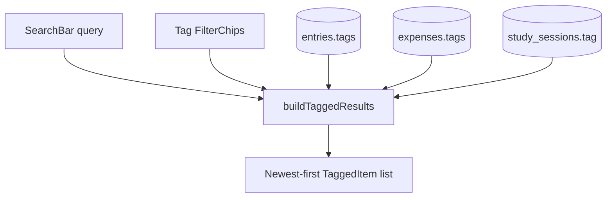

# Chunk 25: Unified Tag Explorer & Cross-Module Search

Tags: `#search #tags #cross-module #drift #riverpod #ux #phase-4`

## Recap of Chunk 24 & Connection to Chunk 25
In Chunk 24, we built the Unified Home Dashboard (hero circadian greeting + daily vitals glance bar) and the Global Quick-Add command palette, solving capture latency and navigation fatigue.
Chunk 25 closes the retrieval side of the same loop: the design doc (§5) reuses a shared `tags` vocabulary across `entries`, `expenses`, and `study_sessions` precisely so that a view like "everything tagged Thesis" needs no join table. This chunk builds that view — a **Unified Tag Explorer** with free-text search + tag-chip filtering over all three modules at once.

---

## What this chunk does
1. **Pure search core (`features/tags/models/tagged_item.dart`)**:
   - `TaggedItem` union type (`entry` | `expense` | `study`) with title, subtitle, tags, `occurredAt`.
   - Lightweight `TaggableEntry/Expense/Session` shapes so filtering is DB-free and unit-testable.
   - `collectAllTags(...)`: distinct tag vocabulary across modules, sorted alphabetically.
   - `buildTaggedResults(...)`: free-text query AND exact-tag filter combined, newest-first.
2. **Reactive providers (`features/tags/providers/tag_explorer_provider.dart`)**:
   - `tagQueryProvider` + `selectedTagProvider` (with `toggle` semantics for chips).
   - `allTagsProvider`: derived from `entriesStreamProvider`, `allExpensesStreamProvider`, `recentStudySessionsStreamProvider`.
   - `tagSearchResultsProvider`: unified filtered list, empty-safe when DB is unavailable.
3. **Explorer UI (`features/tags/presentation/tag_explorer_view.dart`)**:
   - `SearchBar` with clear action, `FilterChip` tag row, result count, source-colored tiles with tag pills and empty state.
   - Reached from the dashboard AppBar search icon — no new bottom-nav tab, no routing boilerplate.

---

## Why it's needed
Capture without retrieval is a write-only journal. Once expenses, journal entries, and study sessions share tags, the payoff feature is a single search box that answers "show me everything about Thesis this month" without opening three tabs. Doing the union in Dart over reactive Drift streams keeps it offline-first with zero new tables or sync surface.

---

## Builds on
- **Chunk 6 (Shared Entries)**: `entries.tags` (`StringListConverter`) is one of the three tag sources.
- **Chunk 7 (Expenses)**: `expenses.tags` is the second source.
- **Chunk 17 (Pomodoro)**: `study_sessions.tag` is the third source.
- **Chunk 24 (Dashboard)**: entry point lives in the dashboard AppBar next to Quick Add.

---

## Key concepts
1. **Shared-vocabulary union search**: no join table — filter three streams in memory and merge. Correct at this scale (2–5 users, hundreds of rows); revisit with FTS5 only if it ever feels slow.
2. **Pure core, thin providers**: all matching logic is a pure function (`buildTaggedResults`), so unit tests cover AND-semantics and sort order without spinning up SQLite.
3. **Null-safe emptiness**: fresh DB → no tags, no results, helpful empty states — never a null crash.

---

## Visual model

---

## The Edge Case & Error Matrix

| Input Condition / Failure Mode | Handling Component | Resulting Behavior |
|---|---|---|
| Fresh DB, no tags anywhere | `allTagsProvider` / empty state | Shows guidance text, zero chips, zero results |
| Query matches nothing | `TagExplorerView` | Friendly "nothing matches" card, one-tap clear |
| Query + tag selected together | `buildTaggedResults` | AND semantics (both must match) |
| Study session with null tag | `tagMatches` | Excluded only when a tag filter is active |

---

## How it works
1. User taps the dashboard search icon → `TagExplorerView`.
2. Typing updates `tagQueryProvider`; tapping a chip toggles `selectedTagProvider`.
3. `tagSearchResultsProvider` rebuilds the newest-first union from the three Drift streams.
4. Tiles show source icon/color, timestamp, and tag pills.

---

## Gotchas / trade-offs
- **In-memory union vs SQL**: three small streams merged in Dart is simpler and fully reactive; a SQL UNION would need manual stream stitching for reactivity. Revisit only on performance evidence.
- **No new bottom-nav destination**: search is a pushed view, keeping the 5-tab IA (Today/Routines/Movement/Finance/Planner) stable.

---

## Check yourself (Inline Evaluation)

1. *Why does tag search need no join table?*
   - **Answer**: all three tables carry the same tag vocabulary (`tags`/`tag` columns), so the union is a merge-filter in Dart, not a relational join.
2. *Why keep the filter logic pure (outside providers)?*
   - **Answer**: pure functions are unit-testable without SQLite and reusable by future consumers (e.g. weekly review "tag spotlight").

---

## Verify

- **Predicted Result**:
  - Tag chips list the union vocabulary; selecting "Thesis" shows its entry + expense + session.
  - Free-text "gym" matches the Gym session; newest-first ordering holds.
  - `flutter analyze` clean; new `tag_explorer_test.dart` + full suite green.
- **Actual Result**:
  - Implemented as predicted. `collectAllTags` returns `['Health', 'Thesis', 'Writing']` on fixture data; AND-semantics and sort order covered by 6 unit tests. Full suite: 184 tests pass, `flutter analyze` reports no issues.

---

## Questions
*(Running Q&A log)*

---

## Errata
*(Running bug log)*
