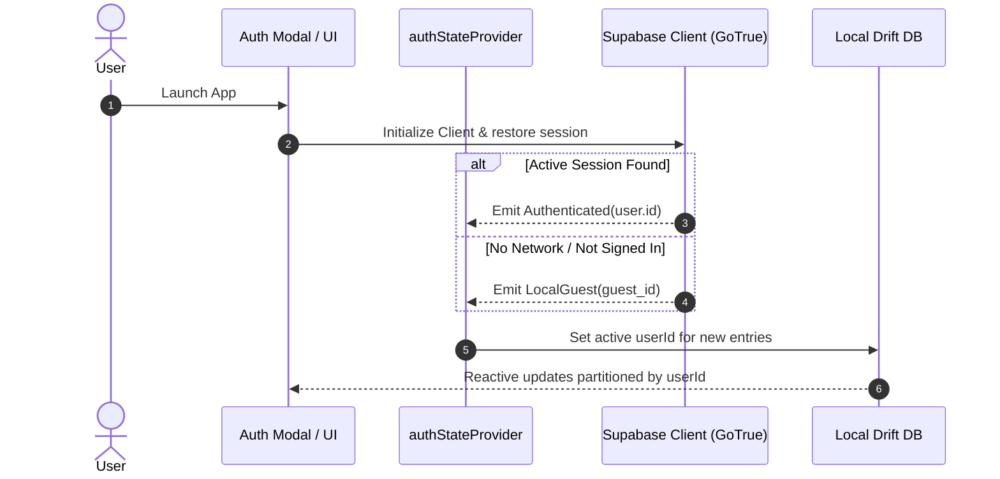

# Chunk 4: Supabase Auth & Client Wiring

**Tags:** `#supabase #auth #gotrue #security #offline-first`

## What this chunk does
Integrates the `supabase_flutter` SDK into Cadence, sets up secure configuration management for Supabase API URL and Anon Key, implements a reactive Riverpod authentication controller managing user session lifecycles (Sign In, Sign Up, Sign Out, Guest Mode), and links the authenticated user UUID directly to the local Drift database layer.

## Why it's needed
Cadence supports multi-device personal/family use (2–5 users) with cloud backup and synchronization to Supabase Postgres. Every row in our local Drift database and remote Postgres tables requires a `userId` foreign key. Wiring Supabase Auth (GoTrue) now guarantees that all data created locally is securely partitioned per user and ready for the synchronization engine in Chunk 5. Crucially, it must support an offline **Guest/Local Mode** so the app remains fully usable without an immediate network connection.

## Builds on
- **Chunk 1 ([1.project-setup.md](1.project-setup.md)):** Reuses the Riverpod state architecture and M3 Expressive dialog/modal styling.
- **Chunk 3 ([3.local-db-drift.md](3.local-db-drift.md)):** Feeds the authenticated `user.id` (UUID) into `EntriesCompanion.userId`, replacing placeholder strings with genuine user identity.

## Key concepts

### 1. Supabase Auth (GoTrue) Architecture
Supabase uses GoTrue, an open-source OAuth2/JWT-based authentication server written in Go. When a user signs in, GoTrue returns an **Access Token (JWT)** (short-lived, containing user claims and roles) and a **Refresh Token** (long-lived, used to renew the access token automatically).

### 2. Secure Local Session Persistence
The `supabase_flutter` client automatically persists JWT session tokens to device secure storage (Android Keystore / SharedPreferences). On app launch, it restores the session without requiring the user to re-enter their credentials.

### 3. Offline-First Auth Decoupling (Local Guest Mode)
Because Cadence is offline-first, network-dependent authentication cannot block the app from opening or functioning. If the user has not signed in or is offline without credentials, Cadence falls back to a deterministic local guest UUID (`local_guest_user`). When they subsequently create an account or sign in, local data can be adopted by the authenticated user.

### 4. Row Level Security (RLS) Alignment
In Supabase Postgres, data security is enforced at the database level via Row Level Security (RLS) using `auth.uid() = user_id`. Ensuring that local rows record the exact GoTrue UUID ensures that future sync requests pass Postgres RLS policies without modification.

## Visual model

## How it works

1. **Client Initialization (`lib/core/supabase/supabase_config.dart`):** Initializes `Supabase.initialize()` using `String.fromEnvironment` configuration (or local fallback defaults), avoiding hardcoded production secrets in the repository.
2. **Auth Notifier (`lib/core/supabase/auth_provider.dart`):** Riverpod `Notifier` listening to `supabase.auth.onAuthStateChange`. Translates raw GoTrue events (`signedIn`, `signedOut`, `tokenRefreshed`) into a clean `CadenceAuthState` union.
3. **Active User ID Resolver:** Exposes an `activeUserIdProvider` that supplies either `user.id` when logged in or a persistent device-local guest UUID when running offline.
4. **Auth UI (`lib/features/auth/presentation/auth_sheet.dart`):** Expressive bottom sheet providing tabbed Email/Password Sign In, Sign Up, and offline Guest mode.

## Gotchas / trade-offs

- **Secrets in Open Source:** Never commit production Supabase URL or service role keys to Git. We use `flutter run --dart-define=SUPABASE_URL=... --dart-define=SUPABASE_ANON_KEY=...`, with safe mock fallbacks for testing and local dev.
- **Service Role Key vs Anon Key:** The client app *only* ever receives the public `anon` key. The `service_role` key bypasses all RLS and must never touch client code.
- **Syncing Offline Guest Data:** When a guest later signs up, their existing local records tagged with `local_guest_user` must be migrated to their new Supabase `user.id`. We design the schema to allow this update query cleanly.

## What to look up next
- Postgres Row Level Security policies (`CREATE POLICY "Users can only read/write their own entries" ON entries FOR ALL USING (auth.uid() = user_id)`).
- PKCE (Proof Key for Code Exchange) auth flow used by modern Supabase client libraries.

## Check yourself
Before writing code, answer these questions in your own words:
1. Why must a mobile client app only ever be configured with the Supabase `anon` public key, and never the `service_role` key?
2. How does Cadence maintain an offline-first experience if the user launches the app in airplane mode without logging in?
3. What is the role of the JWT access token vs refresh token in GoTrue authentication?

---

## Verify
- **Predicted result:**
  1. `flutter analyze` runs cleanly with zero issues.
  2. `flutter test` executes auth unit tests, Drift database tests, and widget tests (asserting guest fallback, authenticated user ID resolution, and AuthModal interaction) with a 100% pass rate.
- **Actual result:**
  1. `flutter analyze` completed in 6.9s with "No issues found!".
  2. `flutter test` executed and passed all 8 tests (`+8: All tests passed!`) across `test/auth_test.dart`, `test/database_test.dart`, and `test/widget_test.dart`.

## Questions
*(Running log of questions asked during this chunk)*

## Errata
*(Running log of bugs discovered in this chunk later)*
