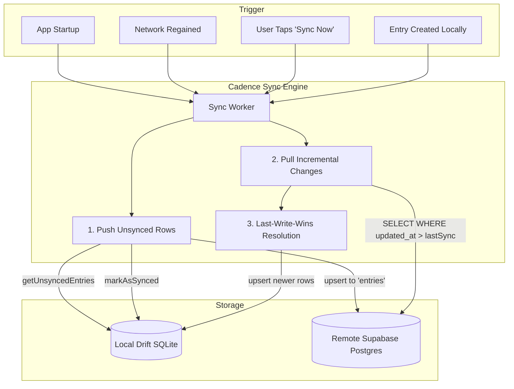

# Chunk 5: Drift & Supabase Sync Engine

**Tags:** `#sync #drift #supabase #offline-first #networking`

## What this chunk does
Implements the bidirectional offline-first synchronization engine between the local Drift SQLite database and remote Supabase PostgreSQL. Detects network connectivity changes, executes outbound push queues for locally created/modified records, pulls remote modifications using incremental timestamp cursors, and applies last-write-wins conflict resolution.

## Why it's needed
Cadence must never lock the UI waiting on network requests, yet multiple personal devices (phone, tablet) must stay in sync when online. Building the sync engine completes the core foundation (Phase 0). Every tracker module built in subsequent chunks (Expenses, Movement, Goals, Calendar, Routines) will simply write to local Drift and immediately inherit background synchronization without having to write individual networking code for each feature.

## Builds on
- **Chunk 3 ([3.local-db-drift.md](3.local-db-drift.md)):** Reuses Drift's `isSynced`, `updatedAt`, `getUnsyncedEntries()`, and `markAsSynced()` operations.
- **Chunk 4 ([4.supabase-auth-client.md](4.supabase-auth-client.md)):** Uses the authenticated `activeUserIdProvider` and `supabaseClientProvider` to authenticate sync transactions against Supabase Postgres Row Level Security.

## Key concepts

### 1. Incremental Sync via Timestamp Cursors
Instead of downloading the entire database on every sync, the client stores a local persistent timestamp: `last_synced_at`. When pulling, it requests only remote rows where `updated_at > last_synced_at`. This dramatically minimizes payload sizes and fits comfortably within Supabase free-tier bandwidth.

### 2. Last-Write-Wins (LWW) Conflict Resolution
When the same record is edited on two offline devices, a conflict occurs when they reconnect. Because Cadence is designed for single-user/family workloads (2–5 users), we employ **last-write-wins by `updated_at`**:
- If `remote.updated_at > local.updated_at`, the remote record overwrites the local row.
- If `local.updated_at >= remote.updated_at`, the local record is pushed and overwrites the remote row.
This avoids complex CRDT (Conflict-Free Replicated Data Type) overhead while remaining deterministic.

### 3. Outbound Push Queue & Batch Upsert
Locally inserted or updated records are marked with `is_synced = false`. The sync worker batches these unsynced records and sends a single `upsert` query to Supabase:
```dart
await supabase.from('entries').upsert(records);
```
Once the HTTP response confirms a 200/201 status, Drift marks those IDs as `is_synced = true` within a local transaction.

### 4. Reactive Connectivity Listening
The sync engine listens to network transitions via `connectivity_plus`. When transitioning from `none` to `wifi` or `mobile`, it immediately triggers an opportunistic sync sweep.

## Visual model



## How it works

1. **Sync Service (`lib/core/sync/sync_service.dart`):** Encapsulates the push and pull algorithms.
2. **Push Phase:** Selects rows where `is_synced == false`. Maps Drift data classes into Supabase JSON payloads. Invokes `supabase.from('entries').upsert(payload)`. On success, marks records as synced in Drift.
3. **Pull Phase:** Queries Supabase `entries` table filtered by `user_id == activeUserId` and `updated_at > lastSyncTime`. For each row returned, compares timestamps with any local record and updates local Drift accordingly.
4. **State Provider (`lib/core/sync/sync_provider.dart`):** Tracks sync status (`idle`, `syncing`, `success`, `offline`, `error`) so the UI displays live sync badges and spinners.
5. **UI Header Widget:** Adds an interactive sync button and status indicator in the app bar.

## Gotchas / trade-offs

- **Clock Drift:** Last-write-wins assumes device clocks are roughly synchronized. Because modern smartphones synchronize via NTP with cellular towers, clock skew is typically negligible (< 1 second).
- **Soft Deletes vs Hard Deletes:** If an item is hard-deleted from SQLite locally while offline, the remote server would never know it was deleted. Hence, our schema uses `is_deleted = true`. The sync engine pushes `is_deleted = true` to Supabase, ensuring deletions propagate across all devices.
- **Offline Resilience:** If Supabase is unreachable or unconfigured, the sync worker catches the socket exception, transitions state to `offline`, and leaves `is_synced = false` untouched for the next attempt.

## What to look up next
- Postgres Triggers for automatic `updated_at = now()` enforcement on row updates.
- Supabase Realtime Channels for instant push sync via WebSockets.

## Check yourself
Before writing code, answer these questions in your own words:
1. Why does an offline-first system require soft deletes (`is_deleted = true`) rather than immediately deleting rows from SQLite?
2. How does the Last-Write-Wins (LWW) conflict strategy decide which version of a record to keep?
3. What happens to unsynced local rows if the device loses internet connection midway through a sync operation?

---

## Verify
- **Predicted result:**
  1. `flutter analyze` runs cleanly with 0 errors and 0 warnings.
  2. `flutter test` executes all database, auth, sync, and widget tests (16 tests total), verifying Drift-to-Supabase JSON serialization, batch queue sync, Last-Write-Wins (LWW) conflict resolution by `updated_at`, guest mode local persistence, offline failure tolerance, and reactive UI sync status indicators.
- **Actual result:**
  1. `flutter analyze` completed with "No issues found! (ran in 4.4s)".
  2. `flutter test` passed all 16 tests with 100% pass rate (`+16: All tests passed!`), confirming both LWW conflict resolution and reactive Riverpod sync state updates.

## Questions
*(Running log of questions asked during this chunk)*

## Errata
*(Running log of bugs discovered in this chunk later)*
