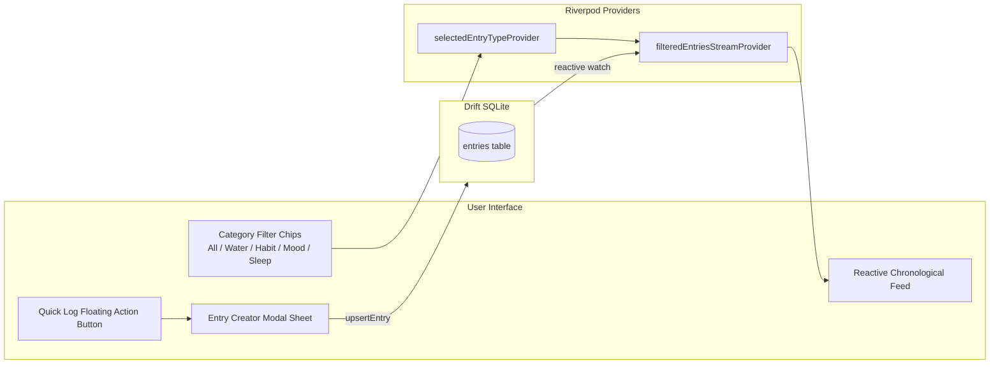

# Chunk 6: Shared Entries & Generic Logging

**Tags:** `#entries #habits #logging #drift #riverpod #ui`

## What this chunk does
Builds the generic logging user interface and domain controllers for tracking habits, hydration, sleep duration, and mood. Provides specialized bottom sheets for fast entry creation (incrementing counters, mood selectors, tag chips), displays a live reactive chronological entry timeline, and allows filtering by category.

## Why it's needed
Rather than fragmenting a user's life across separate apps or isolated database tables, Cadence unifies telemetry (money, habits, water, sleep, mood) into a polymorphic `entries` schema. Having completed the local database (Chunk 3) and offline sync engine (Chunk 5), this chunk delivers the actual user-facing logging experience. Any entry logged here instantly updates the UI reactively, persists in SQLite, and queues for background sync without feature-specific network code.

## Builds on
- **Chunk 3 ([3.local-db-drift.md](3.local-db-drift.md)):** Interacts directly with the `entries` table using `upsertEntry()`, `softDeleteEntry()`, and reactive `watchEntriesByType()`.
- **Chunk 4 ([4.supabase-auth-client.md](4.supabase-auth-client.md)):** Associates all logged records with `activeUserIdProvider`.
- **Chunk 5 ([5.drift-supabase-sync.md](5.drift-supabase-sync.md)):** Ensures all newly logged entries trigger the background outbound sync queue automatically.

## Key concepts

### 1. Polymorphic Shared Model
A single database table represents diverse telemetry by varying the `type` column:
- `water`: `value` (e.g. 1.0), `unit` ('glass' or 'ml')
- `habit`: `value` (1.0 for completion or streak count), `metadata` ({'habit_name': 'Read 20 pages', 'target': 1.0})
- `mood`: `value` (1–5 scale), `note` ('Feeling energised and calm')
- `sleep`: `value` (hours, e.g. 7.5), `metadata` ({'quality': 'deep', 'wake_time': '07:00'})

### 2. Specialized Quick-Entry Bottom Sheets
A unified logging modal with tailored input layouts based on entry type:
- Stepper buttons (`+1`, `+250ml`) for quick hydration.
- Tap chips for common habits.
- 5-point expressive mood selector (Awful, Bad, Neutral, Good, Great).
- Interactive tag input with chips for fast contextual categorization.

### 3. Reactive Filtering by Type
Using Drift's reactive `watchEntriesByType(type)` stream and Riverpod `StreamProvider.family` to filter the activity feed seamlessly without full-page reloads.

## Visual model

## How it works

1. **`lib/features/entries/presentation/quick_log_modal.dart`:**
   A bottom sheet allowing users to select the entry type (Water, Habit, Mood, Sleep), enter numeric values, notes, and tags, and commit to Drift.
2. **`lib/features/entries/providers/entries_provider.dart`:**
   Exposes filtered entry streams based on the active category filter and handles entry creation and deletion helpers.
3. **`lib/features/entries/presentation/entries_feed.dart`:**
   Renders recent entries with distinct icons, formatted timestamps, tags, and swipe-to-delete (soft delete) actions.
4. **Integration with `DashboardScreen`:**
   Embeds the category filters and recent entry feed directly onto the main Today tab, replacing temporary placeholder buttons with the full logging system.

## Gotchas / trade-offs

- **Schema Rigidity vs Polymorphic Flexibility:** Storing custom attributes in a JSON `metadata` column allows adding new entry types (e.g. coffee, medication) without database schema migrations, but loses strict SQL column-type constraints. Drift type converters bridge this with typed Dart maps.
- **Swipe-to-Dismiss vs Soft Deletes:** When dismissing a card in the feed, we must trigger `softDeleteEntry` (setting `is_deleted = true`, `is_synced = false`), rather than a hard delete, to allow the deletion to propagate to Supabase.

## What to look up next
- Flutter `Dismissible` widget best practices for smooth swipe-to-delete animations with background indicators.
- SQLite virtual tables (FTS5) for full-text search across entry notes and tags.

## Check yourself
Before writing code, answer these questions in your own words:
1. Why does Cadence use a single polymorphic `entries` table for water, habits, sleep, and mood instead of creating four separate SQLite tables?
2. When a user swipes to delete an entry from the feed, which Drift database operation is called and why?
3. How does the `metadata` JSON column help prevent having to run database migrations whenever a new type of tracking is introduced?

---

## Verify
- **Predicted result:**
  1. `flutter analyze` passes with 0 issues.
  2. `flutter test` executes all database, auth, sync, entries, and widget tests (21 tests total), confirming polymorphic entry insertion, custom JSON metadata handling, soft deletion, undo restoration, reactive category filtering, and end-to-end UI rendering in `QuickLogModal` and `EntriesFeed`.
- **Actual result:**
  1. `flutter analyze` completed with "No issues found! (ran in 3.1s)".
  2. `flutter test` passed all 21 tests with 100% pass rate (`+21: All tests passed!`).

## Questions
*(Running log of questions asked during this chunk)*

## Errata
*(Running log of bugs discovered in this chunk later)*
