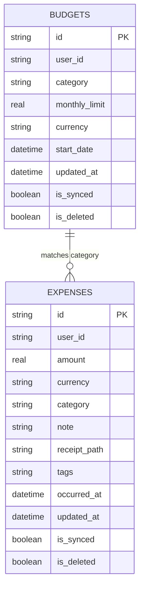

# Chunk 7: Expense Tracker — Data Layer & Calculations

**Tags:** `#finance #expenses #budgets #drift #sqlite #sql-aggregation`

## What this chunk does
Implements the data and computation layer for Cadence's personal finance tracker. Defines dedicated Drift SQLite tables for `expenses` and `budgets`, supports receipt image path references, builds reactive SQL aggregation queries for monthly category spend rollups, and calculates remaining budget allowances.

## Why it's needed
Managing finances is a cornerstone of the Cadence personal operating system. While generic telemetry (habits, water) operates on simple counts, financial transactions require category classification, currency definitions, receipt linking, and budget cap tracking. Establishing this robust data layer now provides the mathematical and reactive backbone for the upcoming finance visualizations, expense entry forms, and receipt scanning UI in Chunk 8.

## Builds on
- **Chunk 3 ([3.local-db-drift.md](3.local-db-drift.md)):** Extends `AppDatabase` with new Drift table definitions (`Expenses`, `Budgets`), bumping `schemaVersion` to 2 and generating companion classes via `build_runner`.
- **Chunk 4 ([4.supabase-auth-client.md](4.supabase-auth-client.md)):** Scopes all financial transactions and monthly budget limits to `activeUserIdProvider`.
- **Chunk 5 ([5.drift-supabase-sync.md](5.drift-supabase-sync.md)):** Equips both tables with `is_synced`, `updated_at`, and `is_deleted` flags to plug directly into the offline sync worker.

## Key concepts

### 1. Dedicated vs Polymorphic Tables
Why give expenses their own table instead of shoehorning them into the generic `entries` table?
- **Aggregations & Indexing:** Financial dashboards frequently compute `SUM(amount) GROUP BY category` over time windows. Storing `category` and `amount` as native, indexed columns avoids JSON path extraction in SQL queries.
- **Budget Foreign Relations:** Budgets need to join directly against expense categories to compute real-time spend vs limit thresholds.

### 2. Month-Window SQL Aggregations
To compute monthly spend without loading thousands of historical transactions into Dart memory:
```sql
SELECT category, SUM(amount) as total
FROM expenses
WHERE occurred_at >= :startOfMonth 
  AND occurred_at < :endOfMonth 
  AND is_deleted = 0
GROUP BY category;
```
Drift compiles this into type-safe Dart streams that emit recalculations automatically whenever a new expense is logged or deleted.

### 3. Budget Status & Burn-Rate Calculation
For any category with a defined budget limit:
- `spent = total spend for current calendar month`
- `remaining = limit - spent`
- `percentage = (spent / limit) * 100`
- If `percentage >= 100%`, category status flags an over-budget warning.

## Visual model



## How it works

1. **Table Schemas (`lib/core/database/tables/expenses_table.dart` & `budgets_table.dart`):**
   Defines columns with defaults, UUID PKs, receipt path support, and JSON tag converter.
2. **Database Registration (`lib/core/database/app_database.dart`):**
   Registers `Expenses` and `Budgets` in `@DriftDatabase`, updates schema version to 2, and adds migration strategy (`onUpgrade`).
3. **Reactive DAOs & Aggregations:**
   - `watchExpenses()`: Chronological active expense stream.
   - `watchExpensesForMonth(DateTime month)`: Expenses restricted to calendar month.
   - `watchCategorySummaries(DateTime month)`: Aggregated category totals for charts and reports.
   - `watchBudgetWithSpend(DateTime month)`: Combines budget limit and actual spend to compute remaining balance and progress percentage.
4. **Finance Providers (`lib/features/finance/providers/finance_provider.dart`):**
   Riverpod providers wrapping reactive streams for clean UI consumption.

## Gotchas / trade-offs

- **Floating Point Math in Currencies:** In production enterprise banking, currency is stored as integer cents to avoid IEEE-754 precision loss (`0.1 + 0.2 != 0.3`). For a lightweight personal tracker, using `double` with rounded display formatting provides flexibility for fractional currencies while keeping calculations straightforward.
- **Drift Schema Upgrades:** When introducing new tables to an existing SQLite file on disk, Drift requires an `onUpgrade` migration callback in `AppDatabase` to invoke `m.createTable(expenses)` and `m.createTable(budgets)`. Omitting this will crash existing app installations upon update.

## What to look up next
- SQLite Indexes on composite keys (`user_id, occurred_at, category`) for scaling past 50,000 transactions.
- Decimal packages (`decimal` in pub.dev) for arbitrary-precision decimal arithmetic.

## Check yourself
Before writing code, answer these questions in your own words:
1. Why do we create dedicated `expenses` and `budgets` tables instead of keeping all financial entries in the generic `entries` table?
2. What happens if you add a new Drift table and increase `schemaVersion` without providing an `onUpgrade` migration strategy?
3. How does SQL `GROUP BY category` with `SUM(amount)` improve app performance compared to filtering and summing transactions in Dart memory?

---

## Verify

- **Predicted result:**
  1. `flutter test test/finance_test.dart` passes all 6 test cases:
     - `logExpense` persists records with tags and receipt paths.
     - `softDeleteExpense` sets `isDeleted = true` and updates sync staging.
     - `watchExpensesForMonth` filters strictly to calendar months.
     - `watchCategorySpendSummaries` aggregates total amount per category via SQL `GROUP BY`.
     - `watchTotalMonthlySpend` calculates complete monthly sum.
     - `budgetProgressListProvider` accurately calculates spent, remaining, percentage, and `isOverBudget` flag.
  2. `flutter analyze` reports 0 issues across the entire project.

- **Actual result:**
  - `flutter test test/finance_test.dart` passed all 6 tests.
  - Full project test suite `flutter test` passed all 27 tests across database, auth, sync, entries, widgets, and finance.
  - `flutter analyze` passed with 0 issues ("No issues found!").

## Questions
- **Q:** *Are we building a backend in Go? Where can I host it for free?*
  - **A:** In Cadence's design, the primary cloud backend is **Supabase** (PostgreSQL, GoTrue Auth, Realtime, PostGIS, Storage) because Cadence is offline-first: the Flutter client reads/writes local SQLite (Drift) and synchronizes directly with Supabase via Row Level Security (RLS). A custom **Go service (e.g. using Chi)** was designated as an optional Phase 3+ companion service for server-side compute (such as complex weekly review aggregations or background cron jobs). If you deploy a Go service, excellent free hosting options include:
    1. **Koyeb:** Free Eco tier (512MB RAM, no cold-sleep spin downs, deploys directly from GitHub/Docker).
    2. **Render:** Free web service tier (512MB RAM, native Go or Docker, spins down after 15 min of inactivity).
    3. **Google Cloud Run:** 2 million free requests/month with fast scale-to-zero (Go binaries cold start in <50ms).
    4. **Fly.io:** Free allowance of 3 micro VMs (256MB RAM), global deployment via Dockerfile.
    5. **Oracle Cloud Free Tier (OCI):** 4 ARM Ampere cores + 24 GB RAM always free (runs full Docker containers continuously).

## Errata
*(Running log of bugs discovered in this chunk later)*
