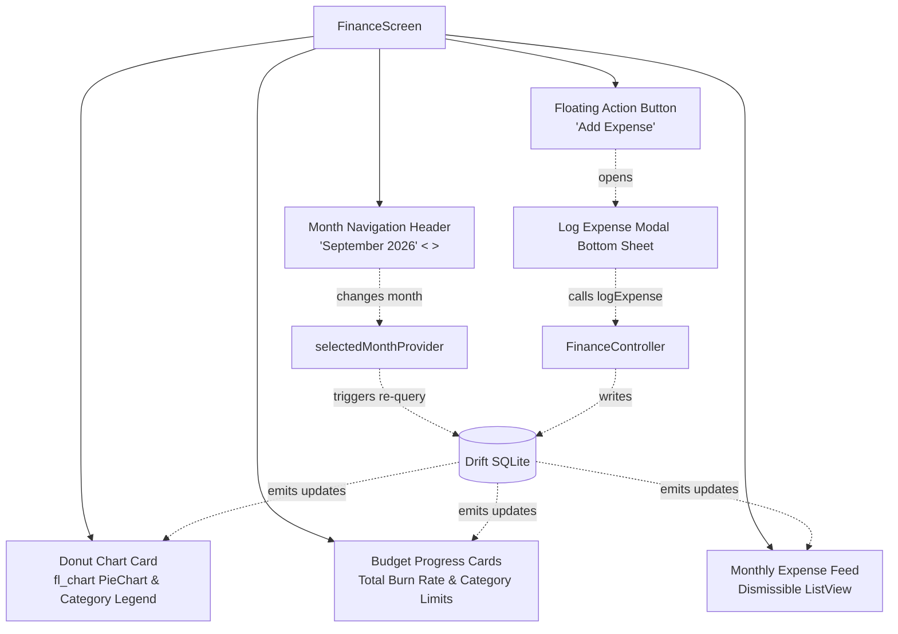

# Chunk 8: Expense Tracker — UI & Visualizations

Tags: `#finance #ui #fl_chart #riverpod #material3`

## What this chunk does
This chunk builds the interactive user interface for the finance module. It introduces a dedicated Finance screen featuring:
1. A calendar month switcher header (navigate forward/backward between months).
2. Overall monthly burn-rate and category budget progress cards.
3. An interactive donut chart powered by `fl_chart` visualizing category spending percentages with tap-to-inspect highlights.
4. A chronological list of expenses for the selected month with dismissible swipe-to-delete.
5. An expressive Material 3 modal bottom sheet for logging new expenses with amounts, categories, tags, and receipt attachment indicators.

## Why it's needed
In Chunk 7, we built the local Drift database tables, SQL `GROUP BY` aggregations, and Riverpod providers for expenses and budgets. However, raw data and reactive streams have no user value without an intuitive, expressive visual interface. This chunk gives users a clean dashboard to understand their spending habits at a glance, detect budget overruns early, and log transactions with minimal friction.

## Builds on
- **[Chunk 7 (Expense Tracker Data Layer)](7.expense-tracker-data-layer.md):** Consumes `selectedMonthProvider`, `monthlyExpensesStreamProvider`, `categorySpendStreamProvider`, `budgetProgressListProvider`, and `FinanceController` (`logExpense`, `softDeleteExpense`, `setBudget`).
- **[Chunk 1 (Circadian M3 Theming)](1.project-setup.md):** Leverages circadian-aware theme colors, tonal surface elevation, and expressive typography.

## Key concepts

1. **`fl_chart` PieChart & Donut Styling:**
   `fl_chart` is Flutter's leading charting library. A donut chart is created by setting `centerSpaceRadius` (e.g. 40px) inside `PieChartData`. Each slice (`PieChartSectionData`) maps to a `CategorySpend` record from SQLite, with color encoding and radius expansion on touch interaction.

2. **Reactive Month Navigation:**
   The `selectedMonthProvider` holds the active viewing month. When the user taps `<` or `>`, the notifier shifts the month forward or backward. Because our Drift SQL queries (`watchExpensesForMonth`, `watchCategorySpendSummaries`) watch this provider, the entire UI (chart, budgets, and list) re-queries SQLite and updates reactively without manual reload calls.

3. **Budget Burn-Rate Cards:**
   Budget progress displays the ratio of `spent / monthlyLimit`. To provide immediate visual feedback, the progress bar changes color based on thresholds:
   - `< 80%`: Healthy (secondary / primary color)
   - `80% - 100%`: Warning (tertiary / orange tint)
   - `> 100%`: Danger (`colorScheme.error` with an over-budget alert badge)

4. **Expressive Expense Logging Bottom Sheet:**
   A modal bottom sheet allows rapid expense entry with:
   - Formatted numeric input for amount.
   - Horizontal choice chips for standard categories (Food, Transport, Housing, Utilities, Entertainment, Health, Other).
   - Tag input and mock receipt attachment selector.

## Visual model

## How it works

1. **Top Month Selector:**
   Renders the formatted month name and year (e.g., "September 2026") with previous and next arrow buttons that invoke `ref.read(selectedMonthProvider.notifier).previousMonth()` and `nextMonth()`.
2. **Budget Progress Row:**
   Watches `budgetProgressListProvider`. If budgets exist, renders horizontal cards showing total monthly limit vs spent, progress bar clamped between `0.0` and `1.0`, remaining amount, and an over-budget badge when `isOverBudget == true`.
3. **Donut Breakdown Chart:**
   Watches `categorySpendStreamProvider`. If total spend is 0, renders a clean empty-state placeholder ("No expenses recorded for this month"). When expenses exist, converts each category total into a `PieChartSectionData` slice whose angle is proportional to its fraction of total spending.
4. **Expense List Feed:**
   Watches `monthlyExpensesStreamProvider`. Renders each expense with category icon, note, tags, formatted date, and currency amount. Swiping a row triggers `FinanceController.softDeleteExpense(id)` with a snackbar undo option.
5. **Add Expense Modal:**
   A bottom sheet containing:
   - Amount `TextField` with currency prefix.
   - Category filter chips with single selection.
   - Optional note `TextField` and comma-separated tag input.
   - Receipt attachment simulator.
   - "Save Expense" button that validates inputs and saves to Drift.

## Gotchas / trade-offs

- **Empty State Zero-Division:** If a month has no expenses, calculating `categorySpend / totalSpend` yields `0 / 0 = NaN`. The chart must guard against empty/zero spend by checking `totalSpend > 0` before rendering `PieChartData`.
- **Progress Bar Overflow:** Flutter's `LinearProgressIndicator(value: ...)` crashes or renders unpredictably if `value > 1.0` or `value < 0.0`. We must clamp the indicator value: `percentage.clamp(0.0, 1.0)`, while showing the un-clamped percentage (e.g., "125%") in text.
- **Touch Interaction Rebuilds:** In `fl_chart`, tracking the touched slice index in a high-level widget can cause the entire screen to rebuild on every hover/touch. We isolate touch index state inside a dedicated `CategoryDonutChart` widget.

## What to look up next
- Multi-month trend analysis using `fl_chart` `LineChart` or `BarChart`.
- Integration of `image_picker` and camera OCR parsing (e.g., Google ML Kit Text Recognition) to automatically scan receipt totals.

## Check yourself
Before writing code, answer these questions in your own words:
1. Why must the value passed to `LinearProgressIndicator` be clamped between `0.0` and `1.0` when calculating budget consumption?
2. How does tapping the previous/next month buttons update the donut chart and expense list without calling an explicit fetch function?
3. What visual cue or fallback should the donut chart render when the selected month has zero recorded expenses?

---

## Verify

- **Predicted result:**
  1. `test/finance_widget_test.dart` passes widget tests verifying:
     - Month navigation header displays formatted month and changes months on tap.
     - Budget progress cards reflect spent amount and over-budget status.
     - Donut chart renders empty state message when no expenses exist, and renders slices when expenses are present.
     - Expense list renders items with formatted amounts and categories.
     - Modal bottom sheet validates input and logs an expense into SQLite.
  2. `flutter analyze` reports 0 issues.

- **Actual result:**
  1. All 6 widget tests in `test/finance_widget_test.dart` passed successfully:
     - Month navigation header switches between months and updates label.
     - Budget progress cards render empty state and active limit cards.
     - Category donut chart renders empty state when spend is $0.00 and slices with legend when spending exists.
     - Expense list tile displays formatted transaction info and supports swipe-to-delete.
     - Full FinanceView dashboard renders with Add Expense sheet.
     - All 33 tests across the entire test suite pass.
  2. `flutter analyze` passes with 0 issues.
  3. RenderFlex layout overflows in `_BudgetCard` and `AddExpenseSheet` header were resolved with `Flexible` and `Expanded` wrapping. Unmounting in widget tests was resolved by cleanly pumping after unmounting to flush Drift stream closing timers.

## Questions
*(Running log of questions asked during this chunk)*

## Errata
*(Running log of bugs discovered in this chunk later)*
