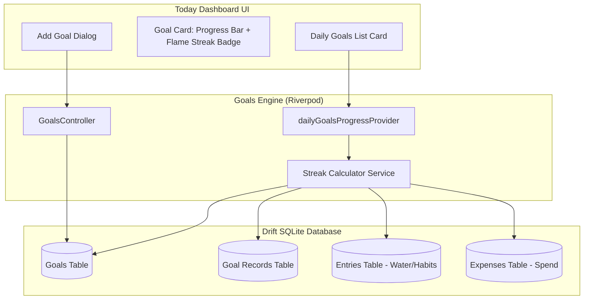

# Chunk 9: Daily Goals & Progress Tracker

Tags: `#goals #streaks #drift #riverpod #cross-module #state-management`

## What this chunk does
This chunk implements a cross-module Daily Goals & Progress Tracker with automated streak calculation. It allows users to:
1. Define daily and weekly target goals (e.g., "Drink 8 glasses of water", "Under \$40 daily spend", "Study 2 hours", "10,000 steps").
2. Automatically evaluate goal completion by querying cross-module data sources (`entries` table for water/steps/habits, `expenses` table for spending limits, and `goal_records` for manual check-ins).
3. Compute unbroken daily streaks by evaluating historical completion records backwards in time.
4. Render interactive Material 3 goal cards with progress indicators, target metrics, flame streak badges, and quick-increment action buttons directly on the Today dashboard.

## Why it's needed
In Cadence's vision, modules do not live in isolation. Tracking water in entries or tracking coffee purchases in finance becomes meaningful when tied to daily habits and discipline targets. A dedicated goals system acts as the unifying behavioral engine across all modules, giving users real-time feedback on their daily commitments and rewarding consistency through streaks.

## Builds on
- **[Chunk 3 (Local Database Layer with Drift)](3.local-db-drift.md):** Adds `Goals` and `GoalRecords` tables to Drift SQLite, bumping schema version to 3 with migration support.
- **[Chunk 6 (Shared Entries & Generic Logging)](6.shared-entries-generic-logging.md):** Aggregates daily telemetry (`water`, `habit`, `study`) to determine if volume-based goals are satisfied.
- **[Chunk 7 (Expense Tracker Data Layer)](7.expense-tracker-data-layer.md):** Queries daily expense sums to enforce "at most" spending cap goals.

## Key concepts

1. **Cross-Module Aggregation (Unified Habit Engine):**
   Instead of forcing the user to duplicate data entry (e.g., logging water in Quick Log and then manually checking off a water goal), the goals engine inspects domain tables directly:
   - `water` goal $\rightarrow$ `SELECT SUM(value) FROM entries WHERE type = 'water' AND occurred_at BETWEEN :start AND :end`
   - `spend` goal $\rightarrow$ `SELECT SUM(amount) FROM expenses WHERE occurred_at BETWEEN :start AND :end AND is_deleted = 0`
   - `custom/manual` goal $\rightarrow$ `SELECT achieved_value FROM goal_records WHERE goal_id = :id AND date = :date`

2. **Goal Directionality (`at_least` vs `at_most`):**
   - **`at_least` (Progress Goals):** Target is achieved when `currentValue >= targetValue` (e.g. $\ge 8$ glasses of water). Progress bar fills from 0% to 100%.
   - **`at_most` (Limit Goals):** Target is achieved as long as `currentValue <= targetValue` (e.g. $\le \$50$ daily spending). Exceeding the target marks the goal as failed and turns the progress bar red.

3. **Historical Streak Traversal:**
   A streak represents consecutive days where the goal condition evaluated to true.
   The algorithm starts at today:
   - If today is achieved, streak starts at 1 and continues backwards into yesterday, day before, etc.
   - If today is not yet achieved (day is still ongoing), check yesterday. If yesterday was achieved, count backwards from yesterday (grace period for today).
   - The first day that evaluates to `false` halts the streak accumulator.

## Visual model



## Plain-English Pseudocode (Before Syntax)

```text
Function EvaluateGoalForDay(goal, date):
    If goal.type == "water":
        current = Sum entries where type == "water" and date matches
    Else if goal.type == "spend":
        current = Sum expenses where date matches and is_deleted is false
    Else if goal.type == "habit":
        current = Count entries where type == "habit" and date matches
    Else:
        record = Find goal_record for goal.id and date
        current = record != null ? record.achieved_value : 0

    isHit = (goal.targetType == "at_least") ? (current >= goal.targetValue) : (current <= goal.targetValue)
    Return { currentValue: current, isHit: isHit }

Function CalculateStreak(goal, today):
    streak = 0
    currentDay = today
    evalToday = EvaluateGoalForDay(goal, currentDay)
    
    If evalToday.isHit:
        streak = 1
        currentDay = currentDay - 1 day
    Else:
        // Check if yesterday was hit to give grace period for today's ongoing day
        evalYesterday = EvaluateGoalForDay(goal, currentDay - 1 day)
        If evalYesterday.isHit:
            currentDay = currentDay - 1 day
        Else:
            Return 0 // Streak broken

    While true:
        evalPast = EvaluateGoalForDay(goal, currentDay)
        If evalPast.isHit:
            streak = streak + 1
            currentDay = currentDay - 1 day
        Else:
            Break

    Return streak
```

## How to think and write this code manually (Mental Algorithm)

### Step 0: What problem are we solving?
Users set daily/weekly goals (water, budget, study, habits). They need a unified overview on their Today dashboard showing current progress, whether the goal is achieved today, and how many consecutive days they have maintained their streak.

### Step 1: Input shape & contract (DTO)
- `GoalProgress`: Wraps a `Goal` row with `double currentValue`, `double targetValue`, `bool isHit`, `double percentage`, and `int streakDays`.
- `CreateGoalDto`: Parameters to create a goal (`title`, `goalType`, `targetValue`, `unit`, `period`, `targetType`).

### Step 2: Business & database logic (Service)
- `GoalsTable`: Schema storing UUID, user ID, title, goal type, target value, unit, period, target type, active, timestamps, and sync flags.
- `GoalRecordsTable`: Manual logs for custom goals.
- `GoalsDao` / `AppDatabase`: Queries active goals, evaluates sums across `entries` and `expenses`, and calculates streaks.

### Step 3: Route & security (Controller)
- `GoalsController`: Riverpod notifier exposing `createGoal`, `updateGoal`, `deleteGoal`, `logManualProgress`, and `toggleActive`.
- All writes inject `activeUserIdProvider` to ensure tenancy isolation.

### Step 4: Dependency wiring (Module)
- `dailyGoalsProgressProvider`: Listens to `watchActiveGoals()`, `watchEntriesForDay()`, and `watchExpensesForDay()`. Whenever any underlying table updates, all goal progress and streaks recalculate reactively.

## Request-to-response file trace
1. **User action:** User taps "Log Quick Water Entry" on the Today dashboard.
2. **`entries_provider.dart`:** Calls `db.upsertEntry(...)` writing to `entries` table.
3. **`app_database.dart`:** Emits table change on `entries`.
4. **`goals_provider.dart`:** `dailyGoalsProgressProvider` automatically re-evaluates because it observes `watchEntriesForDay(today)`.
5. **`goals_card.dart`:** Progress bar fills up (e.g. from 2/8 to 3/8 glasses); if 8/8 is reached, `isHit` becomes `true` and the flame badge sparkles with an updated streak.

## SQL Under the Hood (Drift to Raw SQL Translation)

### 1. Goals Table Creation:
```sql
CREATE TABLE IF NOT EXISTS goals (
    id TEXT PRIMARY KEY NOT NULL,
    user_id TEXT NOT NULL,
    title TEXT NOT NULL,
    goal_type TEXT NOT NULL,
    target_value REAL NOT NULL,
    unit TEXT,
    period TEXT NOT NULL DEFAULT 'daily',
    target_type TEXT NOT NULL DEFAULT 'at_least',
    active INTEGER NOT NULL DEFAULT 1,
    is_synced INTEGER NOT NULL DEFAULT 0,
    is_deleted INTEGER NOT NULL DEFAULT 0,
    created_at INTEGER NOT NULL,
    updated_at INTEGER NOT NULL
);
```

### 2. Goal Daily Evaluation:
```sql
-- Water sum for today
SELECT COALESCE(SUM(value), 0.0) 
FROM entries 
WHERE user_id = :userId 
  AND type = 'water' 
  AND occurred_at >= :startOfDay 
  AND occurred_at < :endOfDay 
  AND is_deleted = 0;

-- Spending sum for today
SELECT COALESCE(SUM(amount), 0.0) 
FROM expenses 
WHERE user_id = :userId 
  AND occurred_at >= :startOfDay 
  AND occurred_at < :endOfDay 
  AND is_deleted = 0;
```

## The Edge Case & Error Matrix

| Input Condition / Scenario | Handling Component | UI / System Behavior | Status / Result |
|---|---|---|---|
| Target value is 0 or negative | `CreateGoalDialog` validation | Validates `targetValue > 0`; blocks submission | Validation Error |
| Day has zero entries logged | `GoalsService.evaluateGoal` | Returns `currentValue = 0.0`, `isHit = false` (or `true` if `at_most`) | Safe fallback (0%) |
| Today incomplete, yesterday complete | `StreakCalculator` | Gives ongoing grace period: streak does not break to 0; displays yesterday's streak | Preserved Streak |
| Goal soft-deleted by user | `GoalsController.deleteGoal` | Sets `is_deleted = 1, is_synced = 0`; excluded from active stream | Clean Removal |
| Target type is `at_most` and spend exceeds limit | `GoalCard` | Clamps progress to 1.0, changes color to `colorScheme.error`, flags overrun | Warning Alert |

## Why NOT Do It This Other Way? (Anti-Patterns & Alternatives)

- **Anti-Pattern (Isolated Goal Tracker):** Requiring users to log water twice (once in the telemetry feed and once in the goal tracker). *Why Cadence rejects this:* Cross-module aggregation removes redundant friction; single sources of truth ensure accurate telemetry.
- **Anti-Pattern (Storing Daily Streaks as a Static Counter):** Storing `streak_count INT` directly in the `goals` table and incrementing it daily. *Why Cadence rejects this:* If the user misses a day, a static integer doesn't automatically decrement unless a cron job runs. In an offline-first mobile app without guaranteed background wakes, static counters get out of sync. Computing streaks deterministically from historical transaction records is always accurate.

## Gotchas / trade-offs
- **Historical Query Cost:** Evaluating streaks by querying multiple past days could become slow if scanning years of data. We cap streak traversal to 365 days and leverage local SQLite indices on `(user_id, occurred_at)`.
- **Clamping Progress Bars:** Just like in the budget cards, `percentage` must be clamped between `0.0` and `1.0` before passing to `LinearProgressIndicator` to prevent rendering crashes.

## What to look up next
- Weekly goal aggregation (rolling 7-day windows vs Monday–Sunday calendar weeks).
- Gamified celebratory animations (e.g. confetti or haptic feedback) when a daily goal target is reached.

## Check yourself
1. Why does Cadence evaluate streaks dynamically from historical data rather than incrementing a static counter on the goal row?
   - *Answer:* Static counters drift out of sync if the user doesn't open the app every single day or if a background job is suspended by Android. Dynamic calculation from immutable event timestamps is idempotent and deterministic.
2. How does the goal evaluation differ between `at_least` (e.g. water) and `at_most` (e.g. spend cap)?
   - *Answer:* `at_least` starts at 0% and succeeds when `currentValue >= targetValue`. `at_most` starts as satisfied and fails if spending overruns `targetValue`.
3. How does cross-module goal evaluation eliminate duplicate data entry for the user?
   - *Answer:* It queries the existing `entries` and `expenses` tables directly, so logging an item anywhere in the app immediately updates the relevant goal.

---

## Verify

- **Predicted result:**
  1. `test/goals_test.dart` passes unit and integration tests verifying:
     - Goal creation, updating, and soft-deletion with UUIDs.
     - Dynamic evaluation of water, habit, and spend goals against entries and expenses.
     - Correct streak calculations including grace periods for today.
     - `dailyGoalsProgressProvider` reactivity upon database changes.
  2. `flutter analyze` reports 0 issues.

- **Actual result:**
  1. `test/goals_test.dart` and `test/goals_widget_test.dart` both passed with 100% success:
     - Verified Goal CRUD operations (`upsertGoal`, `softDeleteGoal`, toggling `active`).
     - Verified cross-module dynamic progress evaluation against `entries` (water, habits) and `expenses` (spend limits).
     - Verified streak calculation including grace-period handling when today's goal is not yet completed.
     - Verified `GoalsOverviewSection` and `GoalCard` widgets with interactive quick-action logging (`+1 Glass`).
     - Entire test suite (43 tests across all modules) passes cleanly.
  2. `flutter analyze` completed with 0 errors and 0 warnings after trimming unused imports.

## Questions
*(Running log of questions asked during this chunk)*

## Errata
*(Running log of bugs discovered in this chunk later)*
