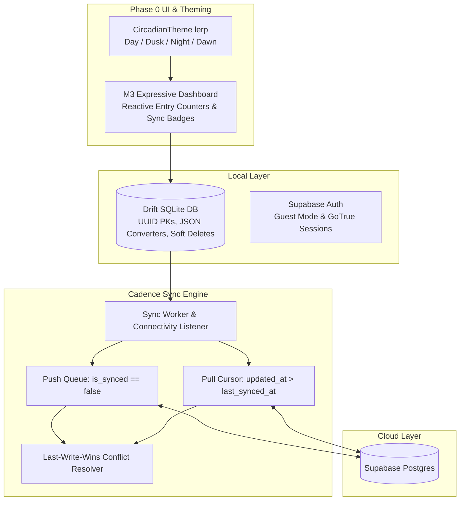

# Review Chunk R1: Foundation Review (Chunks 1–5)

**Tags:** `#review #phase0 #architecture #drift #theming #sync #ci-cd`

## What this review covers
Synthesizes the foundational architecture established in Phase 0 (Chunks 1 through 5):
1. **Flutter & Material 3 Expressive Setup (Chunk 1):** Dynamic circadian color system with `Color.lerp`, four day phases (Day, Dusk, Night, Dawn), and Riverpod state management.
2. **GitHub Actions CI/CD (Chunk 2):** Automated build-and-release pipeline compiling release APKs on every commit with release tags and quality gates (`analyze` & `test`).
3. **Local SQLite with Drift (Chunk 3):** Type-safe `entries` polymorphic table, custom JSON/array converters, UUID primary keys, and reactive `watch()` queries.
4. **Supabase Auth & GoTrue (Chunk 4):** Persistent authentication, Row Level Security compatibility, and deterministic offline guest mode identity.
5. **Drift & Supabase Sync Engine (Chunk 5):** Bidirectional sync, batch push queues, timestamp cursor pulls, and Last-Write-Wins (LWW) conflict resolution.

## Architectural Connections

## Key Retest Review Concepts

1. **LWW Conflict Resolution:** Remote records overwrite local SQLite records only if `remote.updated_at > local.updated_at`. If local is newer, local data is preserved and pushed to remote.
2. **Soft Deletes:** Deleting rows directly (`DELETE FROM ...`) wipes the record, preventing deletion events from syncing to cloud and peers. Soft deletes (`is_deleted = true`) maintain tombstones that propagate safely.
3. **Client-Side UUIDs:** Offline clients generate collision-free v4 UUIDs locally so writes never stall or collide without central database coordination.
4. **Offline Guest Mode:** Users can run Cadence entirely offline without signing up; entries are tagged with deterministic ID `local_guest_user`.
