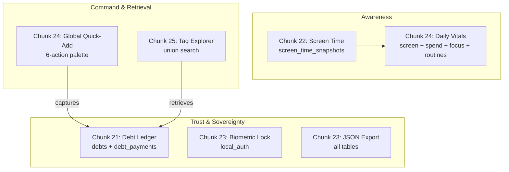

# Review Chunk R5: Periodic Architecture Review (Chunks 21–25)

Tags: `#review #ledger #usage-stats #biometrics #export #dashboard #search`

## Purpose of this Review

Rule 9 mandates a dedicated review chunk after every 5 feature chunks without introducing new code. Chunks 21 through 25 hardened Cadence into a shippable, secure personal OS:

- **Chunk 21 (Debt & Lending Ledger)**: `debts` + `debt_payments` tables with lent/borrowed types, partial payments, settlement tracking, and overdue detection.
- **Chunk 22 (Android Screen-Time Integration)**: `UsageStatsManager` bridge via platform channel, permission-gated sync into `screen_time_snapshots`, category rollups feeding the dashboard.
- **Chunk 23 (Biometric Security & Full JSON Export)**: `local_auth` app lock plus one-click full JSON export of every table — data sovereignty with no backend dependency.
- **Chunk 24 (Unified Home Dashboard & Global Quick-Add)**: hero circadian greeting, cross-module `DailyVitalsSummary` glance bar, and a 6-action command-palette bottom sheet replacing the single-purpose FAB.
- **Chunk 25 (Unified Tag Explorer & Cross-Module Search)**: pure-function union search over the shared tag vocabulary across entries, expenses, and study sessions.

---

## How Chunks 21–25 Connect into the Bigger Picture

Capture (Quick-Add) and retrieval (Tag Explorer) are now symmetric: every write path from Chunk 24 has a corresponding read path in Chunk 25 via shared tags.

---

## Retesting Past Mistakes & Recent Gotchas (Cold Evaluation)

1. *Modal-on-modal context invalidation (Chunk 24 learning doc gotcha)?*
   - **Answer**: palette always `pop`s first, then opens the destination on `Future.microtask` with the parent context. Widget test covers the full palette → QuickLogModal → save round-trip.
2. *Fresh-DB null crashes in aggregations?*
   - **Answer**: `DailyVitalsSummary` defaults everything to zero; tag explorer renders guidance empty states. Covered by unit tests.
3. *Widget-test `pumpAndSettle` hangs with overlapping sheet animations?*
   - **Answer**: real-device behavior is fine (standard pop-then-microtask-push); in tests, overlapping bottom-sheet animations can keep the fake scheduler busy, so the boot test uses bounded `pump(duration)` after sheet transitions. Documented in `widget_test.dart`.
4. *Private dialog reuse (`_CreateDebtDialog`)?*
   - **Answer**: instead of exposing privates, Chunk 24 added a public `CreateDebtDialog` widget sharing the same `DebtController` — one controller, two thin views.

---

## Architecture Checkpoint

- **Offline-first intact**: Chunks 24–25 add zero new tables and zero new sync surface; all reads compose existing Drift streams.
- **Sync/conflict model unchanged**: last-write-wins by `updated_at`; vitals/search are derived views, never synced state.
- **CI gate green**: `flutter analyze` 0 issues, 184/184 tests pass, GitHub Actions builds + releases the APK on every `main` push (design doc §10).
- **Remaining risk (accepted)**: `material_3_expressive` community-package lag (design doc §3a) — no action, personal-app scope.

---

## What to look up next

- Chunk 26: Final Release Polish, End-to-End Build & Summary.
